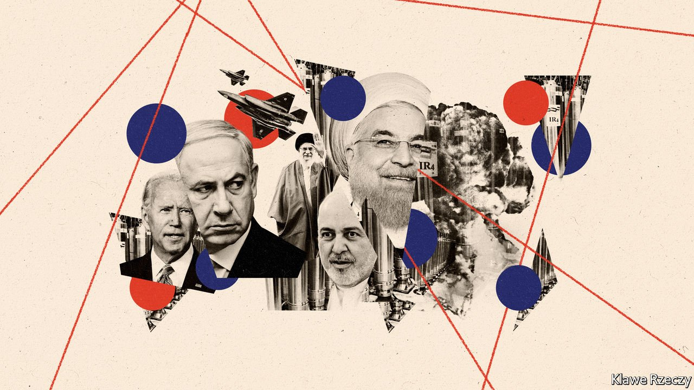

###### Explosive diplomacy

# Will an attack on Iran derail efforts to revive the nuclear deal? 

##### An explosion in Natanz will be felt in Vienna 

 

> Apr 12th 2021 

ON APRIL 10th Iran had two occasions for cheer. One was the resumption of talks, earlier in the week, in Vienna to revive the multinational nuclear deal that Donald Trump, then America’s president, abandoned in 2018. The other was the celebration of National Nuclear Technology Day, which featured performers dressed as nuclear scientists, huddled around centrifuges at Natanz, a facility in Isfahan province, singing paeans to Iran’s scientific prowess. Iranian officials announced they had finally rebuilt part of the facility struck by a  last year. Then, on April 11th, the facility was struck again.

This attack destroyed the power source for the centrifuges, which spin uranium to extract fissile isotopes suitable for use in reactors or, if concentrated enough, in bombs. Thousands of the machines were damaged. Iranian officials blamed Israel, claiming explosives were smuggled into Natanz inside a table. In contrast with previous incidents, Israeli officials acknowledged to reporters that Mossad, Israel’s intelligence service, was indeed involved.


The big question now is what effect the attack will have on the talks in Vienna. President Joe Biden has said that he wants to re-enter the deal, under which Iran curbed its nuclear programme in return for the lifting of international sanctions. First, though, he wants Iran to reverses steps, taken in response to Mr Trump’s actions, that are not in compliance with the agreement. Iran wants Mr Biden to lift sanctions, imposed on it by Mr Trump, first.

Enter Binyamin Netanyahu, Israel’s prime minister, who is no fan of the deal. Was his aim to goad Iran into more nuclear activity in order to provoke Mr Biden to walk away, or the opposite: to slow down Iranian enrichment, thus easing pressure on Mr Biden to re-enter the deal? Notably, the attack occurred as Lloyd Austin, America’s secretary of defence, was in Israel.

Iran has indeed promised to increase its nuclear activity in response. It had already begun testing IR-9 centrifuges, 50 times faster than the IR-1s that make up most of the capacity at Natanz. Since January it has acquired 55kg of uranium enriched to 20% purity, nine-tenths of the way to weapons-grade. Both moves were in breach of the deal. After the attack Iran said it would replace the destroyed centrifuges with newer models and begin enriching uranium to 60% purity at Natanz. That would go even further to reducing the time that it would take Iran to produce a bomb’s worth of highly enriched uranium, were it to seek to do so. But Muhammad Javad Zarif, Iran's foreign minister, said the latest breach, like the earlier ones, would be reversed if America lifted its sanctions on Iran.

A decade ago Israel drew a red line against Iran obtaining 240kg of uranium enriched to 20% purity (about enough to make one bomb). But it may have calculated that the renewed growth of Iran's nuclear programme was reason enough to strike Natanz now. Mossad has shown astonishing freedom of manoeuvre on Iranian soil. In 2018 it pulled off an audacious heist in Tehran of thousands of documents related to Iran’s nuclear programme. Last year it was blamed for a series of attacks and explosions on missile and nuclear sites, including Natanz, and two high-profile assassinations in or around Tehran: that of Abu Muhammad al-Masri, an al-Qaeda operative, in August; and Mohsen Fakhrizadeh, , in November.

Beyond Iran, Israel has intensified air strikes against Iranian targets in Syria and, more recently, Iraq. Israeli forces have also attacked Iran’s ships to disrupt its oil exports and arms shipments. Israel is increasingly open about what it calls this “campaign between the wars”.

There is also the possibility that Mr Netanyahu was guided more by political convenience than strategic necessity. Three weeks after Israel’s fourth parliamentary election in two years, the prime minister, who is on trial for corruption,  to form a new government. With coalition-building talks bogged down and the opposition anxious to unseat him, he is appealing to potential allies.

Mr Netanyahu may feel he has little to lose. For over a year Mossad has been working on the assumption that Iran’s leaders are eager for relief from American sanctions and will therefore avoid any big escalation. After the attack on Natanz, Iran threatened “revenge in appropriate time”, but that vague formulation has in the past provided cover for relatively muted responses. A reported missile strike on an Israeli-owned commercial vessel in the Gulf of Oman on April 13th did little damage.

Iran’s desire for sanctions relief is real. The IMF estimated this month that its accessible foreign reserves fell from $123bn in 2018 to just $4bn last year. (Gross reserves are much higher, but most of that sum is unusable because of sanctions.) But if America and Iran cannot reach a deal in the next few weeks, talks may be shelved for the summer. Last year Iran’s parliament passed a law that would suspend international inspections of its nuclear facilities; it is meant to take effect next month. By then candidates will also be campaigning in a presidential election that will see the incumbent, Hassan Rouhani, forced out by term limits. His successor will not take office until September.

Another complication is that Iran’s establishment is mired in infighting. On March 21st state television began airing the second season of “Gando”, a thriller believed to have been produced with the help of the hardline Islamic Revolutionary Guard Corps (IRGC). In the show imaginary diplomats who bear a strong resemblance to Mr Zarif and his team are accused of espionage. (Mr Zarif is rumoured as a possible presidential candidate; he denies any interest.) “Many Iranians are probably wondering what the country’s security services are up to,” says Mohammad Ali Shabani, editor of Amwaj.media, a website that monitors the Middle East. “While Israel blows things up, the IRGC is commissioning fictitious spy thrillers targeting Iran’s own government amid sanctions and a deadly pandemic.” ■

