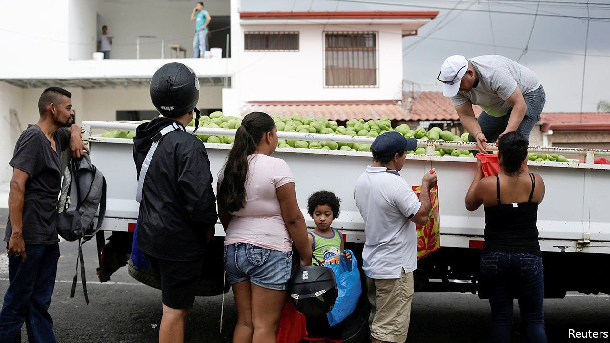
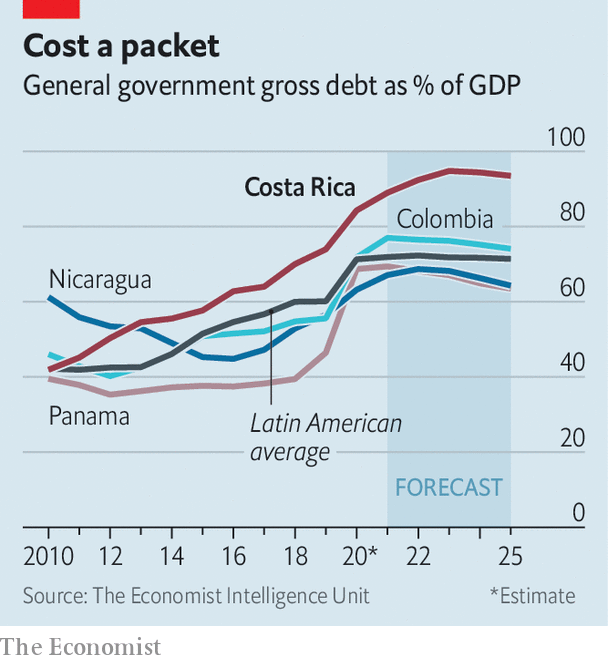

###### No longer top of the class

# Costa Rica is struggling to maintain its welfare state 

##### The covid-19 pandemic has turned unsustainable generosity into a debt crisis 

 

> Apr 15th 2021 

A NEW BUILDING at Hospital México, a public clinic in a quiet neighbourhood of San José, Costa Rica’s capital, would not look out of place in most rich countries. Behind its quiet exterior lies a bigger story. Excellent health care, free to all at the point of service, is one reason Ticos—as Costa Ricans are known—and their neighbours talk of the country’s exceptionalism. In Central America public services tend to be poor, patchy or absent altogether. By contrast all Ticos get state pensions. When they turn on the tap, drinkable water comes out.

Now the pandemic has turned what was already unsustainable into a debt crisis. Even before covid-19 the country of 5m had the third-highest government debt in Latin America and the highest interest payments. But last year its economy shrank by 4.5%, partly thanks to a reduction in tourism, while the fiscal deficit rose to 8.1% of GDP, up from 6.7% in 2019. Public debt has reached 68% of GDP. Unemployment has risen to 18%, from 12% last year.


The country has lurched from one fiscal crisis to the next for years, but the scale of this one prompted the government to agree, in January, to a loan from the IMF of $1.8bn, around 3% of GDP. It is dependent on a package of reforms which must be enacted in the coming weeks. The most controversial part of the deal, currently being debated by congress, is to reform public employment. The government spends more than half of its revenues on salaries for its workers, the highest share in the OECD, a club of rich countries that Costa Rica is in the process of joining. Public-sector pay is lavish: teachers in state schools make, on average, more than twice as much as their peers in private ones.

Much of this is thanks to top-ups to public-sector wages. A pay bump for getting married has been abolished, but others, such as for working in hot conditions, remain. The bill would cut these and instead pay a single salary. No one would be allowed to earn more than Carlos Alvarado, the president, as 2,200 of the 305,000 state workers currently do. Mr Alvarado says the IMF deal “is not only a fiscal discussion, it's a matter of equality”.

 


It is, however, controversial. “The social state is slipping away through our fingers like water,” claims Albino Vargas, the head of ANEP, a union that represents 17,000 public and private workers. Last year protests derailed talks for a loan.

By contrast, this deal is likely to pass. Many reforms have been toned down—for example, the measures to increase revenues, such as by raising a consumer tax, have been removed. The focus is on reducing spending, mainly through lowering the cost of state employees. Indeed, the most accurate criticism is that the deal is too timid. Past governments only took small steps to stave off sovereign default, says Kevin Casas, a former vice-president. This one is no better.

The true risk to the welfare state comes not from this deal, but from the lack of deeper structural change. That unhappy task will fall to the next government (elections are due in ten months). Mr Alvarado is weak; his party holds only 10 of 57 seats in the legislature. His government previously enacted a tax reform and a cap on spending linked to debt and economic growth in 2018. The IMF deal may merely be setting the scene for more to come.

Such reforms are urgently needed. The quality of public services is deteriorating. Costa Rica spends fully 7% of GDP on education, the highest share in the OECD after Scandinavian countries. Despite this it ranks second-lowest of the club’s members in the PISA rankings, which test the skills of 15-year-olds, just above Colombia.

Much could be achieved while still preserving the welfare state, thinks Juan Carlos Hidalgo, an analyst who is running for Costa Rica’s congress next year. Cracking down on tax evasion would help, as would raising taxes. Some state monopolies could be sold off. But without major changes, the country risks becoming more like its neighbours. For many Ticos, that is not nearly good enough. ■

