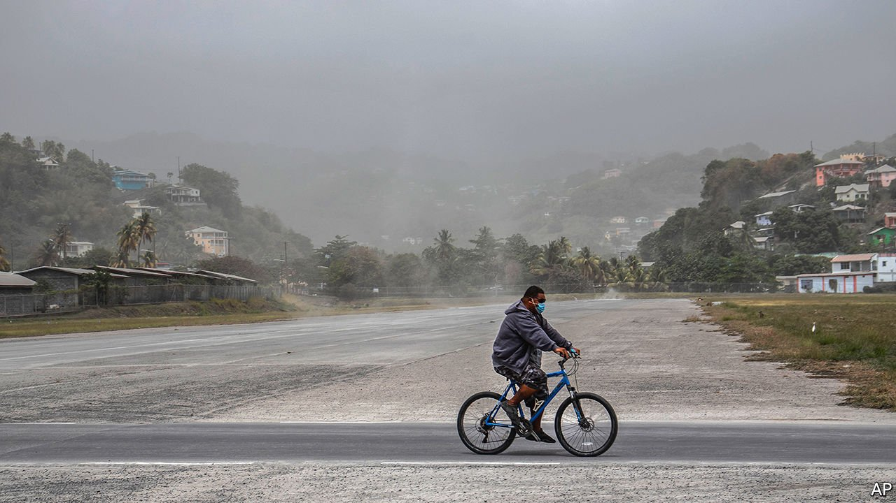

###### Bubbling up

# The Soufrière volcano is creating chaos in St Vincent 

##### Some 16,000 people have been evacuated from the danger zone 

 

> Apr 17th 2021 

ON APRIL 9TH the Soufrière volcano on St Vincent spewed a cloud of ash 10km (six miles) high. Over the following days there were further explosions.Some 16,000 people have been evacuated from the island’s northern region. No deaths have been reported. But even in the southern safe zone, life is tough. Volcanic dust is everywhere. “My chickens are totally confused, they don’t know if it’s night or day,” says one islander.■

