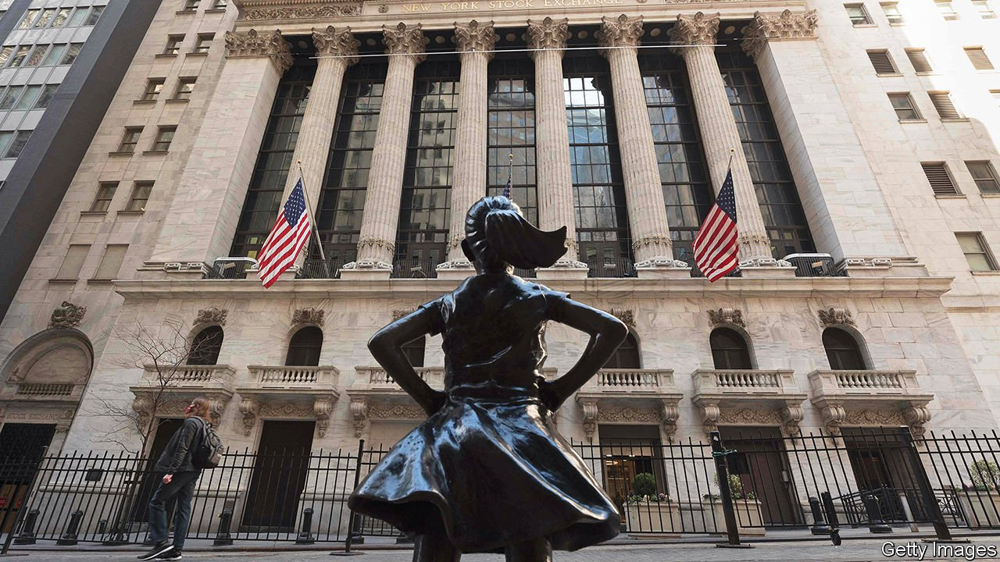

###### 

# Business this week 

#####  

 

> Apr 15th 2021 

 had a bumper first quarter, with profits and revenues beating analysts’ expectations. They were helped by frenzied market activity, such as the surge in special purpose acquisition companies (SPACs) and retail investing. And, thanks to America’s recovering economy, some banks were able to release funds that had been set aside to cover bad loans. JPMorganChaseand Goldman Sachs both reported record revenues. Returns on tangible common equity, a measure which compares profits to capital, jumped to 29% at JPMorgan and to 33% at Goldman. Wells Fargo posted strong results too.

 rose by 2.6% in the 12 months ending in March, compared with 1.7% in February. The jump was in part caused by the fact that inflation figures compare prices today with what they were a year ago. That was when the first covid-19 wave spread through the country, pushing down prices.


America’s budget deficit grew to a record $1.7trn in the six months since October. Federal spending soared last month, following the third round of stimulus payments aimed at boosting the economy.

Britain’s economy improved slightly in February as GDP grew by 0.4% compared with the previous month. The uptick was caused by a recovery in post-Brexit trade with the European Union and by businesses adapting to lockdown conditions.

The International Energy Agency revised up this year’s forecast for the growth in oil demand by 230,000 barrels a day to5.7m. The revision is the result of faster economic recoveries than previously expected, particularly in America and China.

Bernie Madoff, the former financial adviser, died aged 82. He was the mastermind behind the world’s biggest Ponzi scheme, which defrauded investors out of $19bn. He died in a federal prison in North Carolina while serving a 150-year sentence.

Wed at last

After a long and bitter battle, Suez and Veolia, two French water companies, agreed to merge. For months Suez’s board resisted the tie-up. But a higher bid that values Suez at €13bn ($15bn) helped secure the deal. The transaction will create a giant in the water industry with revenues of €37bn. Both companies’ share prices rose by nearly 10%.

Microsoft said it will buy Nuance, a voice-recognition technology company, in a deal worth $20bn. It is . It bought LinkedIn, a professionalsocial network, in 2016.

Chinese regulators ordered Ant Group, a fintech giant, to restructure and to cut the “improper” links between its financial products and its payment platform. Investors welcomed the end of the uncertainty. In November regulators abruptly halted the group’s listing in Shanghai, just days before it was set to raise almost $40bn.

Kurumatani Nobuaki resigned as the boss of Toshiba, a Japanese conglomerate which has been beset with accounting scandals and a disastrous acquisition. The company said the decision was made for personal reasons and was not linked to a recent takeover bid launched by CVC, a European private-equity firm. The bid reportedly caused a split among senior management. KKR, another private-equity group, and Brookfield, an asset manager, are also said to be preparing bids.

General Motors said it would temporarily shut down more factories in America, as a global shortage of semiconductors continues to bite. The move follows similar announcements by other major carmakers. Bosses say the shortfall could last several more months.

, an exchange for digital currencies, listed on the Nasdaq stock exchange. It is the first cryptocurrency firm to go public. It closed its first day of trading down 14% with a market capitalisation of $65bn. The offering coincides with a cryptocurrency surge. The price of Bitcoin rose to a record high of over $64,000, doubling since the start of the year. The price of Ethereum, a smaller cryptocurrency, has also reached a record high.

Grab, a Singapore-based digital firm,said that it will also list on the Nasdaq but that it will do so through a SPAC. The deal values the company at almost $40bn, making it the biggest SPAC listing to date. Grab started life as a taxi-hailing app but has added many services, such as food deliveries. Investors view it as a thriving “super-app”.

Domino’s, a fast-food company, has teamed up with Nuro, a robotics firm, to trial autonomous pizza delivery. In a neighbourhood in Houston some customers can opt for their food to be delivered by a small self-driving car, called R2. Once it arrives, customers enter a code into a touchscreen, the car door swings open and dinner is served.

