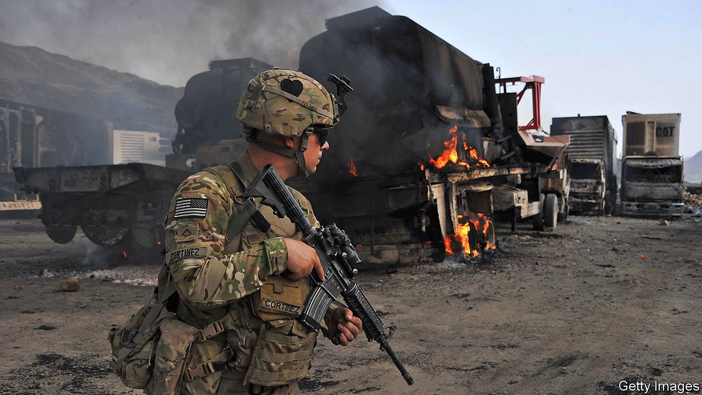

###### 

# Politics this week 

#####  

 

> Apr 15th 2021 

President Joe Biden set September 11th as the day by which . Without their support, other NATO forces are also expected to withdraw. It is not clear how much help the US will now give the elected Afghan government to hold off the Taliban, a jihadist group that seized power in the 1990s and hopes to do so again.

Russia massed more troops along its . A similar build-up in 2014 preceded the annexation of Crimea and the invasion of the south-eastern part of the country. Mr Biden called for a summit with Vladimir Putin, his Russian counterpart, to discuss the situation.


Germany’s ruling  were locked in a bitter row over whether Armin Laschet, the leader of the Christian Democratic Union, or Markus Söder, leader of the Bavaria-based Christian Social Union, should be their joint candidate in the general election due in September.

Boris Johnson, Britain’s prime minister, ordered an investigation into lobbying by David Cameron, one of his predecessors, on behalf of , a collapsed financier. Mr Cameron denied breaking any rules, but admitted he should have used formal channels to contact ministers.

Protesters in Minneapolis clashed with police over several nights after . The chief of police said he believed that Kim Potter mistakenly drew her gun instead of her Taser before shooting Daunte Wright. Ms Potter was charged with second-degree manslaughter.

Hundreds of celebrities, bosses and  signed a statement condemning voting restrictions. They were responding to the American state of Georgia’s new voting law, which critics say would make it harder for black people to vote. Mr Biden has called the rules “Jim Crow in the 21st century”; his predecessor Donald Trump wants a boycott of “woke” firms that speak out against them.

Guillermo Lasso, a conservative ex-banker, unexpectedly won . Mr Lasso, who barely scraped into the initial run-off, has promised to reduce the pay disparity between men and women, to feed chronically undernourished children and to fix Ecuador’s incompetent public-health system.

Pedro Castillo, a leftist teacher, came out on top in the first round of , but did not win a majority of votes. He will face Keiko Fujimori, the daughter of Alberto Fujimori, a jailed former president, in a run-off in June.

Brazil’s Senate took the first step towards a congressional inquiry into President Jair Bolsonaro’s handling of the covid-19 pandemic, which has killed more than 350,000 Brazilians. A committee will submit a final report to the federal prosecutor’s office, which will consider any possible criminal acts.

Blaise Compaoré, who ruled Burkina Faso for 27 years, is to be tried for the murder of his predecessor, Thomas Sankara, who was killed in a coup in 1987. The trial will proceed without Mr Compaoré, who has been in exile in Ivory Coast since he was swept from power by protests in 2014.

Mohamed Abdullahi Mohamed, the president of Somalia, signed a law extending his term in office by two years after failing to hold elections before the expiry of his mandate in February. Donors, who pay for much of the government’s budget, oppose the move.

Patrice Talon, the president of Benin, won a second term in office after an election marred by violence and in which popular opposition figures were barred from running.

Iran accused Israel of sabotaging one of its most important . Explosives destroyed thousands of centrifuges, which are used to enrich uranium, a nuclear fuel. Iran said it would replace the machines and start enriching uranium to 60% purity, closer to levels suitable for a bomb. The moves complicate talks in Vienna to revive the multinational deal that limited Iran’s nuclear programme.

Egypt impounded the container ship that blocked the Suez Canal last month and reportedly demanded that its Japanese owner pay $900m (£652m) in compensation. The Ever Given became stuck in the waterway after running aground amid high winds and a sandstorm.

An election in Samoa delivered a surprise result. The ruling Human Rights Protection Party, which has run the country with little opposition since 1982, tied at 25 seats with the new Fa’atuatua i le Atua Samoa ua Tasi party.

Voters backed a referendum granting Sadyr Japarov, Kyrgyzstan’s president, greater powers. Turnout was low. Among other changes, the cabinet will now answer to the president’s chief of staff.

Gao Fu, a senior Chinese health official, appeared to admit that Chinese covid-19 vaccines were not terribly effective, and suggested that they might be made more so by combining them with other jabs. He later said his words had been misinterpreted.

Coronavirus briefs


Official daily infections hit a record 185,000 in India. Meanwhile, millions of people gathered for a Hindu festival, thousands of whom have tested positive for the virus.

America, South Africa and Europe suspended the roll-out of the one-shot Johnson &amp; Johnson jab after six vaccinated women developed blood clots.

The Centres for Disease Control urged Michigan’s governor to impose a lockdown to curb the spread of the disease in the state instead of relying on vaccines.

Shops, hairdressers and gyms re-opened in England following a lockdown. Beer-lovers braved a cold spell to enjoy a pint at pubs with outdoor seating. The government has hit its target of offering a vaccine to high-risk groups and everyone over 50. Daily deaths from the disease have plummeted from more than 1,000 to a few dozen.

