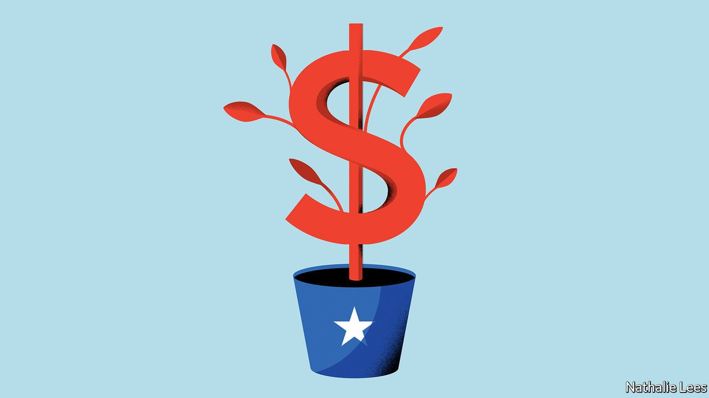

###### State economies

# How some American states’ finances have survived the pandemic 

##### The disaster that wasn’t 

 

> Apr 17th 2021 

LAST MAY California readied itself for budgetary disaster. State officials, forecasting dire impacts from the pandemic, projected that the state deficit would grow to $54bn over the coming fiscal year. That year has now come and gone, and California instead has a $15bn surplus, equivalent to about 7% of its budget for 2020. It is so flush with cash that its constitution obliges it to put some away for a rainy day.

California is not alone in defying gloomy projections. In 22 American states, revenues in 2020 were higher than in 2019. Several now have budget surpluses. The governor of Idaho, which is celebrating a historic surplus, plans tax cuts. Utah will spend some of its windfall on transport infrastructure. Vermont intends to boost higher education and broadband internet.


What has gone so right? Sound fiscal stewardship, federal aid, diversified economies and progressive tax systems have all played a part. But the recent downturn has also been a very unusual one.

In recessions, business income typically falls and stockmarkets plunge. States with the most progressive income taxes, which rely more heavily on high-earners for revenue, tend to be worst hit. During covid-19 they have instead been better off. After a sharp fall, corporate profits recovered to record highs. The stockmarket has soared. And high-earners have been largely insulated. This has enabled states to continue counting on their tax dollars.

Early action by the Federal Reserve to shore up capital markets was key, says Jared Walczak of the Tax Foundation, a think-tank. Federal stimulus propped up incomes, kept businesses afloat and reduced unemployment. Americans unable to spend on travel or services instead splurged on physical goods. Consumer spending rebounded. That money flowed back into state coffers via sales taxes. A Supreme Court ruling from 2018 helped: the decision in South Dakota v Wayfair made it easier for states to collect sales tax from the online retailers to whom homebound shoppers flocked in (virtual) droves.

Some states were more prepared than others. The amount they had put away for a rainy day varied dramatically at the start of the pandemic. Illinois and Kansas had saved almost nothing. New York’s piggy bank amounted to about 3% of its budget. California, which had stashed away 13%, was able to cushion the pandemic’s blow, possibly saving public-sector jobs.

Luck played a role as well. California has had the good fortune to be home to nine of the 37 billion-dollar IPOs in fiscal 2020. States that rely on revenue from limited sources, such as tourism or mining, have suffered more than those with more diversified economies. Wyoming, which prudently had a full year’s worth of cash in its rainy-day fund, is nonetheless reliant on its energy sector. It was hit hard by falling oil and gas demand and has experienced one of the worst drops in revenue.

For this reason, says Kim Rueben of the Urban Institute, another think-tank, the pandemic is a good argument for targeted federal relief. “We don’t expect states to plan for a once-in-a-lifetime global pandemic,” agrees Mr Walczak, who nonetheless frets that the most recent injections of federal aid are now outstripping local need. The new worry may not be states’ penury but federal profligacy. ■

Dig deeper

All our stories relating to the pandemic and the vaccines can be found on our . You can also listen to , our new podcast on the race between injections and infections, and find trackers showing ,  and the virus’s spread across  and .

