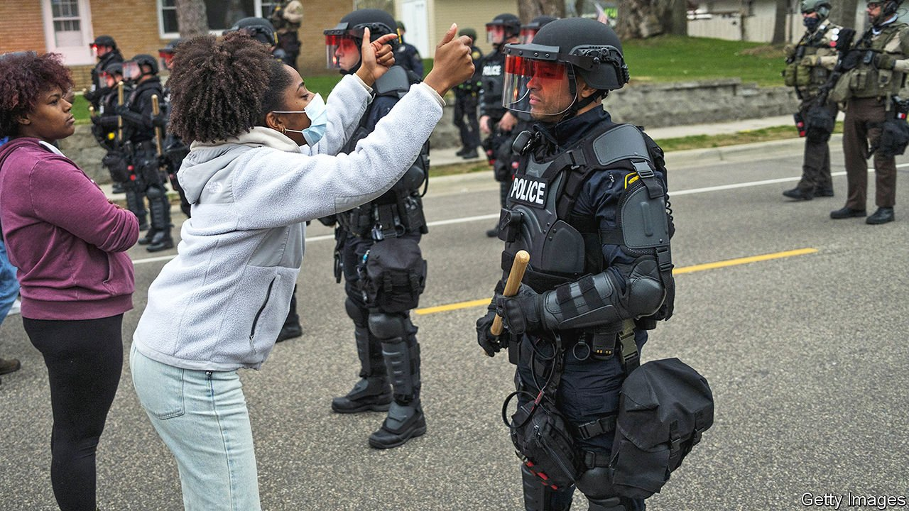

###### George Floyd’s legacy

# Police-reform legislation is spreading in America 

##### But Minneapolis is once again tense after police kill another black man 

 

> Apr 15th 2021 

BLOCKS AWAY from where George Floyd died under a Minneapolis police officer’s knee almost a year ago sits a brick building with one side painted purple, decorated with sunflowers and the words, “You changed the world, George.” That is not just an affectionate farewell. Since Floyd’s death, numerous jurisdictions have passed measures that change how police operate, including laws requiring de-escalation, limiting the use of force and banning chokeholds.

Most recently, on April 10th, Maryland’s Democrat-dominated legislature overrode the veto of its Republican governor, Larry Hogan, to pass a police-reform bill. It repeals the state’s Law Enforcement Bill of Rights, which afforded officers extra due-process rights for internal-misconduct investigations. Around 20 states have similar laws (Maryland’s was the first), which often require that officers be informed of complaints and complainants before questioning, that they be punished within 100 days of any alleged misconduct, and that departments pay suspended officers’ salary and attorneys’ fees.


Maryland’s new legislation also limits the use of no-knock warrants, expands access to disciplinary records and establishes a “necessary and proportional” use-of-force policy. Police who violate this and kill or seriously injure someone are liable to ten years in prison.

Three days earlier, New Mexico became the second state (after Colorado) to ban “qualified immunity”—a judicial doctrine that provides officers expansive shields against civil liability for violating people’s rights. It has also become the 18th state to legalise cannabis use, which removes a major driver of arrests. Nevada may ban traffic-ticket quotas and require de-escalation before using force.

Police behaviour is changing. Cynics may dispute this, pointing to the shooting of Daunte Wright, a young black man killed by an experienced officer who mistook her gun for her Taser, in Brooklyn Center, near Minneapolis, on April 11th. His death sparked several nights of protests. Yet rather than rationalising or stonewalling, Brooklyn Center’s police chief quickly released footage of the shooting. He has also resigned, and the officer who killed Mr Wright has been charged with manslaughter.

