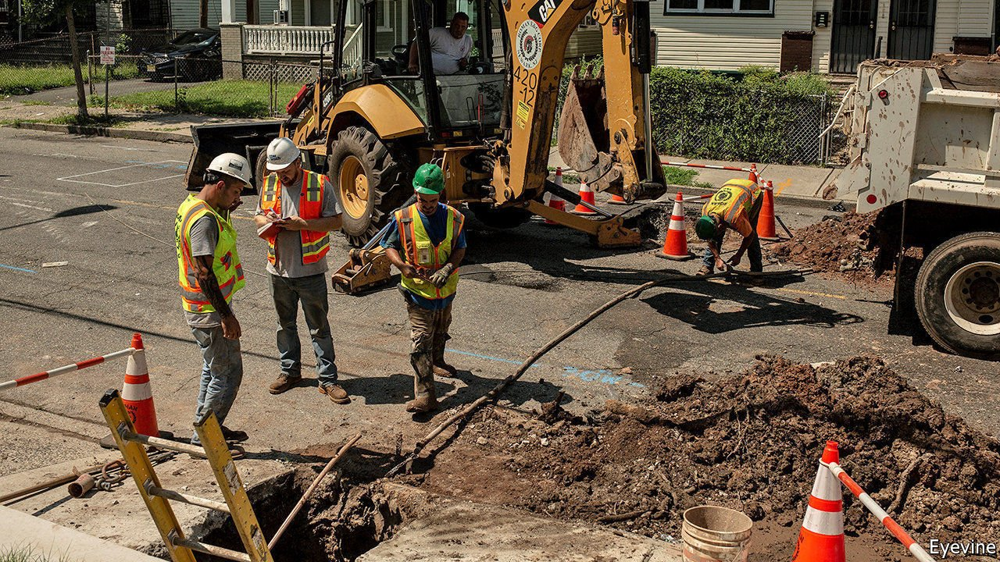
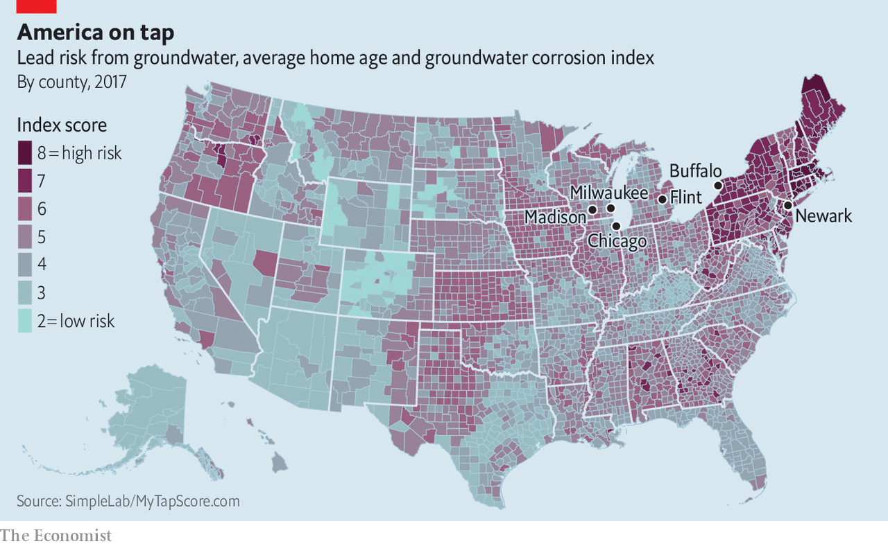

###### Safe drinking water

# Replacing lead pipes—a Newark success story 

##### Can it serve as a model? 

 

> Apr 17th 2021 

FOR TWO years the streets of Newark have been a mess. Residents endured road closures and loud noise. New Jersey’s largest city has been replacing 18,500 dangerous lead service pipelines, more than half of all those connecting homes to the main water line. The replacement is nearly done. The speed is remarkable: government guidelines until recently gave American cities up to 33 years to replace lead pipelines. But Newark could not afford to wait.

Lead is highly toxic and can cause a host of health problems, including heart disease and infertility. It harms children’s developing brains, raising the risk of cognitive and behavioural problems. New Jersey began requiring major water systems to increase testing in the wake of the water crisis in Flint, Michigan, which did not treat water properly, exposing it to lead.


The lead levels in Newark were appallingly high. The Natural Resources Defence Council (NRDC), an environmental group, and NEW Caucus, made up of Newark teachers, sued the city and state in 2018 for failing to act quickly and for violating the federal Safe Drinking Water Act. By the summer of 2019 thousands of residents were told not to drink the tap water.

All 50 states have lead pipes. As many as 10m homes rely on them for their connections to the main water-supply lines. New lead pipes were not banned federally until 1986. Newark did so in 1953.

Old cities tend to be particularly plagued by pipes, some dating back a century, which were not maintained (see map). Chicago has more lead water lines than any other American city; it is substituting them at a snail-like pace of fewer than 800 a year. In Milwaukee, replacement will take decades at its current rate. Buffalo has about 100 miles (160km) of lead pipes delivering water to residents. It replaced 400 lines last year. Madison was ahead of the curve. It began removing its lead pipes in 2001, and took more than a decade to finish.

 


Swapping lead for copper pipes is expensive: it can cost between $5,000 and $11,000 to replace one pipe. Joe Biden’s “American Jobs Plan” released last month should help. He is calling for $111bn in water infrastructure, with $45bn to eliminate all lead pipes and service lines.

Erik Olson, of the NRDC, who flagged Newark’s lead problems in a report in 2003, now says Newark could be a model for other cities. “We’ve had our scraps with the city,” he says, “but they have turned things around.” The NRDC and NEW Caucus settled their lawsuit with Newark in January. But most cities bicker over cost and access.

Ras Baraka, Newark’s mayor, wanted to act fast, but lacked money. Joe DiVincenzo, the county executive of surrounding Essex County, offered to help. He used the county’s triple-A bond rating to raise $120m.

The city’s water department and its subcontractors soon blanketed Newark. A city ordinance allowed workers to replace pipes without the homeowners’ permission. (Three-quarters of Newark residents live in rented space, and tracking down landlords would have held things up.) Kareem Adeem, the head of the water department, says that had it not been for covid-19 the project would have gone even faster. It has been done not only at high speed but also at low cost—roughly $7,000 per line.

Yvette Jordan, a teacher, who was part of the NRDC lawsuit, commends the city for its swiftness, but she says that, had Newark residents not protested and had she not filed suit, Mr Baraka would not have acted as he did. Many residents do not yet trust what comes out of their taps and still buy bottled water for drinking and brushing teeth. Others go to Water Boxes, filtration machines operated by the Newark Water Coalition, an activist group, for their weekly supply. Mr Baraka says: “You don’t have to take the mayor’s word for it. Just test it for free and you’ll know.” ■

