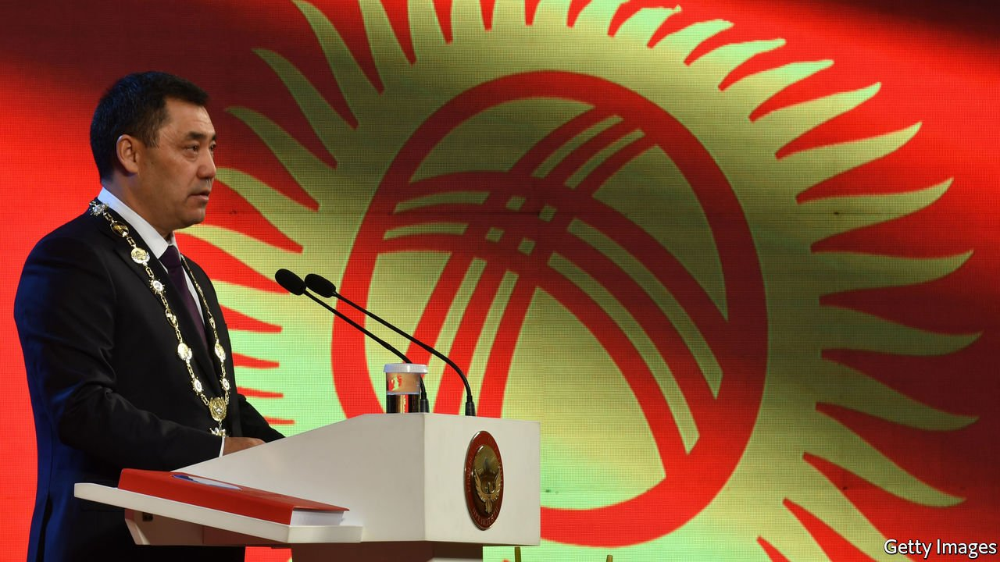

###### Back to the khanate?

# Kyrgyzstan votes for strongman rule 

##### The new president wins worryingly wide powers 

 

> Apr 24th 2021 

NO ONE CAN accuse Sadyr Japarov, the president of Kyrgyzstan, of lacking ambition. Sprung out of prison and into office during political unrest six months ago, he has now won a popular mandate to grant himself unchecked powers as he redesigns the Central Asian country’s political architecture. On April 11th, three months after his landslide victory in a presidential election, a thumping majority of voters—79%—endorsed a constitutional blueprint granting him overweening powers, albeit with a turnout of just 37%.

The new arrangements do away with the parliamentary system introduced after Kyrgyzstan’s second post-Soviet revolution in 2010 to safeguard against strongman rule. Henceforth the president will make all important political and security appointments and control a cabinet headed by his chief of staff, with the post of prime minister scrapped. He will be able to dabble in parliamentary and judicial business, appoint judges and propose legislation to an emasculated parliament. It will function in an awkward tandem with the “People’s Kurultai”, an as yet undefined new assembly that may be able to bypass parliament.


A country that has toppled three presidents in revolutions since 2005 needs a firm hand to steer it back to stability, argues Mr Japarov. “I’m for presidential rule,” explains a pensioner playing with his grandchildren in a leafy park in Bishkek, the capital. “If there’s one boss, you ask him. When there are a hundred bosses, you don’t know where to turn.”

But one man’s firm hand is another’s iron first. Despite the turbulence of the past two-odd decades, Kyrgyzstan has been the most democratic of the five post-Soviet Central Asian countries. “A khanate is not for us,” says Askar Kerimbekov, a lawyer who voted against the changes. “This ‘khanstitution’ cannot be adopted,” railed an MP, Dastan Bekeshev, in an impassioned speech in parliament, using a derogatory nickname for the amended constitution. He warns against a “usurpation of power” as strongman rule returns.

Seemingly intent on confirming his critics’ fears, Mr Japarov’s first move after the referendum was to put his health minister in front of the cameras to promote a miracle cure for covid-19 espoused by the president. Gulping down a concoction of wolfsbane, a poisonous root, the minister acknowledged it could cause “spasms and death” if misused.

Elected to serve a single six-year term under the old constitution, Mr Japarov may hope to remain in office for over a decade by invoking a new provision that allows leaders two terms of five years. He declares, among other things, that he will eradicate organised crime, which has become pervasive. That pledge was seemingly called into question, however, when Raimbek Matraimov, a former top customs official detained over allegations—which he denies—that he was the kingpin behind a massive smuggling ring, walked free without charge after the referendum.

Mr Japarov denies that he is making a grab for total power. He is no autocrat in the making but a democrat determined to “learn the lessons of history”, he told The Economist in January. “If we have seen revolutions happen before our eyes three times, because of the injustice of the rulers, why would I repeat those mistakes?” He promises to usher in an era of stability.

For the time being, most Kyrgyz appear to be staunchly behind Mr Japarov, seeing him as a breath of fresh air compared with the venal political class that has been running the show. A recent poll identified him as Kyrgyzstan’s most trusted politician, and revealed that 70% of citizens are optimistic about their country’s trajectory, jumping upwards from just 41% before he came to power. But as Mr Japarov acknowledges, he had better deliver or his long-suffering people will turf him out. “He’s promised a lot,” says an admirer who voted to give him these all-encompassing powers. “They always promise a lot, but nothing gets done. If he doesn’t deliver, he’ll be overthrown like the others.” ■

