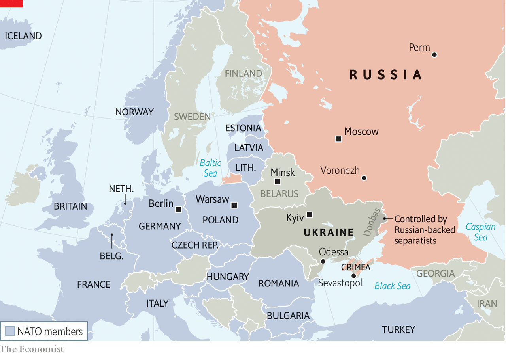

###### Something is rotten

# Vladimir Putin is growing ever more repressive as he loses support 

##### The Russian president has only one goal: his own survival 

 

> Apr 24th 2021 

THE TENS of thousands of young people who marched through Moscow’s city centre on April 21st were peaceful and cheerful, even if they were calling their president, Vladimir Putin, a killer. They were smiling as they demanded freedom, perhaps relieved not to be beaten or arrested by the riot police who watched. A timid sense of spring filled the air.

They were there in support of Alexei Navalny, Russia’s leading opposition politician, who is in prison and on hunger strike. Stanislav, a university student who did not give his last name for fear of being expelled, had been terrified of joining the protest. But the prospect of walking with others like him, of feeling part of a “political nation”, brought him to the streets. He, like others, expected the worst.


They had every reason to. In recent days Mr Navalny’s closest associates have been arrested. The editors of a student magazine that expressed support for him have been detained. Police have been knocking on the doors of those spotted at earlier rallies to issue warnings. Students who have shown support for the dissident have been threatened with expulsion or fines.

Mr Navalny would surely have been pleased that so many overcame their fear. His career has been a crusade against apathy and learned helplessness. But though the marchers seemed almost resigned to being arrested en masse, Mr Putin did not play to their expectations. He did not wish to spoil the impression of his own state-of-the-nation speech earlier that day, in which he handed out promises and perks.

Behind the façade of benevolence is only menace. Mr Putin is terrorising his opponents and threatening his neighbours. He has locked up Mr Navalny in one of Russia’s harshest penal colonies and denied him medical care. Mr Navalny has written on Instagram (through his lawyers) that his hunger strike has turned him into “a skeleton, staggering around his cell”, enough to scare children into eating their porridge.

Most of Mr Navalny’s closest allies have been detained or have fled abroad. His political organisation faces liquidation. On April 21st, as Mr Putin addressed the nation, his security goons were whisking away those of his opponents who had not yet left the country. One cameraman, who worked on the investigations into graft with which Mr Navalny shamed Mr Putin, faces two years in prison for a tweet. Even Vladimir Ryzhkov, a veteran Russian liberal politician who was not part of Mr Navalny’s movement, was detained.

The stakes could not be higher, Mr Navalny’s people said. They called the protest not just to save Mr Navalny’s life, but to prevent Russia from sliding into terror. “If we keep silent now, Russia will descend into complete darkness,” declared Mr Navalny's team on YouTube.

Just a year ago this claim would have seemed hyperbolic. But Mr Putin’s regime has been growing ever more lawless, concentrating power in the hands of security services whose main preoccupation is eliminating any threat to the president and his cronies. “We are seeing a rapid resurrection of neo-Stalinism and its ideology of state terror, directed both against its own citizens and the outside world,” said Kirill Rogov, a Russian political analyst.

The transformation began last March, when Mr Putin scrapped term limits that would have forced him to stand down as president in 2024. That move hinted at the president’s belief that the regime cannot survive without him—and that he cannot survive without it. The prospect of a peaceful transfer of power seems increasingly improbable. He and his cronies have a single goal: his survival. They fear losing their wealth, freedom and possibly more, were Mr Putin to lose his grip on power.

Mr Putin witnessed the danger of a popular revolt when protests erupted last August in Belarus, after Alexander Lukashenko, the country’s dictator, stole an election. That uprising lacked a single political leader: Mr Lukashenko jailed his opponents or drove them out of the country. In Russia, by contrast, the opposition had a focus. Mr Navalny, who cheered the Belarus rebellion as a harbinger for Russia, was gaining support. The Kremlin was rattled. Just a few days after the protests started in Belarus, while Mr Navalny was campaigning in Siberia, Russian security agents poisoned him with Novichok, a nerve agent.

What a worthy man

Mr Navalny fully expected to be imprisoned or worse when he returned to Moscow, on January 17th, after his recovery in Germany. A judge swiftly jailed him for supposedly violating the terms of his parole, itself the result of a trumped-up conviction in 2014. Far from solving Mr Putin’s problems, imprisoning Mr Navalny has boosted his moral authority, radicalised the political situation in Russia, further undermined the president’s legitimacy and left Mr Putin with few good options.

Though Mr Navalny has never been allowed to register a political party or participate in presidential elections, he is now the only credible opposition in Russia. He has built a formidable political machine with some 37 regional headquarters across the country. Financed largely through crowdfunding, it has 250 permanent staff and thousands of volunteers. Mr Navalny also set up an anti-corruption foundation that is behind his explosive investigations, including of a billion-dollar secret palace alleged to have been built for Mr Putin.

The Kremlin used to harass Mr Navalny’s supporters. Now it is steamrollering his movement. State prosecutors are demanding that Mr Navalny’s anti-corruption foundation and his network of regional headquarters be outlawed as “extremist organisations”, equating them with Islamic State and al-Qaeda. On April 26th, behind closed doors, Moscow’s court will consider the prosecutors’ lawsuit. They say Mr Navalny’s organisation works in the interests of foreign states and is plotting a “colour revolution” in Russia—a fear that has haunted the Kremlin since the uprisings in Georgia and Ukraine in the 2000s. The court’s verdict is in little doubt, which means anyone working or volunteering for Mr Navalny could face criminal charges.

The Kremlin rationalises its domestic repression by portraying Mr Navalny as part of a Western plot to discredit Mr Putin. “Russia is under frontal attack from the West. The United States is our enemy and does everything in its power to undermine Russia’s position on the international stage,” Sergei Riabkov, Russia’s deputy foreign minister, declared recently.

The real reason for Mr Putin’s repression is that he and his party are losing support. With parliamentary elections due in September, approval ratings for his United Russia party have sunk to 27%. Trust in the president is slipping too. And the popularity of other opposition parties, however slight, is rising along with an appetite for economic protest. Mr Putin risks having to rig the results so outlandishly that his position could be even more discredited.

What makes that risk so acute is Mr Navalny’s strategy of “smart voting”. Unable to register his own party, Mr Navalny has called on his supporters to vote for whoever is best placed to defeat the Kremlin’s candidate, no matter which party they represent, nor how uninspiring or unpalatable they might be. The Kremlin has threatened to brand anyone supported by Mr Navalny’s smart voting a “foreign agent”.

The persecution of Mr Navalny is occurring during Europe’s worst military crisis since Russia invaded Ukraine, annexing Crimea, in 2014. Russia has built up more than 100,000 Russian troops around eastern Ukraine and in Crimea since March.

A major Russian camp has been established at Voronezh, 200km (125 miles) from the Ukrainian border (see map), but the “central focus” now appears to be farther south in Crimea, says Dara Massicot of the RAND Corporation, a think-tank. On April 22nd Sergei Shoigu, Russia's defence minister, said that the troops would begin returning home the following day. How many will actually leave remains to be seen; Russia has left behind sizeable forces after similar movements in the past.

 


Russia’s aim in amassing so much firepower was probably to squeeze Volodymyr Zelensky, Ukraine’s president. Mr Zelensky has clamped down on pro-Russian media outlets and oligarchs in recent months, to the Kremlin’s frustration. He has also resisted granting autonomy to Russian-backed separatists in the Donbas region of eastern Ukraine. In recent weeks, sniper fire against Ukrainian forces has risen markedly while drones operated by the Organisation for Security and Co-operation in Europe, which monitors the shaky ceasefire, have been jammed.

Mr Putin cannot risk a war that would produce heavy Russian casualties. But he desperately needs some form of victory to boost his standing. On April 14th William Burns, the director of the CIA and a former ambassador to Moscow, warned that the Russian mobilisation would suffice for “a limited military incursion”. One possibility, suggests Marek Menkiszak of the OSW think-tank in Warsaw, is “more firepower, more casualties and local offensives by separatists” in Donbas.

In his state-of-the-union speech, after rattling through a long list of giveaways to please domestic voters, Mr Putin turned to foreign policy. “The purpose of Russia’s policy is to ensure peace and security of our citizens,” he said. He blamed the West for all tensions. Gennady Zyuganov, the leader of the parliamentary Communist Party, has called on the Kremlin formally to recognise the separatists in Donbas, whom Russia has been arming and supporting since the start of the war in 2014.

If Mr Zelensky were to respond forcefully to such provocations, he would risk providing a pretext for a larger attack. Russia has issued over 200,000 passports to Russian-speakers in Donbas since 2019. On April 8th a Kremlin official warned that threats to those newly minted nationals could invite a war that “would be the beginning of the end of Ukraine”.

Ukraine is not the only potential trouble-spot on the former Soviet map. Belarus is another. In his state-of-the-union address, Mr Putin reiterated a conspiracy theory that America had plotted a coup and the assassination of Mr Lukashenko.

This story originated in Russia on April 17th, when Russia’s security services claimed to have foiled an American plan to kill Mr Lukashenko. Russian media amplified the message. In an “exclusive report” on state television, Dmitry Kiselev, a TV anchor who is Mr Putin’s propagandist-in-chief, said it was clear that Western intelligence planned to murder Mr Lukashenko, organise a military intervention and occupy symbolic places in Minsk, the capital.

Mr Putin chose to mention this bogus story on a telephone call to President Joe Biden two days later. Many experts worry that Mr Putin might treat the conspiracy theory as a pretext for tying Belarus into a tighter political and military union with Russia. Mr Lukashenko, who had earlier hinted at a major development by saying that he was making the most important decision of his three decades in power, is expected in Moscow on April 22nd.

This sabre-rattling forms part of a wider political crisis between Russia and the West. On April 17th the Czech Republic publicly blamed the GRU, Russia’s military-intelligence agency, for explosions at ammunition depots in 2014. A few days earlier, America imposed sanctions on Russia for a long list of transgressions, including the huge SolarWinds cyber-espionage campaign. In the space of less than a month, America, Bulgaria, the Czech Republic and Poland kicked out Russian diplomats suspected of being spies, prompting retaliatory expulsions by Russia.

Though the immediate crisis may have passed with Russia's announced pull-back, Western officials are mulling how to respond to its muscle-flexing. American officials are considering whether to send more arms to Ukraine, on top of anti-tank missiles and counter-artillery radars sent in previous years. Allies are also discussing fresh sanctions. But as Mr Putin said in his speech, if the West were to challenge Russia and its (unspecified) red lines, it will be subjected to a Russian response that will be “swift, asymmetric and tough”. In Russia’s climate the smell of spring could be deceptive. ■

: This article was updated shortly after publication on April 22nd to report Russia's announced troop pull-back.

Dig deeper

 (Apr 2021)

 (Apr 2021)

 (Apr 2021)

