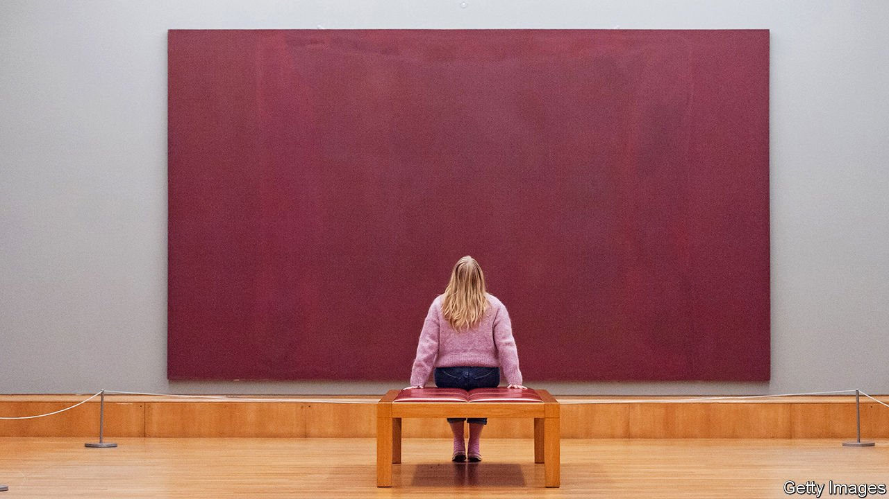

###### Empty halls

# British museums have suffered particularly badly during covid-19 

##### The funding system is to blame 

 

> Apr 24th 2021 

THE NUMBER of visitors to museums around the world collapsed last year. According to an annual survey published by The Art Newspaper last month, the biggest museums in America, Brazil, Greece, Israel, Italy, Japan, Mexico, Russia and Spain—as well as Britain—welcomed fewer than 20% of their usual numbers.

Many governments were quick to offer support. Germany, France and Britain all announced emergency funds of at least £1bn to help their culture sectors survive the catastrophic loss of income. Even in America, where public funding for cultural institutions is scarcer, the federal government earmarked $200m for museums under last year’s Coronavirus Aid, Relief and Economic Security Act. But the way British museums are financed means they have fared particularly badly.


German museums exist almost entirely on public funding that is parcelled out by the federal and state governments and by individual municipalities, which like to have their own museums, orchestras and opera houses. Last November the government approved a culture budget of €2.1bn ($2.5bn) for 2021—its highest ever, and an increase of 8% on 2020. Most museum funding in France is also public. Earned revenues—from donations, sponsorship, entrance fees, restaurants, shops and renting out galleries—rarely amount to more than 20% of a museum’s total budget.

American museums rely on philanthropy, encouraged by generous tax breaks; and in the giving business, there are plenty of takers. Aspiring trustees of the Metropolitan Museum must be ready to donate at least $25m in art or cash, according to a former director. An emergency whip-round for the Met raised $25m last year, and its $150m loss in 2020 is anyway manageable thanks to a $3bn endowment, which has benefited from the buoyancy of the stockmarket.

For the past 20 years, the British government has been reducing state support for culture, and encouraging museums, in particular, to become more self-reliant. In 2001 more than three-quarters of the British Museum’s budget came from the government. In 2019 only half did. Before the pandemic, the Tate galleries were raising £2 ($2.80) for every pound they got in state support. Expensive entry tickets and catalogues for special exhibitions, restaurants and cafés, shops, conference facilities and after-hours for private parties in galleries all helped bring in cash.

These were the areas most affected when the doors closed last spring. Tate welcomed just 600,000 visitors in the past year across its four museums, compared with more than 8m the previous year. Its earned income fell by 40% over the same period. According to a senior curator, its budget for 2021 is less than half of what it was two years ago. Other museums have fared even worse. Nearly two-thirds of the earned income of the Victoria &amp; Albert Museum vanished, as did nearly 90% of the Birmingham Museums Trust and the Royal Collections Trust.

Nor is the government willing to do much to make up the shortfall. Announcing the launch of the £1.57bn culture recovery fund in July 2020, Oliver Dowden, the culture secretary, boasted: “The government is here for culture and we have worked around the clock to get this record investment out to the frontline.” At the same time he was writing to museum directors, urging them to “take as commercially-minded an approach as possible, pursuing every opportunity to maximise alternative sources of income”. If they didn’t, he warned: “I will not be in a position to make the case for any further financial support for the sector.”

To get by, small, regional institutions, in Manchester and Birmingham, for example, are being flexible about opening hours and squirrelling away little pots of money from myriad different sources. Flexibility is harder for the big London museums. To plug the hole in its finances, the Royal Collections Trust, which looks after the queen’s artworks and official residences, and oversees visits to Buckingham Palace when it is open in the summer, took out a bank loan of £22m from Coutts, the queen’s bank. Its credit is sound and, presumably, it got a good rate. Still, it is unusual for a cultural institution to borrow commercially to cover operational losses.

Tate’s approach is more slash-and-burn, cutting staff and exhibitions. A fifth of its staff are taking voluntary redundancy. For the foreseeable future it will put on just half the number of exhibitions it did in 2019, and make more of its own collections to avoid costly transport and insurance charges for artworks borrowed from museums elsewhere. “Until then we are going to be a shadow of ourselves,” a curator says.

The V&amp;A tried a more ambitious plan. To save £10m in annual costs by 2023, it wanted to cut 140 jobs, in part by merging its many collections into three chronological departments, spanning the medieval to the contemporary, with another department focusing on digital art, design and performance, with a fifth one gathering together its sub-Saharan and Asian collections. The backlash was fierce. The museum was forced to back down. It is now unclear how it will fill the hole in its finances.

When the museums reopen on May 17th, the BM will treat visitors to a show on the 850th anniversary of the death of Thomas Becket, and the V&amp;A to a flashy show of Fabergé eggs, but neither will be able to pack people as they used to. Visitors will have to book a slot before coming; there will be no dropping in. The BM will admit only 2,000 people a day compared with an average of 15,000 in happier times. The big London museums’ business model depended on crowds. In the short term, and maybe beyond, they’re having to find other means of survival. ■

Dig deeper

All our stories relating to the pandemic and the vaccines can be found on our . You can also listen to , our new podcast on the race between injections and infections, and find trackers showing ,  and the virus’s spread across  and .

