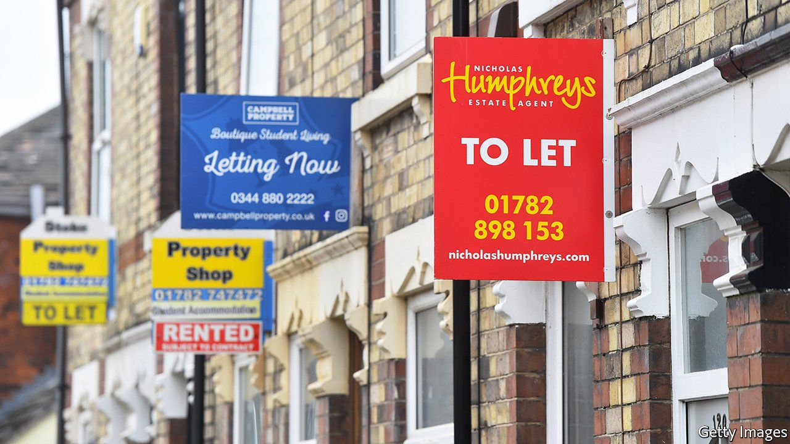
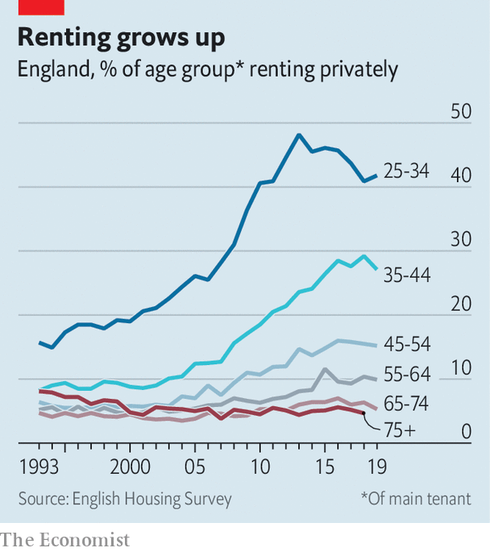

###### Housing

# When Britain’s Generation Rent retires 

##### People who never buy houses will become an expensive problem 

 

> Apr 24th 2021 

SINCE THE second world war, the housing market has, through three big shifts, come full circle. After the war, investment in council housing led to the rise of the social rented sector and the decline of the private rented sector (PRS). Then in the 1980s and 1990s, Margaret Thatcher’s government sold off council housing at a steep discount and made mortgages easily available, so home ownership rose. The PRS became a sort of housing-market waiting-room: a place where people spend a bit of time in their 20s before settling down, coupling up and moving on to home ownership. That changed in the 2000s and 2010s as soaring prices made it harder for people to buy homes, and the PRS was once more on the rise.

As the PRS has grown, so private renters have aged. In 2019 around a fifth of people aged 35-64 lived in the PRS in England, up from closer to a tenth a decade before (see chart). Today’s mid-career renters are likely to become tomorrow’s retired ones.


The welfare state is not set up to cope with such a shift. Only around one in 20 over 65s are now in the PRS. Most retirement-saving advice assumes that people own their homes. Workers are told that to maintain their current standard of living when they retire, they need a pension pot capable of providing around two-thirds of their old salary. But that assumes a sharp fall in housing costs as mortgages are paid off. Royal London, an asset manager, calculated in 2018 that the median worker required a pot of £260,000 ($363,000) to maintain their lifestyle if they owned as property but £445,000 if they were going to continue to rent. Most workers are on track to miss the first target, let alone the second.

 


Social housing used to provide an alternative but there is not much of it these days, so many future pensioners will need housing benefit to cover their rent. State spending on pensions and health care will rise as populations age. With renters getting older, either state spending on rent must rise too, or pensioners will get poorer.

This shift is tricky for the Tories. An ageing population helps them, because older people tend to vote Tory. But renters tend to vote Labour—even, it seems, when factors such as income are taken into account. Hence the Tories’ attempt to turn people into homeowners.

