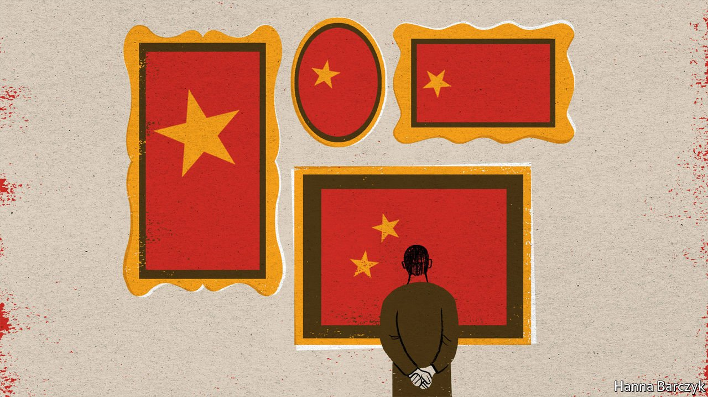

###### Chaguan

# A collection of Chinese contemporary art falls prey to politics 

##### It is part of the broader clampdown going on in Hong Kong 

 

> Apr 24th 2021 

CHINA’S LEADERS seem sure that innovation can co-exist with authoritarian rule. Their confidence looks more rational than it once did: Chinese firms dominate some high-tech fields. Still, they have to explain a counterpoint: when freedoms increased in China over the past 40 years, greater creativity always followed.

Uli Sigg, a Swiss businessman and diplomat, first reached China in 1979, as reformers began to dismantle the Mao-era planned economy. Later, he spent decades building an unrivalled collection of contemporary Chinese art. He was sent to China by Schindler, a Swiss manufacturer of lifts, for whom he established the first Chinese joint-venture with a foreign firm. Rather than a capitalist revolution, he describes years of caution, as entrepreneurs worried that open doors would slam shut. He recalls campaigns against Western “spiritual pollution” that frightened colleagues into ditching suits and ties and reverting to workers’ jackets in blue cotton. But time and again, opening sparked innovation.


An art-lover, Mr Sigg reached China during a brief moment of creative daring. Months earlier, avant-garde artists had staged an unauthorised show on the railings of the national gallery in Beijing, before police swooped. Soon afterwards their movement was pushed underground for much of the 1980s. Many were young, self-taught, and technically crude. Few ordinary Chinese saw their art. Yet those who did were visibly excited by its spirit. “Traditional art takes you to a sublime place and then you come back. Contemporary art changes you. It produces an openness; maybe it is stupid or aggressive. But that is the link to creativity,” explains Mr Sigg. Foreigners often assumed that artists were dissidents. In fact, after growing up amid the bossy propaganda of socialist realism—vast canvasses of dauntless workers, bumper harvests and benevolent leaders—many were tired of politics and content to share their work with a few elite insiders.

In the 1990s Mr Sigg set out to record this ferment, putting his own tastes aside to acquire hundreds of artworks as a public institution might. At one point he sought to preserve propaganda images that younger artists despised, though their aesthetic influence was obvious. He found former masters of socialist realism in dingy provincial apartments, and bought once-feted paintings now rolled up under their creators’ beds. These forgotten propagandists offered another lesson: skills prized in a closed system are little help when times change. An oddly poignant item in the Sigg collection is a very late work of socialist realism: a painting of Mao’s successor, Hua Guofeng, visiting North Korea in 1978, as doves flutter over his head. In its garish way it represents a peak of technical accomplishment, which soon became pointless as Hua was ousted and state-sponsored kitsch gave way to photography.

As Swiss ambassador to China from 1995 to 1998, Mr Sigg watched cultural bosses wrestle with the Western world’s excitement over Chinese avant-garde art, and with the same foreigners’ confounding lack of interest in state-approved paintings of flowers and birds. Later, some officials moved to harness the global renown of freethinking artists. Before Ai Weiwei became an exile excoriated by the Chinese state, he helped to design the Bird’s Nest stadium for the Beijing Olympics of 2008.

In 2010 museum bosses in Hong Kong approached Mr Sigg, after hearing that he hoped to donate his art to a public gallery in China. The government had a site to offer, a vast new harbourside museum in West Kowloon, known as M+. This enthusiasm for experimental art was not a sudden whim. Starting in 1998, Hong Kong’s leaders had publicly fretted that the city’s economic base, built around finance, logistics and an overheated property market, was dangerously narrow. Their solution came in three parts: strengthening Hong Kong as a financial centre, increasing ties to the mainland and promoting creativity. The first local leader after the end of British rule, Tung Chee-hwa, called for Hong Kong to become “the most cosmopolitan city in Asia”. He offered support for creative industries, buttressed by schools that would promote critical thinking via a new subject, liberal studies.

Mr Sigg warned Hong Kong officials about sensitive images in his collection. These include pictures of pro-democracy protests in June 1989 and one of Mao inspecting a urinal, in a homage to Marcel Duchamp. They were undaunted, asking why he would consider offering such works to mainland cities with strict censorship, and stressing Hong Kong’s artistic freedoms. In 2012 he donated 1,463 works, worth $160m, and sold the city 47 more.

The hunt for degenerate art

That was then. Now, liberal studies are blamed for inspiring Hong Kong’s young to join anti-government protests in 2019, and schools must offer lessons in loving China. On April 19th President Xi Jinping called for Chinese universities to produce students who are both curious and absolutely loyal to the Communist Party.

As for Mr Sigg’s collection, it is under fire from Hong Kong politicians seeking to prove their own loyalty. They accuse some images, notably one of Ai Weiwei giving the Tiananmen gate in Beijing his middle finger, of “spreading hatred” against China, in breach of a National Security Law passed last year. Hong Kong’s chief executive, Carrie Lam, pledges to be on “full alert” as M+ staff distinguish between artistic freedoms and national-security threats.

The opening date of M+ is unclear. Mr Sigg can only hope that no artists are banned, for without Ai Weiwei, a Chinese contemporary art museum “would have no academic credibility”, he says. Asked whether he regrets his gift to Hong Kong, Mr Sigg replies that he collected the artworks to save them for China’s people. He is sure they will all be shown one day, though he may not see it.

Perhaps China’s rulers are confident because the innovation they prize is technological, not cultural. Propaganda full of “positive energy” is creative enough for their needs. Hong Kong had its own artistic ambitions. But pleasing the party is the priority.■

