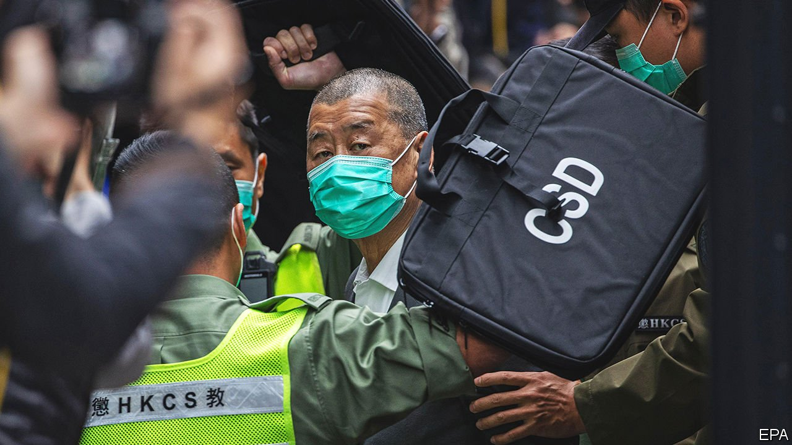

###### Hong Kong

# Leading democrats in Hong Kong are jailed 

##### Some of the territory’s most respected democratic activists fall foul of the National Security Law 

 

> Apr 24th 2021 

JIMMY LAI, publisher of the Apple Daily newspaper, was jailed for 14 months on April 16th for taking part in protests in 2019. His jailing, with other veteran activists, is part of a crackdown by China’s leaders. Martin Lee, known as Hong Kong’s “father of democracy” and Margaret Ng, a barrister, received suspended sentences. Mr Lai wrote to colleagues telling them to be careful because “freedom of speech is dangerous work now”.

