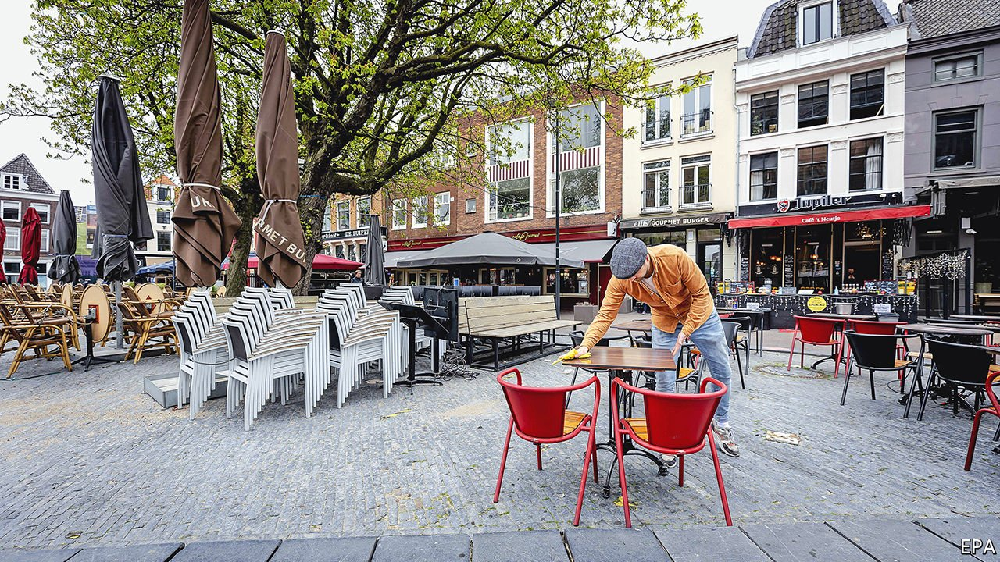

###### Terraced grousing

# A pricey rapid-testing programme rings alarms in the Netherlands 

##### Public procurement in the time of covid 

 

> Apr 22nd 2021 

SIPPING A BEER on a pub terrace may be the Netherlands’ holiest rite of spring. But the country’s grim incidence of covid-19, currently far higher than in Germany or Italy, has kept its pubs shut. As the weather has warmed, cries of “open the terrasjes!” have sounded ever louder in Dutch politics, and this week the government gave in. From April 28th cafés may open outdoor seating (two people per table, maximum) between noon and 6pm. Meanwhile the state is eyeing a more permanent solution. It is funding pilot programmes to explore whether rapid testing of patrons can allow reopening of restaurants, museums, cultural events and the like.

The budget is huge: €1.1bn ($1.3bn) through August, more than 0.1% of GDP. Of that, €2.7m goes to experiments this spring with large-scale events such as theatre performances and football matches. But critics say these are so flawed that they may prove useless. Participants are asked to get follow-up tests and report the results, but only about four-fifths do, spoiling the results for epidemiologists. Oddly, the researchers say they are not even trying to study whether the events lead to more infections, but only whether participants follow social-distancing rules. Public documents do not specify the trials’ research questions, as would be expected for a scientific project. “It is completely unclear what they are going to study,” says Maarten van Smeden, an epidemiology professor at the University Medical Centre Utrecht.


Neither do they explain the risk model used to assess the danger of holding big events during a pandemic. The “lateral flow” rapid tests are less accurate than PCR ones. Studies show they miss about 10-15% of people with asymptomatic covid-19. In areas where the virus is rife, some will get through. This week the city of Breda cancelled one of the planned trial events, a music festival with 10,000 attendees, when it became clear that dozens of infectious people could be in the crowd.

Also worrisome is the way the programmes were organised. The initial lobbying came from VNO-NCW, the national business association. Rather than doing the rapid testing itself, the government contracted out the job to a type of public trust called a stichting. That trust, Stichting Open Nederland, which was set up in February, has no independent board of supervisors. It is not clear how much control the health ministry has over it.

Stichting Open Nederland granted a no-bid contract to a private company, Lead Healthcare, to set up testing infrastructure and provide the first month’s worth of kits. Experts argue that all this broke the rules. “If the government outsources a task, it has to do a public tender,” says Elisabetta Manunza of Utrecht University. Hugo de Jonge, the health minister, has admitted the procedure contravenes EU procurement law, but said it was necessary for the sake of speed. Yet urgent tenders can be executed in a few weeks.

The Netherlands has not handled the pandemic well. Its lockdowns have been hesitant and its vaccination programme slow to get started. The government’s decision to reopen terrasjes (and to end a curfew in force since January) went against the advice of its own infectious-disease board, which is worried that hospitals are nearing capacity. For most Dutch, the priority is getting vaccinated. They see the government’s sloppy, expensive rapid-testing programme as evidence that it pays too much attention to placating interest groups and not enough to public health. ■

Dig deeper

All our stories relating to the pandemic and the vaccines can be found on our . You can also listen to , our new podcast on the race between injections and infections, and find trackers showing ,  and the virus’s spread across  and .

