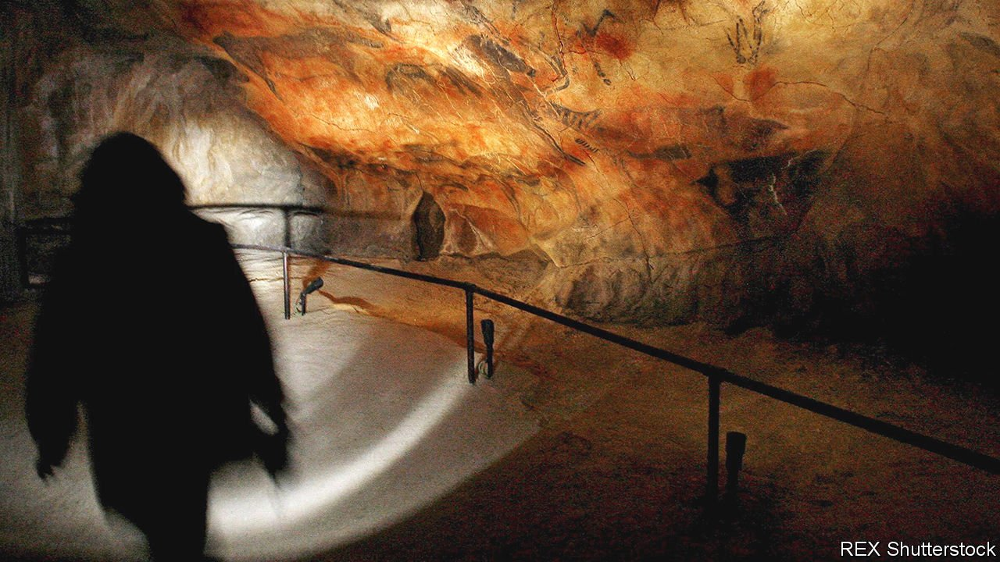

###### On the EU, Altamira, American English, methane, data, workers

# Letters to the editor 

##### A selection of correspondence 

 

> Apr 24th 2021 


The EU’s response to covid-19

You ask “” (April 3rd) with the European Union, pointing out that our economic growth rate has lagged behind America and China. It is worth looking beyond point-in-time comparisons. Despite a slow start, vaccination campaigns are now gaining pace across Europe. Some 360m doses are expected to be delivered by the summer. This is a vital step towards normality and towards Europe becoming a globally significant supplier of vaccines.


I fully accept that America’s budgetary response has been substantive and will provide a valuable boost to global growth. However, it doesn’t diminish the fact that the 27 countries of the EU have stood together and deployed unparalleled support, both at member-state level and collectively. The EU has chosen to focus its economic response on protecting income and employment through job-retention schemes. With the support of the SURE instrument, up to 30m jobs across Europe were protected in 2020. Next Generation EU, a €750bn ($900bn) recovery fund, will fundamentally transform our economies with a focus on digitalisation and climate change.

These measures would have been unthinkable in a pre-pandemic Europe. Governments will take further steps, at national level, to accelerate our efforts. We are at a difficult moment in Europe, but do not underestimate our determination to turn this around.

PASCHAL DONOHOE

President of the Eurogroup of finance ministers

Brussels

 


Dwelling on caves

“” (April 10th) reinforced the unfortunate tendency of some Basques to claim the history of their neighbours. The oldest and most spectacular cave paintings in Europe are indeed in caves at Altamira (shown in your photograph) and elsewhere in Cantabria, which borders the Basque region but is not part of it. The Cantabrians, too, have a strong identity, while proudly embracing their Spanishness.

GRAHAM MCKEE

Dundee

 


American English

Few efforts to address the befuddling inconsistencies of English language orthography (, April 10th) have begun as auspiciously as America’s Simplified Spelling Board. It was established in 1906 with the generous financial support of Andrew Carnegie, who believed that making English easier to learn would turn it into a global language and thereby foster world peace. The group’s directors included such luminaries as David Josiah Brewer, a justice on the Supreme Court, Nicholas Murray Butler, the president of Columbia University, and Mark Twain. Even President Theodore Roosevelt threw his early support behind the group’s efforts.

The organisation's initial work included such changes as dropping the “u” in words like color and valor that have taken hold in American English. But many proposals never caught on, including changing “ough” to “o” to represent the long vowel sound in the re-spelled words altho, tho and thoro. Or changing the -ed suffix to -t in new spellings, such as drest, kist, nipt and washt. In the face of public ridicule on both sides of the Atlantic, the effort ended with a whimper. Carnegie became frustrated with the group's approach and funding dried up after his death in 1919. The Simplified Spelling Board simply fizzled out.

Despite its constant challenges to neophytes and native speakers alike, Carnegie's dream of English becoming a world language has largely been fulfilled. Though his vision of the language being a stepping stone to world peace seems ever more unlikely.

ALAN SOHN

Teaneck, New Jersey

 


Accounting for methane

Misleading accounting rules are also obscuring the impact of methane emissions on global warming (“”, April 3rd). Treating methane as “COequivalent” using the standard 100-year global warming potential, as many countries and the UN convention generally do, undervalues the effect of a new methane source, such as a fracking operation, by a factor of four to five over the 20 years following its introduction. But it also overvalues the ongoing impact of a constant methane source, such as a long-established rice-paddy field or herd of cattle, by a factor of three to four.

Errors like these make it impossible to track progress on a long-term temperature goal. Fortunately, warming-equivalent measures are available that simply require gases with lifetimes longer than 100 years, like CO and nitrous oxide, to be reported separately from methane and the rest. Separate reporting of these cumulative climate pollutants in national and corporate commitments and net zero strategies would be an easy win for COP26, and transform the transparency of the forthcoming global stocktake of progress in achieving the goals of the Paris agreement.

MYLES ALLEN

University of Oxford

ADRIAN MACEYVictoria University of Wellington

 


A laissez-faire approach

 noted that developing countries lack a strong incentive to collect data (April 10th). Indeed. They might in fact have a strong incentive to deliberately avoid data. In “The Data Detective”, Tim Harford tells of Sir John Cowperthwaite’s approach to this question when he was financial secretary of Hong Kong during the 1960s. Sir John refused to endorse the collection of even the most basic economic data during a period of rapid growth. His rationale was that civil servants who collected it might be tempted to use it, thus creating pressure for government intervention in the economy.

MARTIN BIRT

Uxbridge, Canada

 


Dead blossoms

The ethereal transience and beauty of Japan’s cherry blossoms have long inspired poets and writers (“”, April 10th). But they were also used for inspiration of another kind by Takijiro Onishi, vice-admiral of the imperial Japanese navy during the second world war. In October 1944 he penned a haiku to inspire young Japanese Zero fighter pilots as they took off on their suicide-missions to crash dive into American ships:


SUNNY MAHAJAN

Jackson, Tennessee

 


Dancing peacocks

It takes a range of personalities to ensure the smooth running of an office (, March 20th). During an office retreat, we were asked to do the DOPE Personality Test. This divided us into doves, owls, peacocks and eagles to help us understand that people have different ways of functioning. For example, the way you would engage with an introvert owl is different from how you would engage with an extrovert peacock. We now appreciate each other a little better.

The evening proved that the test was reasonably accurate. Some music was played and a handful of people got up. Every single one of the dancers was a peacock that night.

SUROOR ALIKHAN

Geneva

