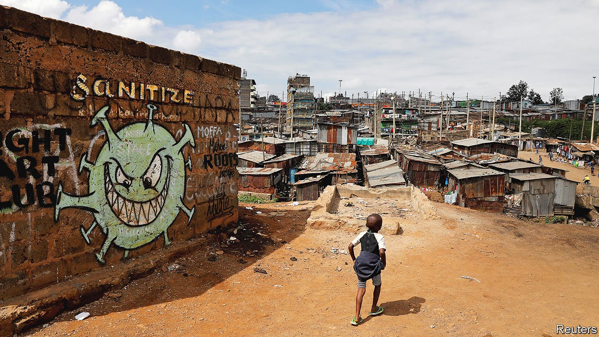
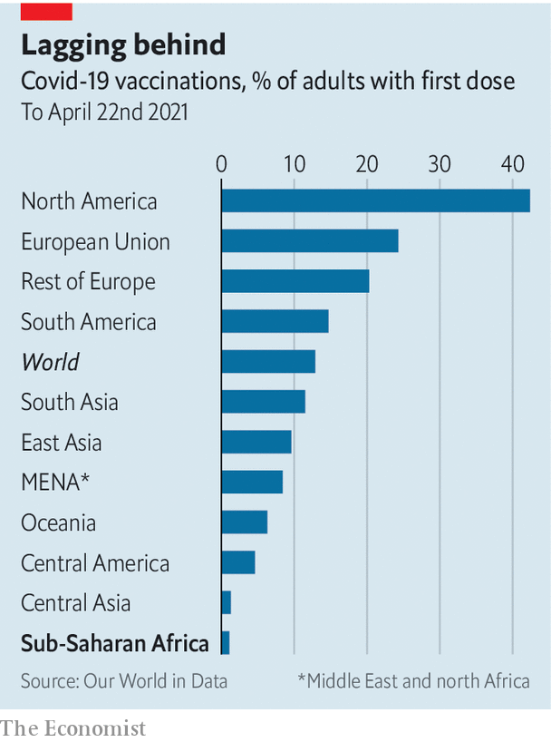

###### Doses of scepticism

# Africa’s covid-19 vaccination drive is off to a slow start 

##### Scant supply is the biggest problem, but not the only one 

 

> Apr 24th 2021 

AS A NURSE in Lilongwe, the capital of Malawi, Linda Banda is at the front of her country’s queue for a covid-19 vaccine. But she is wary. “I’m not sure it’s a safe move,” says the 26-year-old.

Such attitudes are complicating Malawi’s plans. The country received its first vaccines on March 5th. Seven weeks later it has used only about half of its 512,000 doses, most of which came via COVAX, an alliance co-led by the World Health Organisation (WHO). About 16,000 doses are set for the incinerator after expiring last week.


African countries can ill afford to waste vaccines. Just 6m doses have been administered in sub-Saharan Africa, fewer than in New Jersey. Globally 13% of adults have received a first dose, versus 1% in the region (see chart).

 


COVAX, which has supplied most of Africa’s doses, has been hampered by . Yet supply is not the only problem. Many African countries are struggling to use their doses because of operational failings and low demand. Africa CDC, a public-health body, wants 60% of the continent vaccinated by the end of next year. The target looks increasingly ambitious. If it is not met there could be dire consequences for Africa—and, potentially, the rest of the world.

Forty-seven of Africa’s 54 countries have started a vaccination drive. Some have done so efficiently. Angola used online registration. Rwanda surveyed village elders so it knew where to find priority groups. It distributed doses to more than 500 health centres within days of receiving them on March 3rd. Ghana, which has administered nearly 90% of its jabs, drew on its experience in 2018 of vaccinating 6m people in a week against yellow fever. Volunteers were recruited from institutions such as Rotary clubs. Drones carried vials to remote parts.

Yet of the 45 countries for which the WHO has data, 32 have used less than half of their vaccines. A few, like Zambia, received COVAX deliveries only this month. But most have had supplies for longer. Uganda, which has dispensed just 24% of its stock, delayed starting for about ten days and has been slow to distribute doses. An ad hoc approach is common. During an event at the Gambian president’s residence, he and cabinet ministers got a jab. “Then they ended up vaccinating everyone, including the cleaners,” says one observer.

Mamunur Rahman Malik of the WHO in Somalia says countries are using the wrong approach. Somalia has done little outreach and instead relies on people showing up to sites, some of which are closed for Ramadan. It has wrongly assumed that organising covid-19 shots is the same as, say, measles jabs. “But this is not like mothers bringing their children.”

A lack of money is making matters worse. CARE, a charity, reckons that for every $1 spent on vaccines, another $5 is needed to make sure they reach arms. COVAX says it needs about another $3bn to carry out its plans for buying and delivering vaccines this year. In October the World Bank pledged $12bn for vaccines and their roll-outs globally, but as of April 20th it had approved projects worth only $2bn. Just seven of them are in Africa.

Logistical difficulties are coupled with vaccine hesitancy. In a five-country survey published on March 9th by Afrobarometer, a pan-African pollster, an average of 60% of respondents said they were unlikely to try to get vaccinated. After starting with similar eligibility criteria to the West, most countries have expanded who can get jabbed. Strange as it may seem for a continent with so few vaccines, in many countries anyone wanting a dose can get one.

Hesitancy has several causes. A 15-country survey by Africa CDC last year found that half of respondents believed covid-19 was planned by a “foreign actor”. One-third thought that vaccine trials had killed African children. Such falsehoods spread rapidly on WhatsApp. They can also be amplified by religious leaders. In Nigeria powerful pastors such as Chris Oyakhilome have spread misinformation.

The main vaccine available to African countries has not helped. Roger Kamba, the head of the anti-covid taskforce in Congo, blames its nearly two-month delay on the need to assure people following European decisions about the AstraZeneca jab. “We are telling people to take the vaccine but they see all the time on TV that there are problems with it.”

Hesitancy also has prosaic causes. For many Africans covid-19 is simply not a big deal. Official caseloads and death tolls are relatively low. Unlike in rich countries, there is no talk of needing a vaccine to go about daily life. “I did not, at any point, deny the existence of covid-19, but what I doubt is its existence in Sierra Leone,” says Mohamed Kabia, a student in the west African country (official death toll: 79).

African epidemiologists such as Charles Wiysonge of the South African Medical Research Council argue that demand will respond to supply. “Hesitancy is partly a function of so few doses.” It is hard to run mass vaccination campaigns without masses of vaccines. Even successful countries do not know when they will be able to give second doses. “We have a plan but no supply,” says Anthony Nsiah-Asare, health adviser to Ghana’s president.

John Nkengasong, the head of Africa CDC, laments that just 1% of the vaccines used in Africa are manufactured on the continent. For the time being it is mostly reliant on two sources: COVAX and the African Union’s deal with Johnson &amp; Johnson (J&amp;J), which has agreed to provide 220m doses. But when they will arrive is unclear.

Some governments are looking at other options. Having declined to use the AstraZeneca vaccine, South Africa has belatedly signed its own deals with J&amp;J and Pfizer. The Sinopharm vaccine has been approved by 11 African countries, but others are wary because the WHO is still reviewing it. Governments are struggling to get Russia to send doses of the Sputnik vaccine.

Kwaku Agyeman-Manu, Ghana’s health minister, says he has had more than 50 meetings with businessmen who say they can get doses. A middleman “from the Middle East” brought 16,000 Sputnik doses to Accra, he says. Much better would be for countries with excess doses to give or sell them to countries like Ghana. Sadly he has received little response from such places. “No one is listening,” he sighs. ■

Dig deeper

All our stories relating to the pandemic and the vaccines can be found on our . You can also listen to , our new podcast on the race between injections and infections, and find trackers showing ,  and the virus’s spread across  and .

