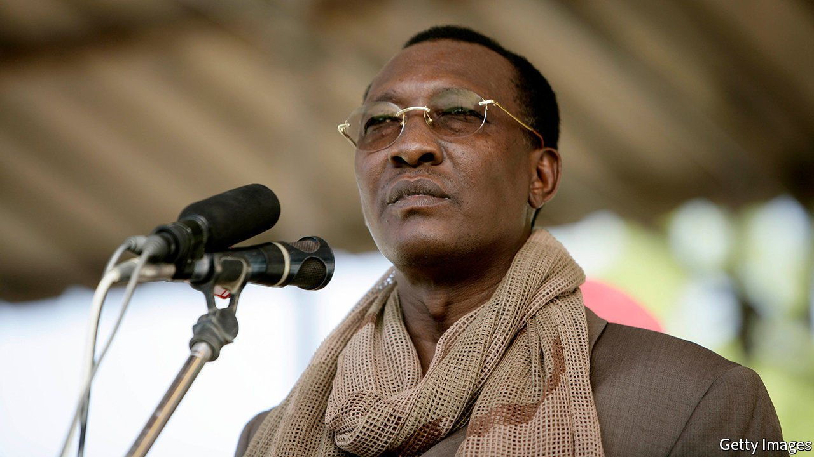
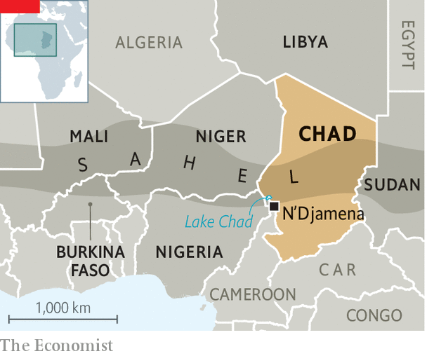

###### A dictator dies

# Chad’s strongman president, Idriss Déby, is killed by rebels 

##### His demise after 30 years in power may lead to instability at home and across the Sahel 

 

> Apr 22nd 2021 

HIS PRESIDENCY started with a rebellion. It also ended with one. On April 20th television stations in Chad interrupted their normal broadcasts to show a room full of men in uniform—medals gleaming and red berets neatly pressed—where an army spokesman announced the death of Idriss Déby, who had ruled Chad for 30 years. The announcement came just hours after election officials provisionally declared Mr Déby the winner of a flawed presidential election held on April 11th. Mr Déby, who came to power after mounting a coup in 1990, reportedly died after being injured on the battlefield while visiting troops fighting a rebel incursion that began on the very day of the election.

Although the exact circumstances surrounding Mr Déby’s death are not yet clear, the transfer of authority that followed it is highly irregular. The government and parliament have been dissolved and a military council led by Mr Déby’s 37-year-old son, Mahamat Idriss Déby, has taken charge. By ignoring the constitution, the army has in effect staged a coup. It says it will rule for 18 months until “free and democratic” elections can be held. That may be too long for many people in Chad. “We don’t want a militarised Chad any more” says Bienfait Djiedor, a 31-year-old student in N’Djamena, the capital. “We want a democratic Chad…where reason rules, not force.”


During his three decades in power Mr Déby brought neither democracy nor development. Instead he cracked down on opponents, protesters and the press. The recent election was no exception. Witnesses told Human Rights Watch (HRW), a monitoring group, that in February police beat peaceful protesters with whips and sticks. In March police officers reportedly drove into a car taking injured demonstrators to hospital, and then pulled the passengers out and hit them. Another protester told HRW he was tortured with electric shocks at the police headquarters.An attempt to arrest an opposition candidate, Yaya Dillo, ended in a shoot-out that he says killed his mother and 11-year-old son.

Although the country has earned billions of dollars from oil, a fifth of its children die before they turn five. Yet Mr Déby proved adept at winning friends in the West, forming alliances with France and America, which saw him as . France has a large military base in Chad. , its 5,100-strong military force roving the Sahel, has its headquarters in N’Djamena. “France loses a courageous friend,” lamented the French government in a statement after Mr Déby’s death.

The dictator’s demise is likely to rock an already tottering government beset by opposition on many fronts. Since 2015 the jihadists of Boko Haram have been attacking across the border from neighbouring Nigeria and Niger. Their atrocities have pushed thousands of Chadians from their homes. The government has also faced repeated incursions by rebels based in Libya and Sudan. In 2019 fighters advancing from Libya towards N’Djamena were halted only after French aircraft bombed them.

 


This month’s rebel attack seems to have pushed deep into Chad, with fighting reported some 300km north of the capital. Despite this, France has so far refrained from direct involvement, apparently offering reconnaissance and intelligence support instead. French reluctance to intervene more forcefully may have been crucial. Besides Chad’s president, the rebels claim also to have killed 14 other senior officers in recent fighting.

The third front where the government has been battling is in the capital itself, recently roiled by repeated protests. Police and demonstrators clashed in February over Mr Déby’s decision to run for a sixth term, and again this month in the run-up to the election. Opposition leaders have denounced the seizure of power by Mahamat Idriss Déby as a coup. In a statement America also emphasised the need for a transition “in accordance with the Chadian constitution”, which calls for the head of the National Assembly to take over and to hold elections within 90 days.

That contrasts with France, which has simply muttered warily about the need to “establish an inclusive, civilian government” after a “limited period”. The younger Mr Déby will probably maintain a close relationship with France and keep supporting Western efforts to fight jihadists in the Sahel, says Nathaniel Powell, a military historian at Lancaster University in Britain. At the request of Emmanuel Macron, France’s president, Chad recently sent 1,200 soldiers to help fight jihadists in Burkina Faso, Mali and Niger.

But the crisis at home may require those forces to come back. The opposition is ready to take to the streets again. Rebels from the north, who claim to be fighting for democracy, are promising to march on the capital. Divisions are appearing in the army, with one general denouncing the transition as a “coup”. Hence there is “a real fear of civil war”, says Cameron Hudson of the Atlantic Council, an American think-tank. “We are afraid,” says Ramadan Mahamat, a 37-year-old teacher in N’Djamena. Every Chadian is asking one question: “What is going to happen to us?” ■

A version of this article was published online on April 20th, 2021.

