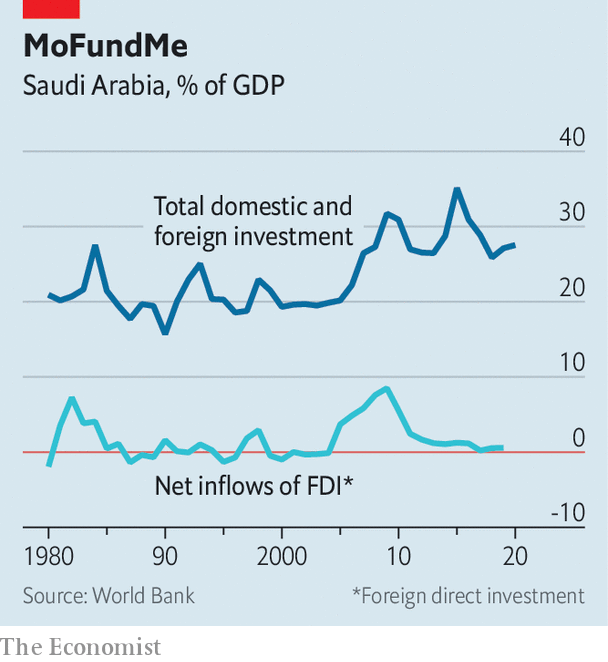

###### PIF, poof

# Muhammad bin Salman’s risky bet in Saudi Arabia 

##### A fire-hose of investment may transform the kingdom’s economy—or deplete its coffers 

 

> Apr 22nd 2021 

SIX YEARS ago almost no one outside Saudi Arabia had heard of the Public Investment Fund (PIF), an entity that held government stakes in blue-chip firms and had fewer employees than a typical supermarket. Today it aspires to become the world’s largest sovereign-wealth fund. It spent billions last year on foreign investments, buying stakes in Western oil firms and cruise lines and even bidding for Newcastle United, an English football club. At home it is building resorts, a financial district and a futuristic city on the Red Sea.

Sovereign-wealth funds in the Gulf are meant to provide for a post-oil future. This can be a contradictory task: they must act as responsible stewards of oil wealth while investing in risky projects to drive diversification at home. The PIF is trying to do both simultaneously and at great scale. Yet its boundless ambition risks running up against the hard realities of maths.


On March 31st the crown prince, Muhammad bin Salman, announced a plan to invest 27trn rials ($7trn) in domestic projects over the next decade. These numbers should be taken with a pinch of salt. Saudi Arabia’s GDP last year was 2.5trn rials; Prince Muhammad’s target would mean absorbing annual investment the size of the kingdom’s entire economy. Last year its investment-to-GDP ratio was 27% (see chart). He hopes foreign direct investment will exceed $500bn over the next decade, optimistic in a country where inflows totalled $106bn over the past decade.

 


The centrepiece of his announcement was a scheme called Shareek (Partner), which would see dozens of publicly listed Saudi firms reduce their dividends and steer 5trn rials into local investment. The biggest of the bunch are Aramco, the state oil giant, and SABIC, a petrochemicals company owned by Aramco. Any dividend cuts would thus land hardest on Aramco’s majority shareholder: the Saudi state.

That would mean further pressure on the budget, which shrank by 7% this year and is increasingly consumed by recurring items. In 2020 the finance ministry earmarked 173bn rials for capital expenditure, 17% of total outlays. Actual spending was lower, an estimated 137bn rials, as projects were cancelled or postponed amid low oil prices and the pandemic. This year’s budget allocates just 101bn rials (10% of expenditure) for capital spending.

Further investment comes from off-balance-sheet sources such as the PIF, which says it will invest 150bn rials annually between 2021 and 2025 in everything from agriculture to aerospace. This sort of top-down development alarms some Saudi businessmen, who worry that the fund will crowd out the private sector.

For the crown prince, though, the PIF is not moving fast enough. He wants the fund to invest about $800bn over the next decade—twice its current level of spending. His target also dwarfs the PIF’s current assets, estimated at $400bn. To raise more capital, Prince Muhammad said in January that the government could sell further tranches of Aramco stock and transfer the money to the PIF. Aramco’s balance-sheet has seen better days, though: net income last year was $49bn, which forced it to borrow to pay a $75bn dividend (a payout it guaranteed during its initial public offering). The PIF could sell stakes in other firms to locals, meaning Saudi investors would finance it. In March it agreed to borrow $15bn from foreign banks, the third time since 2018 it has taken on debt.

The PIF is not the only fund eyeing rapid growth. Mubadala, a sovereign-wealth fund of Abu Dhabi, one of the seven United Arab Emirates (UAE), went on a spending spree in 2020. It sank money into tech firms poised to profit during the pandemic and is now looking at fresh investments in America, hoping to capitalise on President Joe Biden’s plan to spend $2trn on infrastructure. But Mubadala has been more cautious about deploying capital at home. The UAE has only 1m citizens, and most of GDP and government revenue derive from things other than oil.

Prince Muhammad is gambling on a rapid transfer of wealth: money that has accumulated for generations in state coffers will flood the Saudi economy in a decade. The urgency is needed after decades of sluggish policymaking. But it is a risky bet. So much investment might help industries such as tourism and tech. But it might just as well empty the PIF’s coffers simply to buy a herd of white elephants. ■

