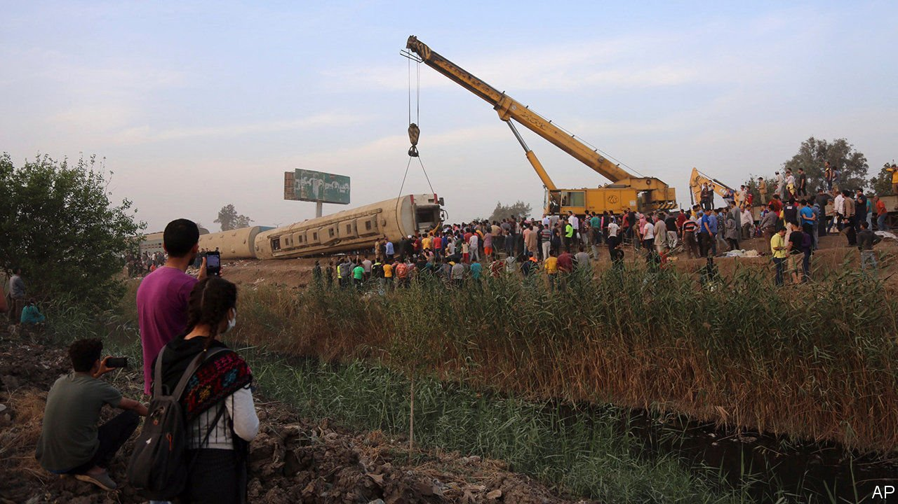

###### Daily disasters

# Why Egypt’s trains keep crashing 

##### It does not take a presidential committee to figure it out 

 

> Apr 22nd 2021 

THE IMAGES are so familiar as to be almost mundane: a carriage flipped on its side like a child’s toy; passengers scrambling to help survivors. On April 18th a train derailed near the Egyptian city of Toukh, north of Cairo, killing 11 people and injuring almost 100. It was the third serious accident in less than a month, including a collision between two trains that killed 19 people.

The official response was equally routine. Abdel-Fattah al-Sisi, the president, formed a committee and promised to compensate the victims. The conductor was detained. The transport minister, Kamel al-Wazir, a former army general, shuffled some top jobs at the railway authority. He did not sack himself, saying he would be a “traitor” if he quit his post.


Egyptians could be forgiven for cynicism. Their country has an appalling number of railway accidents. There were more than 2,000 in 2018, the most recent year for which data are available. Mr Wazir took charge in 2019, after a train slammed into a buffer at Cairo’s main station and exploded.

Decades of underinvestment mean infrastructure is fraying. The average locomotive is 30 years old. Workers are poorly trained and overworked. Drug use is a problem, particularly of tramadol, a cheap opioid. In March the World Bank announced a $440m loan to fix up the network, which should help—if spent wisely. But the national railway has a habit of steering dubious contracts to army-backed firms.

