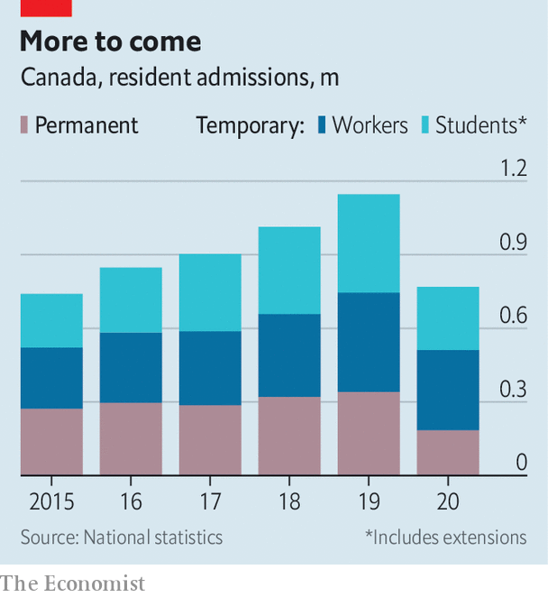

###### A wider welcome

# Canada wants to attract more immigrants 

##### As a result, it is changing the standards for who can gain entry 

 

> Apr 24th 2021 

THE PAST year of lockdowns and travel restrictions has been terrible for migrants. In the first six months of 2020 members of the OECD, a club mainly of rich countries, issued half as many residence permits as they did the year before, a record decline. But one country is determined to buck the trend. In October Canada’s government said it hoped to admit 1.2m new residents from 2021 to 2023, equivalent to 3% of the population. The targets for this year and next are a total of 100,000 higher than originally planned.

Even among high-immigration countries, Canada stands out. Australia has kept its annual immigration target steady at 160,000. Employers in New Zealand should give priority to training people already in the country, says its immigration minister. Canada, by contrast, is gung-ho. Immigration is “a key element” of Canada’s economic recovery and its long-term prosperity, says Marco Mendicino, the minister in charge of it. Without it, the country will age. Within 15 years the ratio of workers to pensioners will fall from three to two.


The pandemic has not just sharpened Canada’s zeal to import foreign talent. It is also changing the government’s idea of what talent means. On April 14th Mr Mendicino announced that Canada would open pathways to permanent residence for 90,000 people with temporary permission to stay. Most are workers in health care and other “essential occupations”, which can range from lorry drivers to bricklayers. The rest are graduates of Canadian universities. That weakens a longstanding distinction between two types of foreigners: “permanent residents”, most of whom eventually become citizens, and people entitled to work or study in Canada but who are eventually expected to leave.

Temporary residents are vital to the economy. Canada admits more of them than the permanent sort (see chart). The country has 1.6m non-permanent residents, estimates Syed Hussan of the Migrant Workers Alliance for Change, a pressure group. In 2018 700,000 foreign students spent C$22.3bn ($18bn), the equivalent of 1% of GDP. Other transient types staff care homes and harvest crops as well as doing jobs that require more education. Seasonal farm workers come to Canada for eight-month stints for an average of 10-15 years, says Mr Hussan.

 


But temporary status has a dark side. Many workers have permits that oblige them to work for a particular employer, which makes them vulnerable to abuse. Last year 2,000 agricultural workers caught covid-19 in Ontario, according to Mr Hussan, after they were confined to the farms where they worked. Even students can suffer. Some who work as low-paid delivery people exhaust themselves competing to be named “managers”, an often spurious title that improves their chances of getting permanent residency. Worst off are undocumented foreigners, many of whom have overstayed their permission to remain in Canada, and whose numbers are thought to be growing. Most have no entitlement to health care or education.

Canada is choosy about who can stay. Most offers go to “economic-class” migrants (and their families) on the basis of their ranking in a points system that scores for education, fluency in English or French, their profession and offers of a job in Canada. The country’s foreign-born population is the best-educated in the OECD. In the next three years Canada also plans to admit as permanent residents roughly 175,000 refugees and 270,000 relatives, mostly parents and grandparents of people already in the country.

Tales of taxi-driving doctors prompted Canada to tweak the points system to admit more people that employers want to hire. But it still gives too much weight to credentials, many experts think. And the pandemic taught Canadians the value of workers with less schooling. “They go out, risk their lives, potentially contracting the virus...so we have some food on the table,“ says Harald Bauder at Ryerson University.

Before the pandemic the government had begun to give temporary migrants more chances to settle down. Since 2008 it has offered permanent residency to workers with experience in the country, provided they are skilled and speak one of its languages. Under pilot schemes it also gives 5,500 residency permits a year to care workers and 2,750 to agricultural workers (though not seasonal ones). But now the government is becoming more flexible. In February it invited 27,000 people in the country to apply for permanent residency under its “Express Entry” programme for economic migrants. To do so it cut the number of points needed to qualify from an average of 461 to 75, the lowest ever.

The flow of migration is likely to return to normal by early next year. But the shift towards what Mr Mendicino calls “a fast, innovative and inclusive pathway to permanent residence” may last. Some immigration advocates want the government to go much further. Jenna Hennebry of Wilfrid Laurier University in Waterloo, Ontario, points out that workers who take Mr Mendicino’s new pathways will still have to speak decent English or French. She fears they are a “fleeting move of convenience” to meet the new targets.

Even so, these changes will transform many a life. Carla Martínez, who arrived from Mexico in 2017, hopes to be among the 30,000 essential workers to get permanent residency under the new scheme. In her first job as a carer she worked “12-14-hour days with no overtime and no weekends”. She later found “the dream family” to work for. But she wants to become a physiotherapist. As a temporary resident she would pay C$90,000 for her training. With permanent status, it would cost just C$15,000. “I wish I could have been doing it by now,” she says. ■

