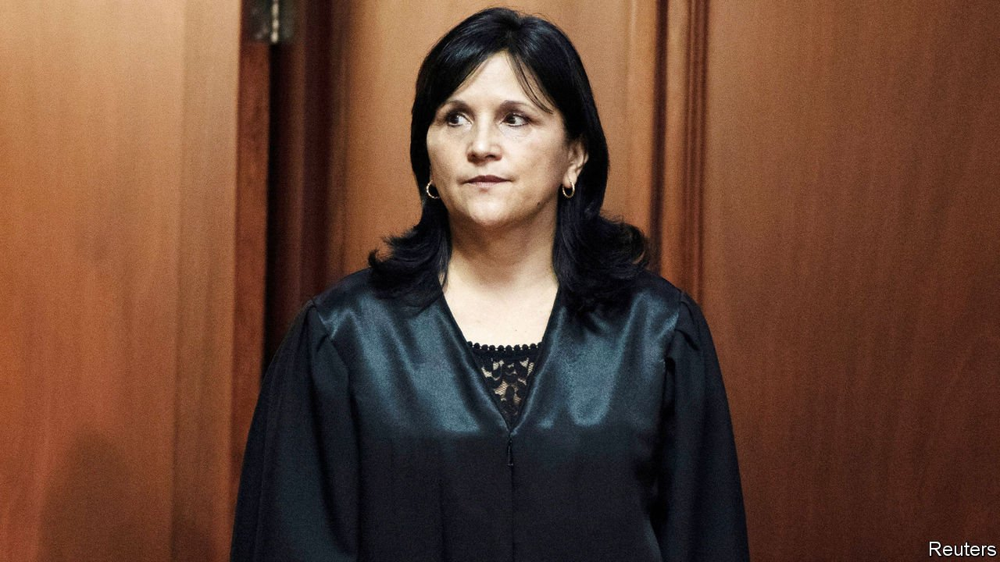

###### Domino effect

# Guatemala’s top tribunal comes under pressure 

##### The country is backsliding on efforts to curb corruption 

 

> Apr 22nd 2021 

OVER THE past decade Gloria Porras, a judge on Guatemala’s constitutional court, has earned a reputation for fearless independence. It came as little surprise to some, then, that on April 13th Congress refused to confirm her nomination for a third five-year term. The move is the latest effort to oust Ms Porras, who has faced a series of lawsuits from groups believed to be acting on behalf of corrupt politicians, smears in the media and attempts to strip her of her immunity as a judge.

Resistance to crusading judges is growing. The constitutional court is the primary target since it deals with politics and crime. Ms Porras often ruled against the rich and in favour of the marginalised. She boosted the rights of indigenous people, who make up at least 40% of the population of 18m. She also helped block a congressional proposal to provide amnesty for crimes against humanity.


The backsliding started under the administration of Jimmy Morales, president from 2016 to 2020. In 2019 he refused to renew the mandate of CICIG, a UN-backed commission that successfully prosecuted dirty politicians and businessmen. But Ms Porras says pressure on her has intensified since Mr Morales’s successor, Alejandro Giammattei, took office.

The judicial system has been hindered in other ways, too. In 2009 a law was adopted to bring transparency to the committees that appoint judges to the Supreme Court and Courts of Appeal. But according to the Washington Office on Latin America (WOLA) a human-rights lobby group, the process has been marred by conflicts of interest and criminal manipulation. For example, an increasing number of law schools have been created to try to influence which judges are picked (the committees are partially drawn from these schools). Last year the special prosecutor’s office against impunity, a state body, suggested that a businessman in pre-trial detention for corruption had attempted to rig the selection process. Congress, as the blocking of Ms Porras’s confirmation shows, is also biased. It barred another judge, Néster Vásquez, from taking his seat on the constitutional court. Other judges on the court have close links to the president: one of them, Leyla Lemus Arriaga, was his chief of staff.

This will further weaken the rule of law in Guatemala, one of the factors behind the migration of its citizens northwards. “The constitutional court was one of the last checks and balances in the country,” says Adriana Beltrán of WOLA. The abuses that will follow its taming are yet another reason to leave. ■

