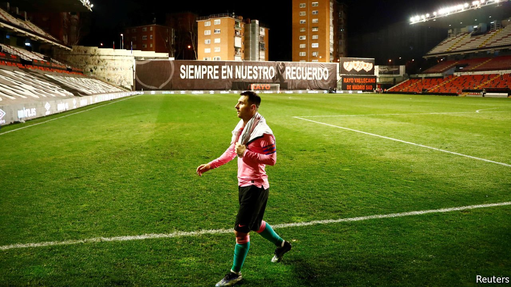

###### Kicking covid

# Latin American athletes are jumping the queue for vaccines 

##### Footballers have never been so eager to get a booking 

 

> Apr 24th 2021 

FOOTBALL FANS are used to moments of magic from Lionel Messi. Earlier this month the Argentine forward produced yet another clinical finish—this time off the pitch. On April 13th Mr Messi helped to score 50,000 vaccines for Conmebol, the South American football confederation, after sending three signed shirts to Sinovac, a Chinese pharmaceutical company. Conmebol says its goal is to jab all professional players ahead of the Copa América tournament this summer. But the ball is not in the back of the net just yet. For one thing, five of the confederation’s ten members, including Argentina, a co-host of the tournament, have yet to approve the use of the Sinovac vaccine.

Mr Messi’s is not the only attempt to win footballers early jabs. In Mexico 19 players from Rayados, a team in Monterrey, flew to Dallas to get injected this month. Several from its local rivals, Tigres, also crossed the border to get an appointment. The Mexican government promised to vaccinate the men’s and women’s football teams and their staff if they qualified for the Olympics (only the men did so). In Brazil Athletico Paranaense is not only pledging vaccines for its players and staff, but for its entire paying fan base. Many clubs have lost members, says Andrew Downie, a sports journalist (who has occasionally written for The Economist). The jabs are a way of enticing back fans.


In a region with both horribly high numbers of covid-19 deaths and slow vaccine roll-outs, injections are a prize worth winning. In Mexico the roll-out has been politicised by Andrés Manuel López Obrador, the president. He decided to initially give vaccines to people in rural, poorer areas rather than those most at risk of dying. Mexicans who can afford to do so are getting the vaccine in Texas. In Brazil Jair Bolsonaro, the covid-sceptical president, has said he wants to make it easier for corporations to buy vaccines—a move many Brazilians view as a way to shift the goalposts for the privileged. In February the revelation that ministers in Argentina, Ecuador and Peru had got themselves and their friends jabbed early stirred outrage.

In contrast, the popularity of footballers has not yet taken a dive. In Mexico public opinion has softened as more and more people, not just the super-rich, cross the border to get jabbed. “It’s no longer taboo,” says Andrés Díaz, a football journalist who is thinking of making the trip himself, now that it has become clear that states such as Texas are more than happy to give out surplus vaccines. Footballers may be better inoculated than politicians against charges of “VIP immunisation”. A survey in 2018 found that 61% of Mexican and 50% of Brazilian respondents said they trusted professional athletes and footballers; only 13% and 7% respectively said the same for politicians. Still, putting young, fit footballers ahead of society’s most vulnerable could turn out to be an own goal. ■

Dig deeper

All our stories relating to the pandemic and the vaccines can be found on our . You can also listen to , our new podcast on the race between injections and infections, and find trackers showing ,  and the virus’s spread across  and .

