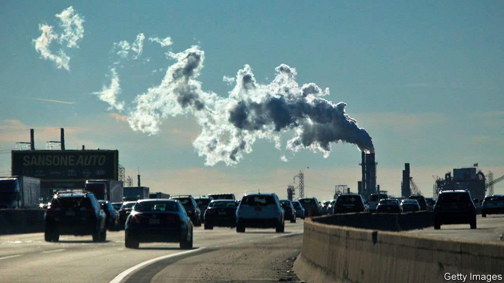
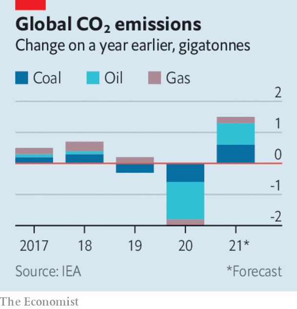

###### 

# Business this week 

#####  

 

> Apr 24th 2021 

 


As , the International Energy Agency forecast that energy-related carbon-dioxide emissions will rebound in 2021 after a steep fall during the pandemic, and grow by 4.8%. That would represent an increase of 1.5 gigatonnes, the second-largest rise on record. With restrictions on travel still in place, emissions from oil are expected to remain below the levels of 2019, but emissions from coal will rise a bit, and reach an all-time high from natural gas. China’s emissions will increase by 6% over 2019, and India’s by 1.4%, but America’s will be 5.6% lower.

Booming industrial production and exports fuelled an 18.3% expansion in China’s economy during the first quarter compared with the same three months last year, when the country went into lockdown and its economy contracted. Compared with the previous quarter, GDP grew by just 0.6%.


Reeling from its exposure to the collapse of Archegos, an investment fund, Credit Suisse decided to raise SFr1.7bn ($1.9bn) from investors in order to bolster its capital buffers. The Swiss bank’s write-off of loans to Archegos led it to a net quarterly loss, overshadowing a surge in revenues from its investment bank. Switzerland’s financial regulator said it was investigating “possible shortcomings in risk management” at the bank.

The board at Boeing extended the mandatory retirement age to 70 for David Calhoun, allowing him potentially to continue as chief executive for six more years.

A bidding war broke out for Kansas City Southern, a railroad company that transports freight in America and Mexico, when Canadian National submitted a $33.7bn offer, $4bn more than a proposal from Canadian Pacific. 

The writing’s on the wall

Stora Enso, a packaging and woods-products company, announced the closure of two factories in Finland and Sweden, because changes in consumer behaviour during the pandemic have accelerated the decline in demand for paper. Sales from paper will account for just 10% of the company’s revenues after the closures, down from 70% a decade ago.

Toshiba rejected an offer to take it private from CVC, saying the lack of detail in the proposal made it impossible to evaluate. The Japanese conglomerate said that the private-equity firm had decided to “step aside” and await further guidance, but it was open to serious proposals. CVC was reportedly counting on Kurumatani Nobuaki to stay at the helm as Toshiba’s chief executive, but he has resigned. Mr Kurumatani used to run CVC’s operations in Japan.

The union that tried to organise workers at an Amazon factory in Alabama filed objections with the National Labour Relations Board about the voting process. It alleges that, among other things, the company, threatened employees with significant lay-offs and cuts to pay if they supported unionisation. In the end 70% decided not to join.

Apple allowed Parler, a social-media app favoured by right-wingers, to return to the iPhone’s App Store, citing Parler’s promise of stricter moderation. The app had been removed by Apple and Google, and its hosting pulled by Amazon, after the assault on Congress in January. The case sparked arguments about the power of big tech platforms to regulate political debate.

Britain’s government announced an investigation into  Nvidia ’s planned $40bn takeover of Arm, a Britain-based chip-design firm, on national security grounds. South Korea’s competition watchdog said it also would look at the deal, which faces scrutiny in America and China, too.

The European Union unveiled proposals that would  within member states, with big fines for miscreants. Planned restrictions on the police’s use of facial recognition look especially strict.

Elon Musk’s SpaceX won the contract to build the landing craft for NASA’s project to put two astronauts on the Moon, perhaps in 2024. Its bid beat rival proposals from Blue Origin, founded by Jeff Bezos, and Dynetics, which is based in Huntsville, Alabama. SpaceX provides craft for NASA’s other big commercial space programmes.

Own goal

A select group of 12 football clubs tried to form a , an idea that has been knocking around for decades. By mid-week, nearly all had withdrawn from the proposal, after it was roundly criticised by fans, players, pundits, domestic leagues and the world governing body, FIFA. Even politicians put the boot in. The league could have generated billions for the elite teams involved, but fans dismissed it for betraying the roots of the beautiful game and gave it the red card.

