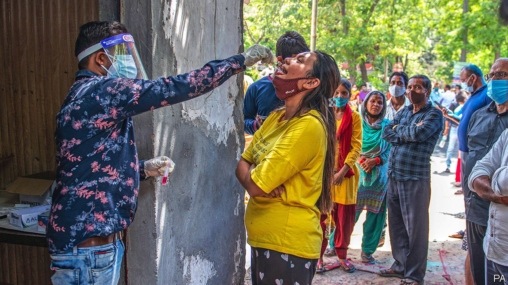
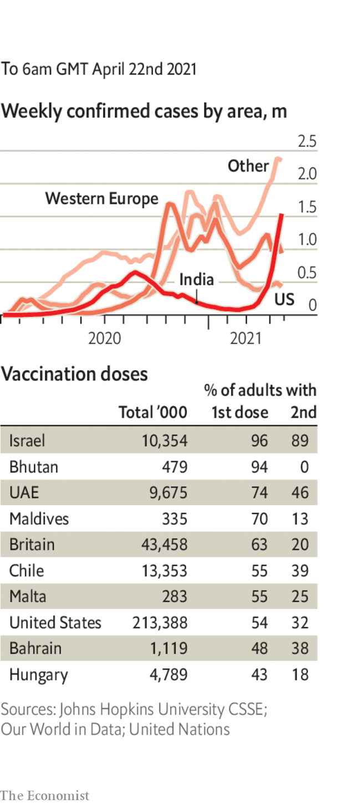

###### 

# Politics this week 

#####  

 

> Apr 22nd 2021 

Deep into a , the government in India lowered the age for inoculation to 18, liberalised the approval of vaccines, handed more power to the states and redirected oxygen supplies. New recorded cases have soared past 300,000 a day, up from 20,000 in early March.

Australia and New Zealand inaugurated a travel bubble, allowing passengers to travel between the two countries without the need to quarantine. A fully vaccinated employee at Auckland airport tested positive for covid-19 a day after travel restarted.


An Indonesian submarine carrying 53 sailors went missing while participating in a training exercise near Bali. The navy lost contact with the vessel soon after granting permission for a dive. An oil spill has been found nearby.

 used his state-of-the-union speech to warn the West against “crossing the red line”, saying that this would trigger a “swift and tough” response. Tensions have risen, following the imposition of additional sanctions by America in response to political meddling by Russia. Mr Putin has amassed troops on Russia's border with Ukraine, though it is not clear what he aims to do with them.

At the same time, , Russia’s leading opposition figure, who is in prison and on hunger strike. Thousands of Mr Navalny’s supporters responded to Mr Putin’s speech with demonstrations in several cities.

 chose Annalena Baerbock, who is only 40, as their candidate for chancellor in September's election, wrong-footing Angela Merkel's Christian Democrats, who have been arguing about who they think should succeed her. A day later the CDU anointed Armin Laschet as its standard-bearer, though he has failed to impress voters in recent months.

In Hong Kong, a publisher and critic of the government in Beijing, was sentenced to 14 months in prison for participating in pro-democracy protests in 2019. Four former opposition politicians were also jailed. Martin Lee and Margaret Ng, two veteran campaigners, and three other activists were given suspended sentences.

Xi Jinping said that countries which are “bossing others around” and interfering in internal affairs “will not be well received”. The Chinese president made his comments days after America and Japan pledged to co-operate on resisting China’s territorial claims in the East and South China seas.

A jury found  of the murder of George Floyd during an arrest in Minneapolis last year, when the policeman knelt on Floyd’s neck for nine minutes. In a remarkable statement made while the jury was deliberating, the judge singled out comments by Maxine Waters, a Democratic congresswoman, as possible grounds for Mr Chauvin to appeal. Ms Waters had urged protesters to “get more confrontational” if Mr Chauvin was acquitted.

Joe Biden enraged some Democrats when he signed an order capping the annual number of refugees to America at 15,000, in line with the number allowed under Donald Trump. Mr Biden has promised to increase the cap. Amid intense criticism the White House said the order had been “the subject of some confusion”, and the cap for the rest of this fiscal year would be increased, the number to be set by May 15th.

Chad, died of wounds he sustained while visiting troops in a battle with rebels. A military council led by Mr Déby’s son, Mahamat Idriss Déby, suspended the government and constitution and assumed power, promising to hold elections in 18 months.

A fire on Table Mountain swept onto the campus of the University of Cape Town, destroying student accommodation and a library housing a unique collection of books related to African studies, including rare editions published in the 1500s.

The Syrian parliament scheduled a presidential election for May 26th. The war-torn country is also suffering from a growing economic crisis, but President Bashar al-Assad is not expected to allow any serious competition.

For the first time in six decades . At the congress of the ruling Communist Party Raúl Castro stepped down as first secretary. His successor is Miguel Díaz-Canel, a 61-year-old apparatchik who became president, the second-most powerful job, in 2018. Mr Díaz-Canel has much to do. Protests and frustration are growing on the socialist island.

Chrystia Freeland, Canada's finance minister, unveiled the Liberal government's first budget since 2019. Vowing to finish “the fight against covid”, Ms Freeland outlined C$101bn ($81bn) in new spending over three years, including a national child-care programme.

NASA flew a small robotic , the first time that a machine from Earth has undertaken a successful flight on another planet. Ingenuity hovered for just a minute, but it is hoped that further flights will last longer and cover more ground.

Coronavirus briefs

 


The EU’s medicines agency recommended that the Johnson &amp; Johnson vaccine should carry a warning about blood clots being a very rare possible side effect, but reiterated that the benefits of the jab far outweigh the risks.

A regulatory body in Brazil approved the emergency use of a cocktail of medicines to treat mild and moderate cases of covid-19. The treatment is thought to reduce the chances of hospitalisation significantly. The country’s death toll surpassed 380,000.

Sweden’s government warned that it might introduce stricter restrictions. “There is no room now to start living as if the pandemic is already over,” said the health minister.

The State Department updated its travel advice for American citizens. Its “Level 4: Do Not Travel” advisory will apply to 80% of the world’s countries.

