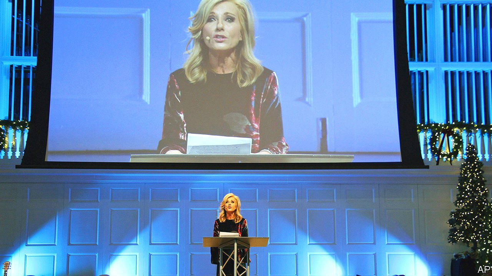

###### Religion in America

# America’s largest Protestant denomination considers changing direction 

##### The Southern Baptists are paying closer attention to critical race theory and the role of women 

 

> Apr 22nd 2021 

ED LITTON recalls looking at the black-and-white photograph and guessing it dated back to the early 1900s. He was off by nearly a century: it had been taken in 1981, less than ten miles (16km) from the wood-panelled office where he sits. In the photo, the body of Michael Donald, a 19-year-old African-American from Mobile, Alabama, hangs from a tree. Two Ku Klux Klan members, angry that a jury had failed to convict another black man accused of killing a police officer, picked Donald at random to retaliate. His is believed to be the last recorded lynching in America. “It blew my mind,” Mr Litton says. “When I looked at it, I realised we live in a real segregated culture.”

This spurred him and his congregation to mend relations with African-Americans in their community. If elected president of the Southern Baptist Convention (SBC), America’s largest evangelical Protestant denomination, in June, he will lead more than 47,000 churches as they, too, attempt to heal the wounds of racism, which runs deep in their history. The SBC was founded in 1845 by separatist Baptists who wanted to appoint slaveholders as missionaries.


It is not the only reckoning ahead of them. An investigation by the Houston Chronicle published in 2019 found more than 700 cases of sexual abuse in SBC churches over two decades. Mr Litton and other nominees for the post—including Al Mohler, president of Southern Baptist Theological Seminary—will have to confront these issues as their numbers shrink. After peaking at 16.3m adherents in 2006, the SBC has lost nearly 1.8m members.

Several prominent black pastors left after a group of seminary presidents, among them Mr Mohler, declared in November that critical race theory—a collection of thinking on racism that originated with legal scholars—is “incompatible” with SBC doctrine because it purportedly replaces the gospel with race as the framework for understanding human nature. The SBC’s National African-American Fellowship agrees that some aspects of the theory do conflict with their theology. But they say the presidents’ inflexible position dismisses “the lived experiences of African-Americans and other ethnic groups”.

The gospel according to Kendi

Critical race theory has sparked heated debate before. A resolution at the SBC’s last annual gathering that affirmed its utility as an “analytical” tool prompted a faction of Southern Baptists to create their own network of conservative churches. They are supporting one of their leaders, Mike Stone, for SBC president. Mr Litton laments that people who speak about racial issues are labelled as liberals or Marxists. “Critical race theory is being touted as a baseball bat to beat people up,” he says.

In recent weeks debate has turned to women’s place in the church, after Beth Moore, a popular Bible teacher, announced she no longer identifies as a Southern Baptist. For nearly 30 years she inspired women to study the Bible; her books are in the homes of millions of Southern Baptists. In 2018 Ms Moore recounted how she had been ridiculed for being a female leader within conservative Christianity. But her criticism of Donald Trump made her a pariah. A survivor of sexual abuse, she was perplexed Christians would put on a pedestal a man who boasted about groping women.

Ms Moore’s departure reflects wider concerns about how women who have survived abuse are treated. “Not only are their cries and pleas not heard, but oftentimes they are actively villainised,” says Rachael Denhollander, a lawyer and ex-gymnast who initiated the criminal case against Larry Nassar, a former doctor for the US gymnastics team accused of sexually abusinghundreds of women and children. At their last annual gathering Ms Denhollander challenged convention leaders to believe victims and stop predators. The SBC’s decentralised structure has hampered efforts to create a registry of offenders.

Controversy also surrounds doctrines on sexuality that create power imbalances between men and women notably “complementarianism”, according to which men and women are equal but have distinct roles. Only men can preach and be pastors; women can teach but not preach. After leaving the SBC, Ms Moore apologised for being “complicit” in teaching such doctrines as if they were essential to Christian belief. She has not completely abandoned complementarianism, but she says it should not be a litmus test of evangelical faith (many SBC pastors and leaders, by contrast, believe that someone who rejects complementarianism also rejects the authority of the Bible).

Fears of liberalism creeping into the SBC are probably misplaced. An analysis from Ryan Burge, from Eastern Illinois University, shows that more Southern Baptists believe in the literal interpretation of the Bible than ever. A survey from Lifeway, the SBC’s publishing arm, found that since 2016 pastors have grown hesitant to preach on race. One pastor, who spoke on condition of anonymity, said he was asked to resign for his emphasis on confronting racism. “We know you are passionate about racial reconciliation,” he was told, “but our church is not the platform for that.”

Mr Litton says discussions over critical race theory and the role of women matter, but they can be harmful if they supersede agreement on the essentials of the faith, such as the gospel. “When theological debate is the centre of Southern Baptists’ life, it is not good,” he says. ■

