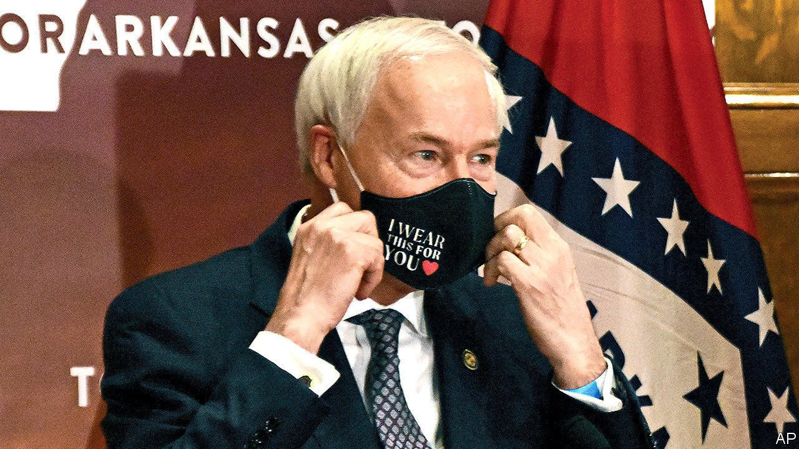

###### Blocked

# Trans medicine gets entangled in America’s culture wars 

##### This is unlikely to help children diagnosed with gender dysphoria 

 

> Apr 24th 2021 

AS TRANSGENDER medicine has boomed in America, the number of doctors offering puberty blockers and cross-sex hormones to children who identify as the opposite sex has surged. In some states the World Professional Association for Transgender Health lists more than a dozen endocrinologists who work with children. In Arkansas it lists just one. Yet this month the state became the first to ban the prescription of such drugs to those aged under 18. Unless the American Civil Liberties Union (ACLU), which has become a vocal champion of trans rights, succeeds in blocking the law, the Save Adolescents from Experimentation (SAFE) Act will come into effect this summer.

Arkansas is one of more than 16 states to have introduced such a bill in recent months, according to the ACLU. An even greater number have introduced legislation that would prevent transgender girls from playing on female sports teams (Arkansas passed such a law in March). Lawmakers in these mostly conservative states are pushing back against the Biden administration’s embrace of gender ideology, which holds that trans people should be recognised as the sex with which they identify (meaning trans women should have access to women-only spaces, from prisons to hospital wards) and that trans-identifying children should have access to puberty blockers and cross-sex hormones.


For lawmakers to impose a blanket ban on the use of such drugs in children is a mistake, argued Arkansas’s Republican governor, Asa Hutchinson, when he vetoed the law (the House and Senate overrode his veto). It created, he said, “new standards of legislative interference with physicians and parents as they deal with some of the most complex and sensitive matters involving young people”. He also described the law as a product of America’s culture wars. His point was exemplified by lawmakers’ hyperbolic claims that young children in the state are undergoing sex-change surgery (they are not). Doctors, meanwhile, worry about the law’s wider ramifications. Dr Janet Cathey, a co-founder of the state’s first transgender clinic at the University of Arkansas for Medical Sciences, says she worries it will deter young doctors in other medical fields from wanting to work in Arkansas.

Yet the bills are not only political opportunism. They are also a response to mounting concerns about the use of puberty blockers and cross-sex hormones in children. Blockers, which are prescribed from around the age of nine to children who feel desperate about developing secondary characteristics of their sex, like breasts and facial hair, are not licensed for this purpose, nor have they undergone a clinical trial for it. Research shows they cause bone damage and may affect brain development.

Doctors who treat trans-identifying children say blockers buy time while patients work out whether to proceed to cross-sex hormones. Yet the vast majority of children on blockers go on to hormones, suggesting the drugs operate more as a push than a pause. Cross-sex hormones, meanwhile, cause myriad severe health problems, including uterine atrophy and heart problems for trans men on testosterone. They can cause sterility.

All this is prompting other countries to introduce curbs on the use of blockers. Last year, British judges ruled that children were unlikely to be able to give meaningful consent to taking them. Their review was sparked by the case of a young woman, Keira Bell, who took blockers and hormones as a teenager (and at 20 had her breasts cut off) before realising that she was a lesbian woman, not a trans man.

America, where health care is more profit-driven and decentralised than in most rich countries, seems a long way from even a discussion of the need for such limits. Instead, the focus is on affirming the desire for medical transition. Some states have passed laws banning “conversion therapy”, a term misused to describe therapy that explores causes of gender dysphoria other than trans-ness. Professional bodies, like the American Academy of Paediatrics, have endorsed affirmative care and puberty blockers. Some of its members believe this is a mistake, but fear they will lose their jobs if they say so publicly.

The view routinely expressed in America is rather that puberty blockers “save lives” (an allusion to the belief that trans children are at a greatly heightened risk of suicide; there is no evidence for this). Health-care professionals who work with trans children extol the wonders of blockers and hormones. When asked about worries that these drugs are being prescribed without first properly exploring other comorbidities common in trans-identifying youngsters—like depression and anorexia—Elizabeth Stout, a psychologist in Little Rock, Arkansas, suggested that blockers and hormones could sometimes function as a cure-all. “It is often the case that treating the gender dysphoria first eliminates the need to treat the other mental-health concern at all,” she said. ■

