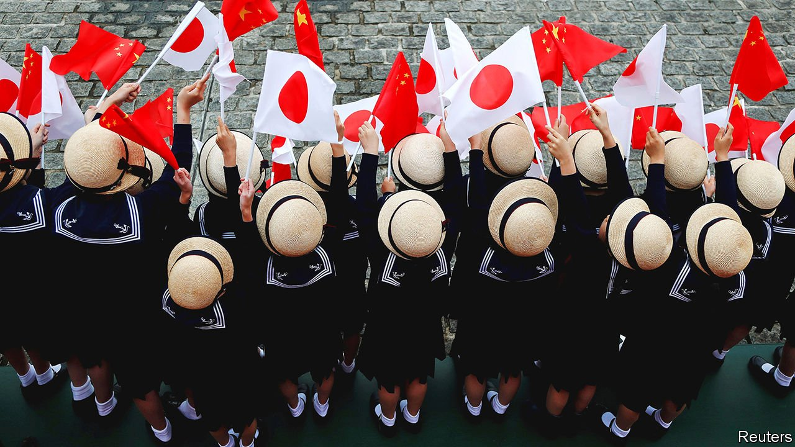

###### Panda power

# A powerful faction in Japan strives to keep China sweet 

##### Nikai Toshihiro and the politics of not choosing between America and China 

 

> May 1st 2021 

THERE ARE no fewer than seven pandas at the Adventure World zoo in Wakayama, a mountainous region in central Japan. After the latest cub was born in November, Zhao Lijian, a spokesman for China’s foreign ministry known for his pugnacious tweets, went all gooey: “It will be a witness of the friendship between China and Japan.” That may be wishful thinking. But the prevalence of the rare bears in Wakayama certainly bears witness to the clout of Nikai Toshihiro, one of the prefecture’s representatives in the Diet and one of China’s best friends in Japan.

Mr Nikai is the secretary-general of the ruling Liberal Democratic Party (LDP), second in rank only to its leader, Suga Yoshihide, who is also the prime minister. He wields immense influence over the party’s candidates, legislative agenda and budget. He has held the job for longer than anyone in the party’s 65-year history.


Mr Nikai is also Japan’s most prominent advocate of friendlier ties with China. The two neighbours havea series of long-simmering disputes, over everything from Japan’s half-hearted contrition for its atrocities during the second world war to a territorial dispute over some tiny specks in the East China Sea. But plenty of powerful Japanese, especially among business people, would prefer to be on better terms. China buys some 22% of Japan’s exports, more than America’s 18%. Hong Kong absorbs another 5%. Japan needs “a more harmonious relationship with China”, says Nakanishi Hiroaki, the head of Keidanren, Japan’s biggest business lobby. As Seguchi Kiyoyuki, a former head of the central bank’s office in Beijing, argues, “The US is father and China is mother—we cannot choose.”

Mr Nikai tends to echo such sentiments. Born in 1939 in Gobo, a small city in Wakayama prefecture, he came of age in an era when backroom dealmaking was the norm in Japan. He is a skilled practitioner of “ryoteipolitics”, says Nakabayashi Mieko of Waseda University, referring to the posh restaurants where Japanese powerbrokers gather in private rooms to resolve matters of business and state out of the public eye.

Whereas younger politicians focus on public relations, Mr Nikai concentrates on human relationships, says Iio Jun of the National Graduate Institute for Policy Studies in Tokyo. He used to run the powerful Ministry of Economy, Trade and Industry, which helped him not only to build ties with big business, but also to gather a loyal following within the LDP. In 2016 the prime minister of the day, Abe Shinzo, tapped him to become its secretary-general, in part to keep him from throwing his weight behind a rival candidate for leadership of the party.

That perch helped make Mr Nikai a kingmaker when Mr Abe unexpectedly resigned owing to ill health last year. Mr Suga was not seen as a successor, but Mr Nikai marshalled support for him. “He feels that he made the Suga administration, so he feels perhaps equal to Suga, or even higher than him,” says Shinohara Fumiya, a commentator close to Mr Nikai. His continued backing is essential to Mr Suga’s survival, though deference to Mr Nikai has also damaged Mr Suga’s standing. Mr Nikai promoted an ill-considered subsidy for domestic tourism that helped spread the pandemic. In an embarrassing reversal, Mr Suga had to scrap the idea.

Among Mr Nikai’s causes, none counts for more than relations with China. For many Japanese of his generation, a sense of guilt about the war bred an eagerness to help China develop. Ancient cultural ties serve as another impetus to get along. “It’s China’s cultural power that first bought Nikai,” reckons Miura Lully, a political scientist in Tokyo.

Yet it is China’s economic power that has kept Mr Nikai enthralled. He began taking big delegations of businessmen to China as early as 2000. His long-term relationships with Chinese leaders make him a “rarity” these days, says Yu Tiejun of Peking University. “Diplomacy depends on human relationships to a great extent; trust is the most important thing. We cannot find many people like him who could be trusted by this side.”

Those ties proved useful when Sino-Japanese relations hit a nadir in the early 2010s. As tension over the disputed islands threatened to flare into open conflict, China banned exports of important industrial materials to Japan and angry mobs ransacked Japanese car showrooms in China. But Mr Nikai kept talking and travelling. “We need to be able to talk to the Chinese, and Mr Nikai is an asset,” says Miyake Kunihiko, a former diplomat and special adviser to Mr Suga. When Mr Abe moved to calm relations in 2017, Mr Nikai delivered a letter from him to Xi Jinping, China’s president. “He played a role as the bridge between Abe and Xi,” says Kawashima Shin of the University of Tokyo. In the trip’s wake, bilateral trade flourished and the number of Chinese tourists visiting Japan leapt. Mr Abe made plans to receive Mr Xi on a state visit to Tokyo.

But tensions between the two countries are rising again, testing the limits of Mr Nikai’s influence. China’s recent abuses in Hong Kong and Xinjiang and its growing hostility to Taiwan have made moderation harder to sell. Separating business from security is becoming trickier, too, as the line between them becomes more blurred. Calls are growing in Japan for Mr Xi’s visit (which was postponed because of covid-19) to be cancelled and for Japan to adopt Western sanctions on China.

After a recent summit, President Joe Biden and Mr Suga issued a joint statement supporting Taiwan, which the two countries have never before done. Mr Zhao has complained that Japan is acting as a “vassal” of America. “Nikai has hot lines to the Chinese side, but even such hot lines cannot solve territorial issues,” says Mr Kawashima. The pandas in Wakayama are not gifts, he notes, but merely on loan. ■

