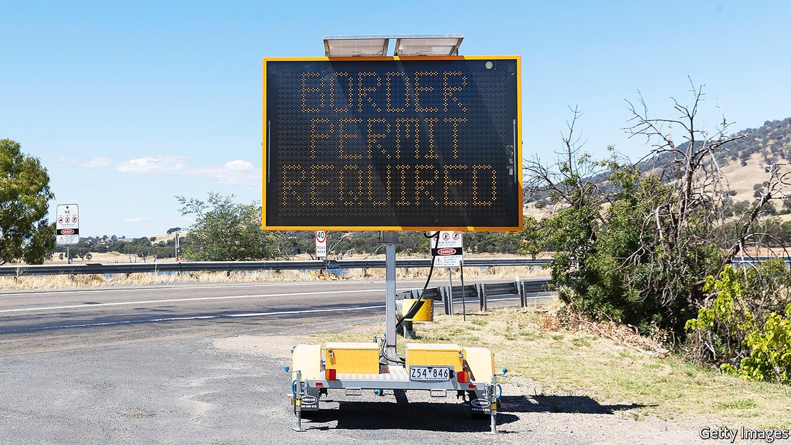

###### Isolation nation

# For many Australians, quarantine cannot be too tough 

##### Most of its people favour even tougher restrictions on travel 

 

> May 1st 2021 

IT TOOK TWO cases of covid-19 to plunge Perth, the capital of Western Australia, into lockdown on April 24th. The state government announced a three-day “circuit-breaker” just as locals were gearing up for a long weekend. “We can’t take any chances,” declared the premier, Mark McGowan.

Australian states keep ordering snap lockdowns because they are nervous about more contagious strains of covid-19. Some of the world’s strictest border controls have generally held the virus at bay. Most foreigners are barred from entering the country, and returning citizens must quarantine for two weeks in guarded hotels. When a case of the virus slips through, state premiers throw up defences.


A single infected quarantine guard closed Perth for five days in February. The state of Victoria, home to 6.7m Australians, went into a short lockdown after a cluster of 13 cases leaked from a hotel in Melbourne. Brisbane, capital of Queensland, has been shut down twice since January. And that is just this year.

The latest breach in Perth started with a man who fell ill after his isolation had ended. He caught the virus in quarantine, from an infected traveller in another room, raising fears about airborne transmission within hotels. State leaders are hollering for an even tougher system. Most quarantine hotels are in big cities, so one idea is to send travellers to better-ventilated sites in quieter spots. Mr McGowan wants the federal government to use air bases or a detention centre on Christmas Island, an Australian territory in the Indian Ocean. Queensland hopes to build a quarantine facility in the small city of Toowoomba. Victoria envisages a “village-style environment” outside Melbourne.

Another suggestion is to clamp down even harder on travel. Border controls ban residents from leaving as well as outsiders from coming in. Aussies can escape only for a handful of reasons, such as a family funeral. Mr McGowan, however, thinks they are swanning off too easily. “If people want to go overseas to covid-infected countries in the middle of a pandemic, then why should they come home and risk the rest of us?” he asks.

The federal government, for its part, is asking for a sense of proportion. The quarantine hotels are “99.99% effective”, says the prime minister, Scott Morrison. Half a million people have passed through them, notes the health minister, Greg Hunt. He calls it “one of, if not the, most successful systems in the world”.

But voters back the fiercest isolationists. Mr McGowan declared Western Australia “an island within an island” when the pandemic started, and cut it off from the rest of the continent for most of last year. He is so popular that his opponent conceded a recent state election weeks before the first vote was cast. Annastacia Palaszczuk, a strict guardian of Queensland’s borders, won a third term in October.

So when will Australia reopen to the rest of the world? The federal government had planned to vaccinate the adult population of 20m by October, but the roll-out is months behind schedule. Even when everyone is fully jabbed, officials say that travellers may still need some form of quarantine. A poll in February found that 71% of Aussies want to keep the international border closed until the “public health crisis has passed”. On that basis, they will be cut off for some time. ■

Dig deeper

All our stories relating to the pandemic and the vaccines can be found on our . You can also listen to , our new podcast on the race between injections and infections, and find trackers showing ,  and the virus’s spread across  and .

