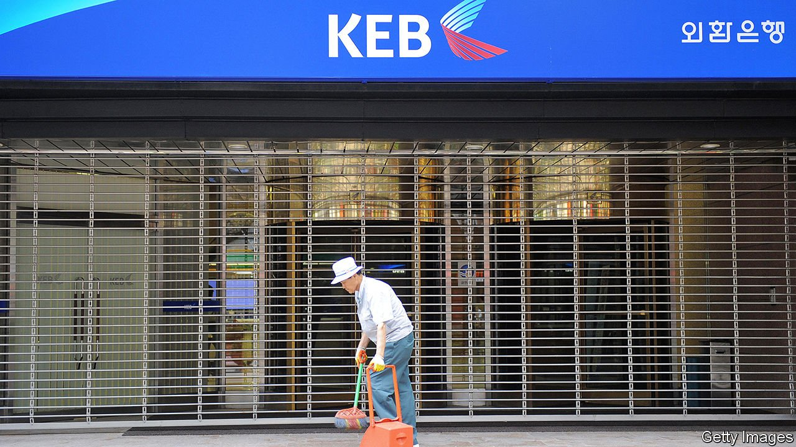

###### Chips and blocks

# The pandemic has accentuated South Korea’s two-speed economy 

##### Semiconductors are booming; services are not 

 

> May 1st 2021 

TWO ENORMOUS grey buildings decorated with blue, red and yellow rectangles meant to resemble a painting by Piet Mondrian dominate an industrial park south of Seoul. Inside, the world’s largest production lines for semiconductors churn out chips for Samsung Electronics 24 hours a day. Robots zip along rails on the ceiling, carting stacks of silicon wafers from one step in the process to the next. Few humans are allowed anywhere near the machinery, and only in protective suits, to prevent stray hairs or specks of dust from contaminating their output.

These buildings and others like them have been at the heart of the South Korean economy’s resilience throughout the pandemic. It shrank by just 1% in 2020, as global output fell by 3.5% and many rich countries suffered much deeper recessions. It is projected to grow by about 3.5% this year—its best pace in a decade. It has already regained its pre-pandemic size. That is a function mainly of exports, which are dominated by semiconductors and other manufactured goods, and were up by 16.6% year-on-year in March. Samsung made more money in 2020 than the year before, despite the pandemic.


Combined with South Korea’s success in limiting infections, this has meant that parts of the economy have hardly noticed the pandemic. Employment in manufacturing in South Korea stayed roughly constant between January 2020 and March of this year. Frantic construction of gleaming shopping malls and apartment blocks around the industrial park in Pyeongtaek is testament to the area’s dynamism. At lunchtime cars are double-parked outside the rows of new restaurants.

A barista in a coffee shop reports business as usual, except for a few weeks in the winter when she was allowed to serve only take-away. Two young men at an outside table who work for semiconductor firms say the pandemic has made little difference to their lives over the past year. “It’s factory work, not something you can do from home, so we’ve been going to work and taking our breaks here the whole time,” says one.

Near Ewha University in north-western Seoul, however, the picture is strikingly different. The grid of small streets which used to bustle with local and international students and Chinese tourists is mostly deserted. As university seminars have moved to Zoom and quarantine rules have kept foreigners away, the bulk of the area’s cafés, restaurants and cosmetics shops have closed down. The few that remain open are struggling. “I’ve been here for 30 years and this is the worst it’s ever been,” says the owner of a shop selling cut-price clothes. She expects that she can hang on for a few more months, but she has had to fire her part-time sales assistant. A restaurant around the corner stayed in business by making deliveries but has had to lay off most of its staff.

Unemployment, which hit a 22-year high of 5.4% in January, was back to pre-pandemic levels by March. But the number of people employed in retail, food or entertainment was still 6.6% below the level of 2020, suggesting that many had dropped out of the labour force altogether rather than registering as unemployed. Whereas export-focused businesses are benefiting from the recovery in global demand, these industries will suffer for longer, says Park Seok-gil of J.P. Morgan, an investment bank. The slow pace of vaccinations, he argues, will act as a drag on services in the middle of the year.

Some economists worry that the prolonged slump may exacerbate the already gaping divide between high-tech manufacturing and low-productivity services. “If the crisis is prolonged, it will leave scars on fragile sectors and poorer, less well-educated workers,” says Park Chang-hyun, an economist at the Bank of Korea, the central bank. Some small service firms may not rehire everyone they have laid off, so some of those who lost their jobs in the pandemic may find only badly paid, precarious part-time jobs. If they find no work at all, the pandemic-related shrinkage of the labour force may become permanent, reckons Mr Park. Youth unemployment is a particular concern: it has continued to grow even as overall employment has begun to recover, reaching 10% in March.

To cushion the blow, the government has doled out about 1% of GDP in relief payments to small businesses since September. It has also announced massive investments in digital infrastructure and “green” technologies with the aim of creating more well-paid jobs. But that will take a while. Business-owners say that the payments have barely made a dent in their losses. They want the government to compensate them for lost earnings and to expand low-interest loans to tide them over the remainder of the pandemic. Meanwhile, South Korea continues to record hundreds of cases of covid-19 every day. The roll-out of vaccinations is progressing sluggishly, and restrictions on socialising and dining out remain in place. It will be a while before the usual bustle returns to the streets around Ewha. ■

