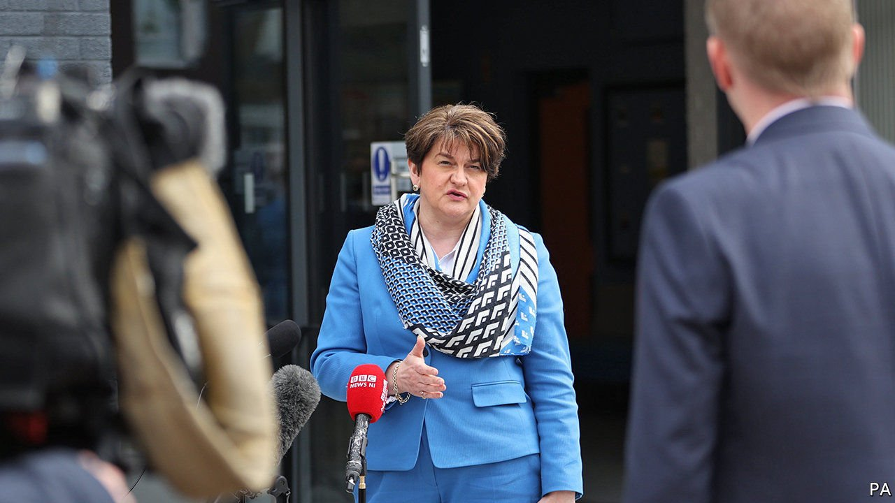

###### Northern Ireland

# Arlene Foster, Northern Ireland’s first minister, is ousted 

##### The Irish Sea border has claimed its first victim 

 

> May 1st 2021 

IN 1979 EIGHT-YEAR-OLD Arlene Foster was in the kitchen while her father, a reservist in the Royal Ulster Constabulary, was outside shutting his animals in for the night. She later recalled hearing gun shots: “I didn’t know what they were until my father came in on all fours crawling, with blood coming from his head.” Her father survived, but the family had to leave their home.

That was the political world in which Mrs Foster, who has been leader of the Democratic Unionist Party (DUP) for five years, was raised. It is less violent now, but still pretty brutal. On April 28th, after four-fifths of Mrs Foster’s colleagues in the Stormont assembly signed a letter of no confidence in her leadership, she said she would step down as DUP leader and first minister.


Mrs Foster’s star has fallen a long way since 2017, when despite holding just 1.5% of seats in the House of Commons, she kept Theresa May, and then Boris Johnson, in power. Mr Johnson then betrayed her, imposing a border in the Irish Sea, which has divided the United Kingdom, as part of his Brexit deal.

That calamity for unionism is key to the dismay at Mrs Foster’s leadership. But in truth her position has for four years been far weaker than her influence in Westminster implied. She has been vulnerable ever since the exposure of her role in the “cash for ash” scandal—a botched £1.2bn ($1.7bn) green energy scheme—four years ago.

Mrs Foster has no clear successor as DUP leader. Sir Jeffrey Donaldson, the party’s leader in Westminster, would represent a more polished continuity candidate, while Gavin Robinson, the 36-year-old MP for East Belfast, would be more liberal. But neither can be first minister because they are not in Stormont. Some in the party are considering a split leadership between Stormont and Westminster.

Edwin Poots, a veteran DUP minister, is favourite to become first minister. He is steeped in the party: his father was a hardline associate of Ian Paisley even before the Protestant cleric founded it 50 years ago. Mr Poots is a creationist, who has said he believes the Earth is about 6,000 years old. In 2011, when he was health minister, he refused to follow the rest of the UK in relaxing the ban on allowing gay men to donate blood. But he can be pragmatic and has worked quietly behind the scenes with Sinn Fein. That relationship will be crucial if the 1998 Good Friday Agreement which brought peace to the province is to survive.

Dealing with the consequences of the Irish Sea border will be the big challenge facing whoever takes over from Mrs Foster. “It isn’t going to go next year,” says a DUP assembly member. “This will define politics here for a generation but the current leadership hasn’t been able to look even two days in front.”

For more coverage of matters relating to Brexit, visit our 

