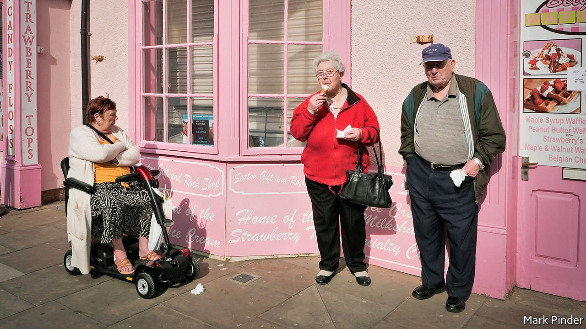
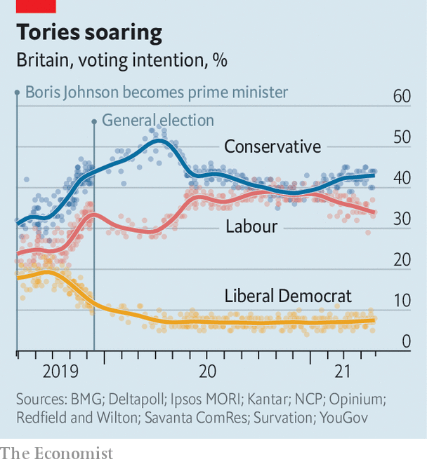

###### Upcoming elections

# How the Tories may triumph in the Hartlepool by-election 

##### Sleaze in London does not seem to be shifting opinions in the north-east 

 

> May 1st 2021 

“THEY’VE BEEN more or less locked up for nearly six months, so they’re just going daft,” says Tim Fleming, 68, the landlord of The Cosmopolitan, up on the headland overlooking the North Sea. The beer garden has been busy since England’s lockdown was relaxed on April 12th to a spell of fine weather, and weekday takings look more like those of a weekend.

Mr Fleming used to be a town councillor for the UK Independence Party, and in recent years has sat with a small independent group. On May 6th Hartlepool will hold a by-election for a new MP, and he plans to vote Conservative for the first time in his life. “The vaccine was a masterstroke. It’s pulling us out, when the rest of Europe is still in the mire.”


It will be an unusually busy polling day, as last year’s scheduled elections were postponed because of covid-19. Depending on where they live, Britons may vote for new councillors, a regional mayor, and a police and crime commissioner. Scotland and Wales will elect new devolved parliaments. For the Tories, Hartlepool is the most glittering prize, and perhaps the hardest. “I’d be astonished if Labour don’t win it,” says Robert Hayward, a Tory peer and psephologist, who notes that governments rarely gain seats in by-elections.

There are plenty of reasons for voters to shun the Conservatives and elect a Labour MP, as the town has at every election since 1964. The covid-19 pandemic has killed 127,000 Britons, including 252 in Hartlepool, a town with a population of 94,000 which has high levels of obesity and lung disease. It has created the deepest downturn for 300 years. Mr Johnson, in an ugly feud with Dominic Cummings, his former aide, is accused of saying he was prepared to “let the bodies pile high” to avoid a lockdown, and of a secret deal with party donors to refurbish his flat to the tastes of Carrie Symonds, his girlfriend.

In the 2019 general election Mr Johnson flipped around four dozen Leave-leaning seats in northern England, the Midlands and Wales, including Hartlepool’s near-neighbours of Redcar, Darlington and Sedgefield. More lie still in Labour’s hands, on shrunken majorities. The Conservative vote is spread thinly too, so a small shift in the polls in the next election could produce big gains or losses.

 


Hartlepool will offer a clue as to whether Mr Johnson’s revolution has stalled, or still has further to run. For 12 years the town was represented by Peter Mandelson, an architect of New Labour. Its loss would mean more than half the constituencies represented by members of Tony Blair’s cabinet of 1998 are now in opposition hands. Sir Keir Starmer’s leadership of the Labour Party would be thrown into crisis; supporters of Jeremy Corbyn, his predecessor, itch to declare him a failure.

Tory campaigners think the result will be close, although it’s hard to judge the terrain precisely, as lockdowns have prevented parties everywhere from canvassing their voters for the past year. Brexit remains an asset. Hartlepool voted 70% in favour of leaving the EU, and in 2019 Nigel Farage’s Brexit Party secured 10,603 votes—three times Labour’s lead over the Tories. The question is whether those voters will turn up again; if they do, polls suggest they will mostly go to the Conservatives. Tory leaflets warn that Paul Williams—the Labour candidate, a family doctor and a former MP for a nearby seat—worked against Brexit, and cannot be trusted.

Europe carries risks for Mr Johnson nationally. If he talks too little about it, the Tories’ new Brexiteer voters may drift away. If he bangs on too much, those who simply wanted the divorce “done” after years of discord become aggrieved. The Tories risk re-enacting Leonid Brezhnev’s Red Square parades, imploring exhausted workers to defend the October revolution long after the last tsarist is dead. For now, Mr Johnson is getting the balance right: polls suggest he has largely held on to his Brexiteers, while winning over a handful of Remainers. “He’s in the sweet spot,” says Chris Curtis of Opinium, a pollster. Voters’ identities as members of Brexit tribes have markedly softened since the political convulsions of 2019, but they are still stronger than party allegiances. Only one in ten think Britain’s relationship with Europe is now fully settled.

Mr Johnson has managed to persuade the public that, although the Conservative Party has been power for 11 years, under three prime ministers, he leads an energetic new administration. That feat eluded Sir John Major and Gordon Brown after similar tenures. In Hartlepool, the Tories cast themselves as insurgents taking on a neglectful Labour establishment. Money helps. Locals rave about Ben Houchen, the Tory mayor of Tees Valley, whom they credit with bringing jobs to the port to the south of the constituency.

Mr Johnson’s “levelling up” agenda shows little by way of methodology, beyond pushing cash to his new seats. Tory leaflets say Jill Mortimer, their candidate, is the best person to negotiate with ministers for investment, and Mr Fleming has taken the hint. “If there’s a Conservative government, and a Conservative mayor, we’re not going to get any money if we’ve got a Labour MP,” he says. Dr Williams, who has promised to reopen a closed criminal court, says his challenge is convincing voters that blame for cuts to local services lies with the government, and not Labour, which has controlled the council on and off since the 1970s.

Labour hopes sleaze and infighting ages Mr Johnson as it did Sir John. Certainly polls suggest that voters think him more corrupt than Sir Keir. But drinkers at The Cosmopolitan are unmoved, and think Mr Johnson a character, and more reliable than “bitchy” Mr Cummings.

Mr Johnson’s most remarkable feat is emerging from a pandemic, in mid-term, with his polling in the low 40s—a little shy of where it stood at the general election. He is enjoying a long and deep bounce from the vaccine, says Lord Hayward: 72% of voters, and 82% of Brexiteers, approve of the government’s handling of the programme. Dr Williams says credit belongs to the NHS, and finds the government’s plaudits a little galling after so many mistakes. “I had to make my own PPE,” he says.

Ms Symonds isn’t the only one picking out curtains. “Consumers are champing at the bit to spend,” says Oxford Economics, a consultancy. Clothes sales have jumped. The consensus forecast is that the economy will grow by 5.7% in 2021, the fastest annual pace in decades. Hartlepool’s decayed high street is mostly shuttered, but the big retail park is busy, and there’s a stream of Deliveroo drivers at McDonald’s. Mr Johnson has been predictably ill-suited to a crisis, but as a good-times prime minister, who splashes a little cash and opens the pubs, he excels. “He’s a positive guy trying to get things done,” says Mr Fleming. “You don’t get any positive vibes off Starmer. It’s like he’s fighting for his life.” ■

For more coverage of matters relating to Brexit, visit our 

