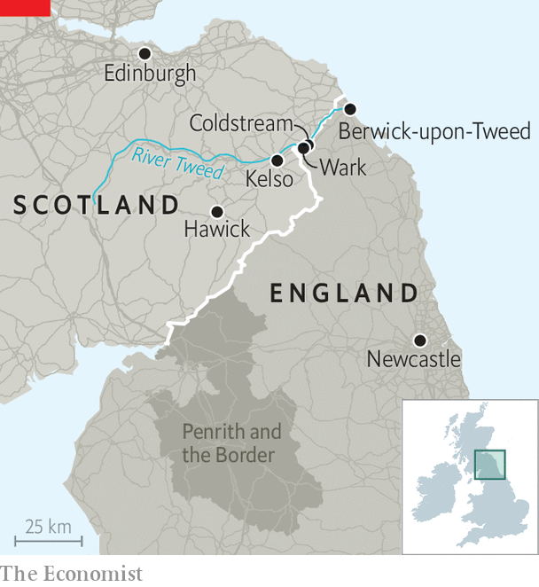

###### Nervous neighbours

# Nervous times on the Scottish border 

##### Scots living near England worry about the prospect of independence 

 

> May 1st 2021 

ON THE BANKS of the River Tweed, the English hamlet of Wark and the Scottish village of Coldstream used to play football each year for control of a two-acre field, according to medieval rules which placed no limit on the number of players. Coldstream grew and gained the upper hand. The victory is etched on Ordnance Survey maps: a part of Scotland that would otherwise belong to England. The border is a wooden fence swallowed by grass.

Even along the stretches decided by more conventional means, the border is similarly invisible. But if the Scottish National Party wins a big majority in elections to the Scottish Parliament on May 6th, it may become the most prominent question in British politics, for Nicola Sturgeon, Scotland’s first minister and the SNP’s leader, will seek a second Scottish independence referendum.


Unlike many of their fellow countrymen, voters in the borders are likely to back the Conservatives next week. The region leaned more heavily against independence than the rest of the country in the first referendum in 2014. At the last election in 2016, the Tories won all three Scottish Parliament seats abutting England, and they seem on track to hold them, forming a fat collar of blue across the bottom of a mostly yellow electoral map.

 


To avoid passport checks after Scottish independence, the SNP aims to join the Common Travel Area, an agreement between Britain and Ireland that allows citizens to travel freely in each other’s countries. But if Scotland rejoined the EU, it would have to impose controls on English goods entering Scotland. Lorry parks and inspection sheds would have to be set up on at least some of the 25 road crossings on the 96-mile border, cutting through a region with a shared history and a distinctive identity that spans the border.

The quickest route between Scottish villages is often via England. There is no clear geological or geographical division between the two countries: Berwick-upon-Tweed has changed hands at least 13 times, and both sides launched border raids. Many border Scots reckon they are ignored by both governments, which impose unpopular projects on the region: nuclear plants, reservoirs and mass forestry. “They really will feel that they’re at the very end of the world if a hard border emerges,” says Rory Stewart, a former Tory MP for Penrith and the Border, on the English side.

The economy of southern Scotland is built on the assumption of easy access to England. Businesses draw on suppliers, stock stores and serve customers sprawled across the border. “Since the troubles were quelled in the 1700s we’ve all been bouncing back and forth perfectly happily, marrying, doing business and going on holidays without any impediment whatsoever,” says John Fordyce, a distiller in the town of Hawick, 12 miles into Scotland. England is 60% of Scotland’s export market, and the EU is 19%.

Some of those who live near the border are unfazed by the idea of restrictions on trade with England, but the uncertainty weighs on others. Sheila Robertson, financial director of Stewart Technology, an electronics firm, says her company hopes to build a second factory but is awaiting the outcome of the election. Andrew McEwan, who runs a digital marketing business near Kelso, points to the potentially infinite nature of separatism. “If Scotland voted for independence, surely we should have a vote on whether the borders could leave Scotland.”■

