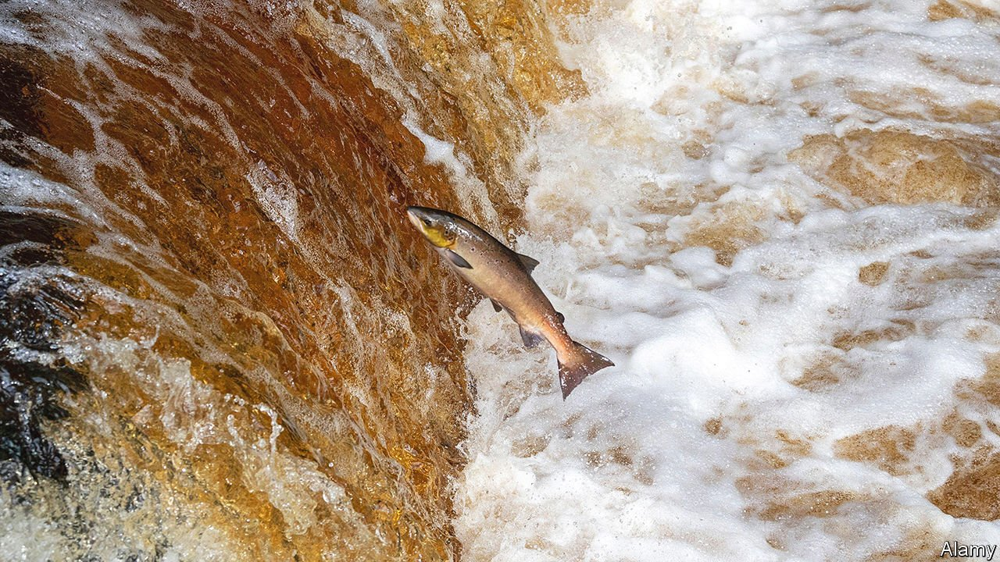

###### Fishy statistics

# Norway shows the scale of salmon farmers’ Brexit problems 

##### Fish are doing much worse than whisky 

 

> May 1st 2021 

BRITAIN’S SALMON farmers are not having a good year. Pandemic-related restaurant closures have hit the industry hard. Salmon is a fancy dish, the kind of food people often order when dining out rather than cook at home.

Then came Brexit. As recently as December Scottish-farmed fish could move seamlessly to plates the length and breadth of the European Union (EU) but now they are subject to sanitary and phytosanitary (SPS) checks at the border to ensure they meet EU standards. In January British salmon exports to the EU fell to just £0.5m ($0.7m), a 98% drop from January 2020. Figures published on April 26th showed that February brought some relief, with the value of salmon exports recovering to £25.6m, but they were still down by more than 10% on the year before.


Disentangling the effects of the pandemic and Brexit is far from straightforward, but a clue lies across the North Sea. Norway is not a member of the EU but is inside the European Customs Union, and its salmon are not subject to SPS checks. The Norwegians take their salmon exports seriously, publishing weekly export data. When the value of British exports fell by 98% in January, Norway’s were down by just 23%. In February the value of Norwegian exports fell by just 5% year on year, half the drop experienced in Britain.

January’s catastrophic fall in salmon exports reflected the difficulties of moving from a seamless border to a much knottier one. Customs officials and hauliers struggled to get to grips with new procedures and untested IT systems took time to bed down. Exporters complain that different EU states are applying the rules with varying degrees of stringency, further complicating the task of complying. Those teething problems have begun to ease but there is still structural friction. The new checks add cost and bureaucracy, discouraging customers from buying produce they can get elsewhere.

That helps explain the contrasting fortunes of salmon and whisky. Britain’s whisky exports to the EU rose by 9.3% year on year in February. Scottish distilleries have much stronger brands than Scottish fish farms and a product that rises in value with age is less vulnerable to short delays than one that must be fresh out of the sea. Norwegian salmon is a perfectly good substitute for the Scottish variety; Scandinavian whisky, less so. ■

For more coverage of matters relating to Brexit, visit our 

