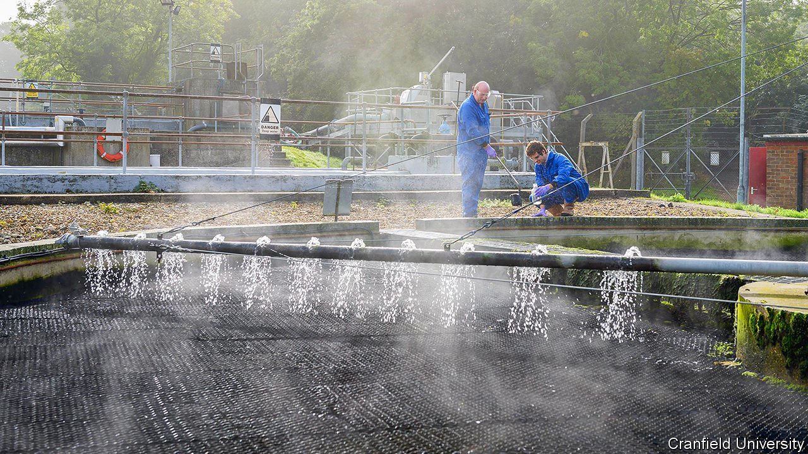

###### Pond-dipping

# Testing sewage for covid-19 

##### It’s a cheap and effective way to map the spread of infection 

 

> May 1st 2021 

THE SOUND is that of an Alpine stream. The smell is not. On a bright spring day, Davey Jones, professor of environmental science at Bangor University, stands above a surging torrent of sewage. He holds a bucket on a stick which he lowers into the torrent then, as rich gusts of smell drift past, gingerly lifts it out. He holds the bucket up to the light and examines his catch, as a child might when pond-dipping. “Some identifiable bits of object in there.” He peers closer. “Looks like some sweetcorn floating around.”

Civilisation, it has been said, is the distance humanity has placed between itself and its faeces. But civilisation now needs to get a lot closer to its faeces. Because as well as sweetcorn, sewage also contains coronavirus. In every litre of wastewater that flows through Britain there are currently around 1,000 coronavirus particles. At the peak of the January wave, each litre contained between 100,000 and 10m. Take data like these, plot them on a map, and you have a snapshot of a nation’s infection.


Sewage mapping—or to give it its grand name, “wastewater analysis”—is now happening on a large scale in Britain. When the pandemic began, it was not clear whether coronavirus particles would either be shed in faeces or survive in sewage. It was therefore not clear whether it could be mapped in this way. A preliminary trial begun in March 2020 at six wastewater treatment plants in Wales and north-west England showed that it was frequently shed—and that it could be mapped. (Similar trials on sewage have taken place across the world, and routine wastewater analysis is now being carried out in a few countries.) Now over 4,000 samples are processed each week in Britain.

Testing sewage has many advantages. For one thing, it is easier to handle than people, who require expensive testing centres, staff to perform the tests and the inclination to turn up for them. Stools are much less demanding: to get a sample from a sewer you merely need a bucket and a stick. It is cheap, quick—and pleasingly inclusive. Not everyone will go to a testing centre. Everyone goes to the toilet.

Wastewater analysis could, says Sally Davies, UK Special Envoy on Antimicrobial Resistance and an advocate of the art, “be game-changing”. It has already changed things. If you know where to look, then every day across Britain you can spot people with buckets on sticks and a purposeful air, pond-dipping in the nation’s excreta. In Nottingham and in Newcastle, in Liverpool and in Manchester, scores of manhole covers are being lifted; hundreds of buckets dipped; thousands of samples removed. (More expensive automatic samplers are also widely used.)

These samples, their colour ranging from a discreet eau de Nil to rat’s-back dark, are then bottled. The colour depends on many factors, from contamination with industrial effluent, to rain (which dilutes samples), to the time of day. Samples taken at lunch—which reflect the post-breakfast rush filtering through the system—are some of the richest. All samples are analysed in labs, including one which Dr Jones runs in Bangor, to produce a map of the nation’s infection. If a surge in infection is spotted, surge testing can then be conducted in the area. Wastewater analysis is not sufficient in itself. But it is, says Dr Davies, “a cheap way of raising a flag and saying ‘There might be something going on here, let’s have a look’.”

Tracing diseases along water systems is not new. Epidemiology was spawned in the sewer when in 1854 John Snow, a London doctor, plotted cholera cases on a map and realised that the disease was being caused not by airborne “miasma” but by a water pump contaminated with sewage. Nor will it end with this pandemic: before 2020 wastewater analysis was already being used to monitor illegal drugs and polio. Now, it is hoped it will expand to include not just coronavirus but everything from the next potential pandemic to antimicrobial resistance.

Given how long the power of sewage has been understood, it feels surprising that this rich data-stream was, until recently, merely being flushed down the toilet. Partly the problem was size. Dr Snow was counting corpses, which are at least easy to spot. Modern analysts are counting coronavirus particles, which are tiny: it would require at least 2,500 coronaviruses to span the full stop printed at the end of this sentence. The other problem is inertia. The knowledge to run a national programme of analysis might have been there before, but the money to roll such things out can rarely be found. “Until,” says Dr Jones, “literally the shit hits the fan.” ■

Dig deeper

All our stories relating to the pandemic and the vaccines can be found on our . You can also listen to , our new podcast on the race between injections and infections, and find trackers showing ,  and the virus’s spread across  and .

