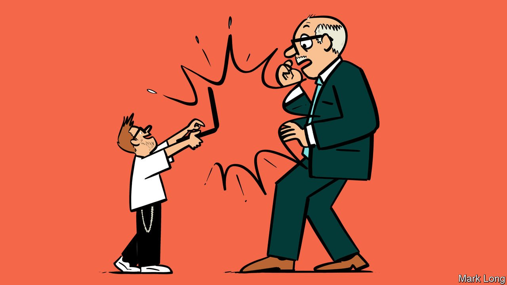

###### Geeks v bureaucrats

# How France’s data scientists are upstaging its administration 

##### They are succeeding where the énarques failed 

 

> May 1st 2021 

WHEN THE pandemic broke out, a 23-year-old French data scientist was working in his bedroom at his parents’ house in a Savoyard valley. Guillaume Rozier began to plot, and tweet, cases of covid-19 in Italy against those in France. His data analysis swiftly became a popular covid-19-tracking site. This April it spawned “ViteMaDose” (QuickMyJab), a website that in two clicks scans disparate French health sites for scarce vaccination slots. It now draws 2m-3m views each day.

France’s geeks are taking on its mighty bureaucrats. Armed with simplicity, clarity and algorithms, they are defeating the administration’s fondness for complexity, confusion and rules. Other new sites, such as Covidliste or Covid Anti Gaspi, match unused vaccine doses in fridges to willing takers nearby. “How”, an astonished talk-show host asked Mr Rozier, “have you managed to create this system that the French administration hasn’t?”


Mr Rozier, whose site is non-profit, says he saw the need when struggling in March to get an appointment for a relative. France’s health system is fragmented, with no centralised booking; vaccine deliveries are patchy. He crowdsourced help to refine the algorithm and design. “Lots of people contact us to say thanks for helping find appointments,” he says. “That’s really cool.”

France’s 5m bureaucrats are masters of the art of convolution. When the government started a new lockdown in March, they devised a two-page permission form to leave home, with 15 different justifications, before shelving it in the face of ridicule. Current rules mix precision with farce. The French can buy alcohol, for instance, but not underwear.

President Emmanuel Macron is trying to overhaul the administration. He is abolishing the elite ÉcoleNationale d’Administration. Cédric O, his digital minister, is piloting the European Union’s first digital health certificate, for travel to Corsica. But bureaucrats are generally better at devising rules and collecting information than making either comprehensible. Allez les geeks.

