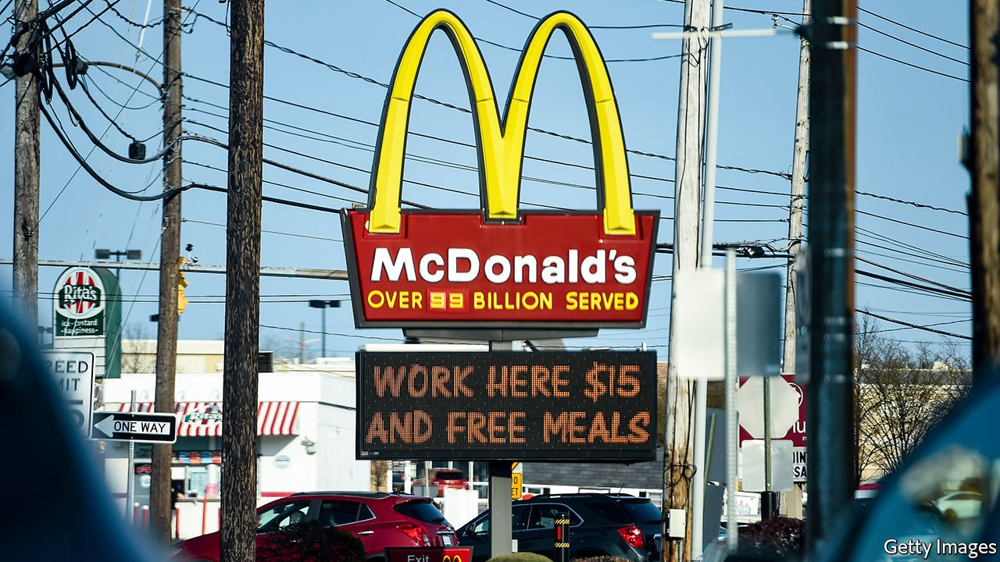
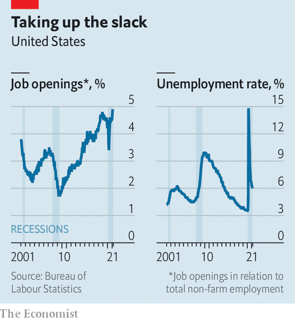

###### Help wanted

# Why are American workers becoming harder to find? 

##### Labour shortages are rising even though unemployment remains high 

 

> Apr 29th 2021 

THE PANDEMIC has led to all sorts of weird economic outcomes. The latest oddity is the growing chorus of complaints in America about a shortage of labour, even though 8m fewer people are in work today than before covid-19 struck. In early April Bloombergreported that Delta Air Lines had cancelled 100 flights for lack of staff. People are so hard to find that one café in Florida has turned to robots to greet customers and deliver food. A branch of McDonald’s is paying potential burger-flippers $50 just to turn up for a job interview.

 


The data back up the anecdotes. Total vacancies are running at their highest level for at least two decades (see chart), indicating that firms have plenty of unfilled positions. Furthermore, job openings are leading to fewer hires than you would expect based on the historical relationship between the two. And even accounting for changes in the composition of the workforce, wage growth, at about 3%, has been surprisingly robust, suggesting that firms are offering bigger pay packets to tempt workers. If they persist job shortages could eventually fuel inflation, threatening the economic recovery.


There are three potential explanations for the puzzling shortages: over-generous benefits; fearful workers; and a reallocation of labour between industries. Start with America’s huge fiscal handouts. The latest stimulus cheques, posted in the spring, were for up to $1,400 per person. Seemingly every American knows of a neighbour’s cousin’s boyfriend who received a “stimmy” cheque, then quit his job in order to sit on the sofa. A federal supplement to unemployment insurance (UI), currently $300 a week, ensures that four in ten unemployed people earn more from benefits than they did in their previous job. Economic research has long concluded that more generous benefits blunt incentives to look for work.

Yet this relationship appears to have weakened during the pandemic. The fact that increases in UI payments have been time-limited may make workers reluctant to turn down a job with longer-lasting rewards. In the early part of the pandemic the UI supplement was even more generous, at $600, but its expiry in the summer had “little effect on overall employment”, according to a paper published in February by Arindrajit Dube of the University of Massachusetts-Amherst. Likewise, in the areas where the current $300 is a relatively larger boost to income, employment growth has not weakened since January, when that uplift was introduced.

This suggests that the second factor, fear, may be important in explaining America’s shortage of staff. Nearly 4m people are not looking for work “because of the coronavirus pandemic”, according to official data. And consider which industries are experiencing the most acute worker shortages. Jobs in health care, recreation and hospitality report the highest level of job openings, relative to employment. Many of these involve plenty of person-to-person contact, making their workers especially vulnerable to infection (a study from California earlier this year found that cooks were most at risk from dying of covid-19). By contrast, in industries where maintaining social distancing or being outside is often easier, labour shortages are less of an issue. The number of job openings per employee in the construction industry is lower today than it was before the pandemic.

The final reason for worker shortages relates to the extraordinary reallocation of resources under way in the economy. The headline growth in vacancies represents the rise in opportunities in some industries—say, clerks in DIY stores—as others decline, reflecting changing consumer demands. Analysis by The Economist of over 400 local areas also finds a wide variation in job churn across geographies: the gap between jobs growth in the most buoyant areas and that in struggling ones is twice as wide as it was before the pandemic. Workers may take time to catch up with this creative destruction. A former bartender looking for work in downtown Manhattan, for instance, may not quickly spot and secure a position as a delivery driver in farther-out Westchester.

As vaccinations continue to reduce hospitalisations and deaths from covid-19, and limit the spread of the disease, Americans’ fears about taking high-contact jobs should fade too. But if shortages are to dissipate fully, and the threat of inflation is to be contained, some of the unemployed will also have to take up work in sectors and areas that are new to them. ■

A version of this article was published online on April 27th, 2021

