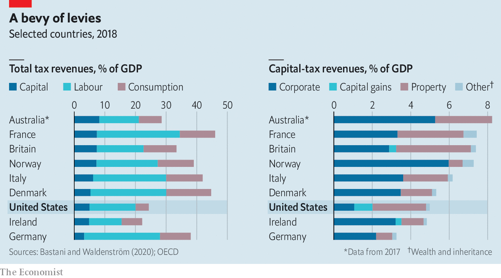

###### Benchmarking Biden

# Will Joe Biden’s proposed taxes on capital make America an outlier? 

##### America’s president plans to raise both the corporate and the capital-gains tax 

 

> Apr 29th 2021 

IF PRESIDENT JOE BIDEN succeeds in raising America’s top rate of federal capital-gains and dividend tax to 39.6%, as he pledged to Congress on April 28th, it would be twice the average top rate in Europe. But it would apply only to the highest-earning 0.3% of taxpayers: those earning more than $1m. The fact that countries cast their nets differently makes comparing taxes on capital, which include levies on companies and property as well as on capital gains and dividends, tricky. The OECD, a club of mostly rich countries, does not publicly track members’ capital-gains-tax rates because exemptions and carve-outs make them so hard to compare.

Fortunately comparing how much money countries raise is easier. America’s total taxes on capital brought in revenues worth about 5% of GDP in 2018, according to analysis by Spencer Bastani of the Institute for Evaluation of Labour Market and Education Policy and Daniel Waldenstrom of the Research Institute of Industrial Economics, two Swedish think-tanks. That compares with an average of 5.8% for a panel of 16 OECD countries. What is distinctive about America is its mix of capital taxes. Its corporate tax raises relatively meagre revenues (see chart), whereas property-tax revenues are unusually high. Overall, America collects less tax than most rich countries, so as a share of total revenues, capital taxes are a hefty 20%, fifth among the 16 countries in the researchers’ sample.

 


By how much would Mr Biden’s plans change this picture? Working out the answer is just as tricky as conducting cross-country comparisons. The headline proposals are straightforward. Corporate taxes would rise from 21% to 28%. And the rate on capital gains and dividends would nearly double from 20% for top earners (who own a disproportionate share of wealth). But assessing how saving and investment respond to capital taxes is one of the most hotly debated topics in economics.

Investors can choose when to sell assets, and therefore when to pay capital-gains tax. American budget wonks usually calculate a revenue-maximising rate of capital-gains tax of about 28%. But that is under existing rules, which in effect waive the tax on estates when heirs inherit them. Mr Biden wants to close that loophole, so postponing capital gains indefinitely might no longer be so attractive, drawing more of them into the tax net. Taking this change into account, the Penn-Wharton budget model finds that Mr Biden’s capital-gains proposal would raise $113bn over ten years.That is still relatively modest compared with the $1trn that Mr Biden’s proposed increase to the corporate tax is expected to bring in. The combined revenues would come to about 0.4% of projected GDP over the decade, which would still leave America in the middle of the OECD pack for overall capital taxes.

Might the scorekeepers be underestimating the revenues from changing capital-gains taxes? That is what a recent paper by Natasha Sarin of the University of Pennsylvania, Larry Summers of Harvard University, Owen Zidar of Princeton University and Eric Zwick of the University of Chicago argues, for a variety of technical reasons. Earlier work by Mr Zidar and Ole Agersnap, also of Princeton, finds a rate of 38-47% could maximise revenue. Still, the uncertainty around these analyses is high—the second paper relies on an extrapolation from state-level taxes. And in any case the revenue-maximising rate is not necessarily the same as the most desirable rate for society, notes James Poterba of the Massachusetts Institute of Technology.

Economic policy should consider both the revenue raised and the downsides of the tax—and Congress will no doubt soon be debating just that. ■

A version of this article was published online on April 28th, 2021

