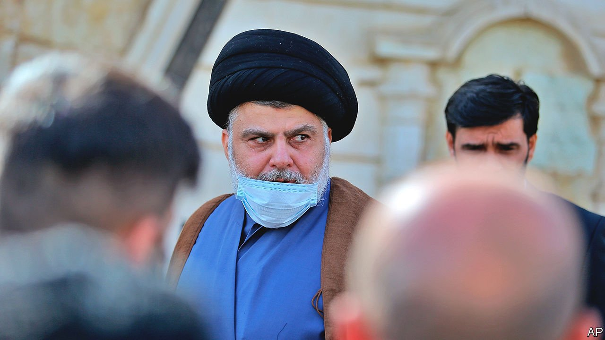

###### The enemy of my enemy

# Firebrand cleric Muqtada al-Sadr and America move closer in Iraq 

##### Two former foes find their interests converging. For how long? 

 

> May 1st 2021 

IRAQ’S HEALTH ministry did not think to install smoke detectors or a sprinkler system when it renovated the Ibn al-Khatib hospital in Baghdad last year. So when oxygen tanks for covid-19 patients exploded on April 24th, the fire spread fast, killing at least 82 people. The blaze also singed the reputation of Muqtada al-Sadr (pictured), the volatile Shia cleric whose political party, Sairoun, controls the ministry. Rivals accuse him of siphoning funds that should have gone to the hospital.

Mr Sadr’s evolution from warlord to protest leader to pillar of the establishment has been remarkable. Having once led demonstrations against corruption, he is now the target of them. And his relationship with the public is not the only one transformed. As his power has grown, his interests have changed. Lately that has moved him closer to America, a former foe.


Saddam Hussein was “the little serpent”, but America “is the big serpent”, said Mr Sadr not long after America toppled Iraq’s most homicidal dictator in 2003. During the ensuing years Mr Sadr’s militiamen attacked the American troops who occupied Iraq, killing hundreds of them. But today, as America draws down its forces (only 2,500 remain), Iran poses a bigger challenge to Iraq’s independence. It wields influence through local militias and the politicians it backs. America sees Iran as a threat and, increasingly, so does Mr Sadr.

The cleric’s relationship with Iran is complicated. He has spent years of his life in Qom, Iran’s holiest city, studying and seeking protection from armed rivals in Iraq. Iran has at times seen him as a useful ally. But he has also championed Iraqi nationalism. When protests against corruption and Iranian influence broke out in Iraq in 2019, Mr Sadr’s forces backed them—at least at first. When it seemed as if the protesters sought to sweep him aside as well, his forces helped violently to quash the protests. Some Iraqi officials hold Iran responsible for a drone attack on Mr Sadr’s home in 2019.

Mr Sadr seems to view Iranian influence in Iraq as a threat to his own power. That helps explain why he recently welcomed a statement by the American and Iraqi governments reaffirming the presence of American forces in Iraq. He also denounced rocket attacks by Iranian-backed militias on America’s embassy in Baghdad and on an airfield in the north used by American forces. He has even offered to deploy his own militia, the Peace Companies, to guard Western embassies. Iraq’s ties with Saudi Arabia and the United Arab Emirates, America’s allies and Iran’s enemies, should be strengthened, he says.

Mr Sadr rejects direct talks with America, but they share many interests. Both backed Daewoo, a South Korean conglomerate, in its bid for a multi-billion-dollar contract to develop the port of Faw in the south-east. It beat a Chinese firm supported by a rival Shia militia leader. Mr Sadr is also mulling an electoral pact with Sunni Arab and Kurdish politicians who are close to America. He already lends his support to Mustafa al-Kadhimi, the prime minister, who is backed by America and who has tried to limit Iranian influence. Mr Kadhimi has faced opposition from Iranian-backed parties. But Sairoun, which is the largest party in parliament, protects him from a vote of no confidence.

“Iraq is in chaos, Iran is filling the vacuum and Sadr’s is the only strong force that can resist,” says an Iraqi official. Some in the West agree. Mr Sadr was spared when America placed sanctions on Iraqi militia leaders with ties to Iran in 2019. Under President Donald Trump, American officials tried to engage the Sadrists through Iraq’s ambassador in Britain, who is Mr Sadr’s brother-in-law. President Joe Biden is still formulating his Iraq policy and may seek to ease tensions with Iran. But some in the administration are encouraging America’s political allies in Iraq to align with Mr Sadr before an election in October. “Ride Sadr while you destroy the Iranian-backed elements, and then in eight years think again,” says a Western analyst.

Others think that would be a mistake. “You can’t trust him,” says one of the protesters whom Mr Sadr turned against. The loudest warnings come from Mr Sadr’s former confidants. Sheikh Assad al-Nassiri, a cleric now in hiding, thinks Mr Sadr’s aim is to capture the state. Ghaith al-Tamimi, a cleric who was defrocked for disobedience to Mr Sadr, says Western backing for him would be “a monumental strategic blunder”. He worries that “it will end democracy in Iraq and surrender the country to a dictator worse than Saddam Hussein.” ■

