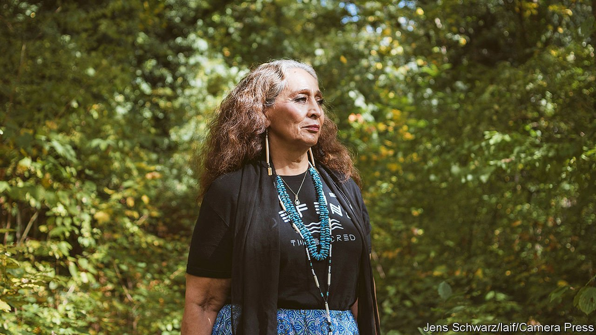

###### Black snake, sacred water

# LaDonna Brave Bull Allard died on April 10th 

##### The historian and campaigner for Native-American rights was 64 

 

> May 1st 2021 

THE FIRST time they drove up to Whitestone Hill, in south North Dakota, LaDonna Brave Bull Allard had to ask her husband to stop. She could hear grief coming out of the ground, crying and screaming. She had to lay down food and water there, as well as prayer-ties of sweet willow-bark tobacco that could soothe and heal the spirits of the dead.

Whitestone Hill in 1863 had seen a terrible massacre, when hundreds of men, women and children had been herded into a ravine and shot by the United States Army. They had been members of a large camp of tribes, mainly Sioux, who had been meeting to prepare for winter by hunting buffalo and arranging marriages. Among them was her great great grandmother Mary Big Mocassin, then nine years old, who felt the sudden heat of a bullet tear into her hip. She survived, but had shivered in a field for hours crying for her mother. Her voice, too, called from the place.


On the very date of that massacre, September 3rd, but in 2016, LaDonna herself was in a field, frozen and immobile. Again, white men in heavy fighting gear—this time company security guards—were breaking up a camp, one she had made to obstruct the building of the Dakota Access Pipeline beneath the sacred lands of her tribe. Hundreds of protesters were being tear-gassed and pepper-sprayed. Dogs were set on them, and now she was facing one with blood on its dark grey jaws. Yet the only thought in her head was a historian’s: how could this be happening again, on the anniversary of so much killing?

It happened because they were living in prophecy, the sort the old women liked to discuss round the kitchen table while she, and the other young, pretended not to hear. One was of Zuzeca Sapa, a black snake that would destroy the world unless her people stood up to defeat it. Back then the snake was taken to be the new Interstate highway, surfaced with black tar. Now it was clearly the pipeline, 1,170 miles long and costing $3.8bn, intended to carry black oil from the North Dakota shale-oil fields to Illinois. On the way it threatened 380 archaeological sites; 26 were in the 40-mile stretch round the meeting of the Missouri and Cannonball rivers, where roots had first grown out of her feet.

This was her father’s land. As a child she had noted every feature which later, as historian of the Standing Rock Sioux, it became her job to catalogue and preserve. The low rolling hills carried the remains of Arikara villages, with effigies arranged in stones and prayers laid for years on the ground. On the peak above her camp her father was buried, along with one of her sons. At the confluence of the rivers was a whirlpool that carved the sand into great spheres strewn along the banks, the sacred stones. Here beside the Cannonball river her grandfather had sun dances with Wise Spirit, her uncle climbed trees for honeycombs and the family hauled up water every day, to drink and live. Soon afterwards that history was part-destroyed by the damming of the Missouri, which left the water unsafe to drink, the whirlpool flat and bleached trees, skeletons of spirits, poking from the water. The pipeline map provided by the company showed nothing there; her people’s footprints had been taken out of the earth.

It was up to them to crush the snake. She was no activist: her loves were genealogy and archaeology, pursued through university and now for her tribe. Her way was to invoke the past like a mantra, as she did when she quickly, firmly gave her real identity to any white interviewer: Tamakawastewin, “Her Good Earth Woman”, Sissintonwan Dakota from her mother, Oglala Lakota from her father. Yet she also had land, and in April 2016 she set up the Sacred Stone camp at Standing Rock as a spiritual centre of protest. Only a few came at first; locals brought them coffee, firewood and sleeping bags. But a social-media appeal drew hundreds, then thousands, eventually in two camps, in tents and yurts and maple-pole tipis. The seven bands of the Sioux met there for the first time in 140 years. The camps overflowed with horses, dogs, children, singing, story-telling and the smell of frybread. Tribal flags from almost every state lined either side of the route down to the pipeline site, where young men riding bareback would line up to block the road. She spread the word by travelling and speaking; the young spread it on their phones.

In this deliberately leaderless gathering, she kept the focus sacred. The ancestors had put medicine into this ground. Now it had to be applied again, to heal the body of Mother Earth and especially to heal Water, their first medicine. Indigenous spiritual leaders from all over America, as well as beyond it, brought water from their own rivers to fortify the Cannonball against future leaks of oil. The protesters were “water protectors”, and their rallying cry was “Mni Wiconi”, “Water is Life.”

It lasted the best part of a year. At first the Obama administration had allowed the pipeline, then paused it; the Trump administration, citing the national interest, ordered it to resume, but was found in violation of federal law. Violence broke out as the pipeline company (which had not been stopped from operating) continued to dig towards the last remaining stretch, where her heart was. The leaderless movement began to fall apart. Meanwhile the tribal council of the Standing Rock Sioux, as well as the local police, became disenchanted with the camps, their mess, cost and trouble, and joined federal agencies to drive them out. By March 2017 they were cleared, and through the miles of 30-inch light-green pipes the black snake oozed its way.

This looked like defeat, but not entirely. President Biden might yet shut this pipeline down, as he had cancelled KeystoneXL; the signs were hopeful. She had plans to build a new camp, fully self-sufficient, in the hills nearby. Echoes of the old camp, too, still sounded. The names “Sacred Stone” and “Standing Rock” were now famous, and fresh prayers had been laid on the ground. In this corner of North Dakota, at least, her people were no longer erased from history. If you walked there, you could hear their resistance rather than their grief. ■

