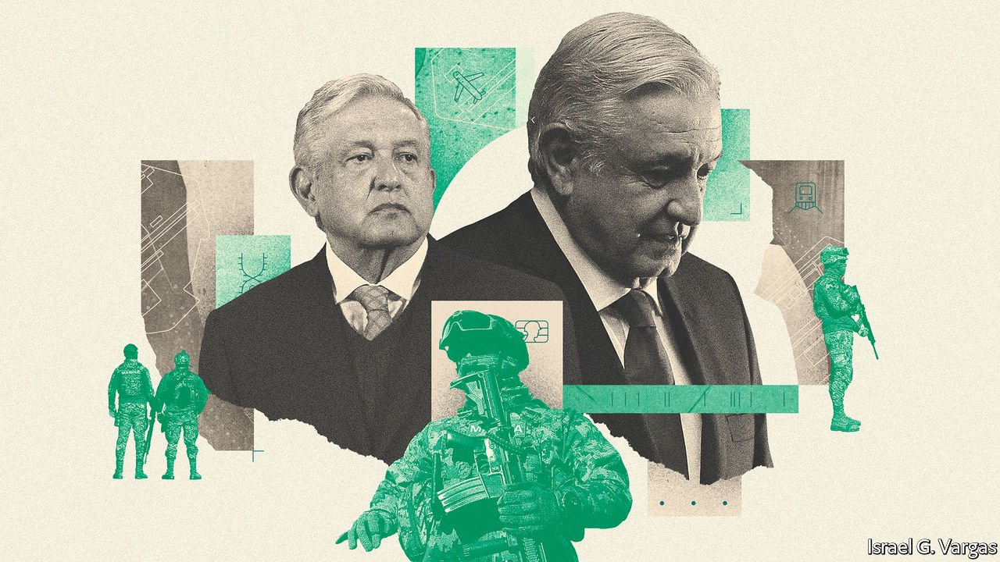
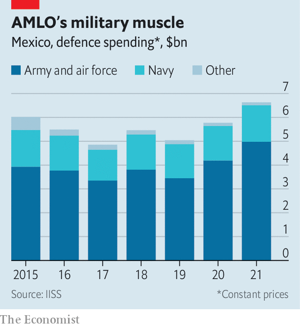

###### Sergeant López Obrador

# Mexico’s president is giving the armed forces new powers 

##### They have not held such sway since the 1940s 

 

> Apr 29th 2021 

THE MAYA train, a 1,500km-long railway that is due to run through the Yucatán peninsula, is one of Andrés Manuel López Obrador’s pet projects. But rather than entrust the job to world-class architects or engineers, Mexico’s president has given it to military men. Last year he said the armed forces would build several sections of track, later adding that they would also operate part of the line. In March it was revealed that the army would not only construct and run the railway, but also keep all the profits from it, too.

The story of the Maya train hints at the rising influence of the armed forces under AMLO, as he is known. During his campaign in 2017 he promised to remove soldiers from the streets and criticised the army for human-rights abuses. But since becoming president he has given them more and more power. They have not held such sway since the end of Mexico’s military-led government in the 1940s.


As well as building shiny projects, such as the Maya train and the new international airport in Mexico City, the armed forces fight drug gangs, control migration, guard fuel pipelines, administer ports and run hospitals—all tasks previously carried out mostly by government agencies or the police. Before AMLO, the armycontrolled some parts of the border with the United States; it now controls all of it. The navy used to monitor ports; from this year it administers them. Last year AMLO also handed customs, previously run by a government agency, to the armed forces.

They have always played some role in public security in Mexico. Shortly after Felipe Calderón, the president from 2006 to 2012, was inaugurated he launched a campaign against drug traffickers, dispatching some 20,000 troops across the country. What started as a temporary measure intended to restore order continued under Enrique Peña Nieto, AMLO’s predecessor. Similarly, the armed forces have long had a hand in some big infrastructure projects. But according to Javier Oliva of the National Autonomous University of Mexico, under AMLO “a very quick evolution” has taken place, and the armed forces now have an unprecedented level of involvement in national affairs.

For a start, the president has rendered civilian policing all but obsolete by dismantling the federal police and creating a new National Guard. In theory this is a civilian organisation. In practice that is “a very big pretence”, says Eduardo Guerrero, a security analyst. Neither the former federal police nor new recruits wanted to join it in large enough numbers, so members of the army and navy were drafted in. Of the 100,000 or so National Guard members as of February, three-quarters are from the army or navy. It is commanded by a recently retired general.

Moreover, AMLO has put the militarisation of public security on a firmer legal footing, says Catheryn Camacho Bolaños of the Mexico Autonomous Institute of Technology (ITAM). In May last year he issued an executive decree expanding and formalising the role of the armed forces in public security, including the authority to detain suspects and secure crime scenes. And whereas other ministries face funding cuts, the army is flush with cash (see chart). The ministry of defence, which covers the army and air force but not the navy, received $5.6bn in 2021, a 40% increase on 2018 in nominal terms.

 


The president’s increasing tendency to lean on the armed forces appears to stem from a desire for quick results. Mexico’s civilian bodies are weak. AMLO distrusts them, along with the private sector, and has alienated or weakened both further. Mexicans rate the armed forces more highly than any other state institution, seeing them as comparatively professional and free of corruption. The military has around 216,000 active personnel who obey the orders of the president as commander-in-chief, without the buffer of a Pentagon-style civilian bureaucracy.

By promising speedy action—whether through building infrastructure or doling out covid-19 vaccines, as they have done this year—the armed forces are likely to boost AMLO’s support base. At 63%, he has one of the highest approval ratings for a president at this point in his term of office. But with important state, local and legislative elections in June he is keen for it to be even higher.

With a little help from his friends

This desire for efficiency could have unintended consequences. There is a tacit understanding between the government and the armed forces that they are not to get involved in politics. That is potentially under threat, thinks Jorge Castañeda, a former foreign minister. The armed forces, now emboldened, “may start to get opinions on things, and temptation lies down that road”, he warns.

The case of Salvador Cienfuegos, a retired general and a former defence minister, is seen by some as a worrying example of the armed forces meddling in politics. In October 2020 the United States arrested Mr Cienfuegos in Los Angeles on charges of working with the H2 criminal group to traffic drugs.  it was not informed in advance. A month later the US prosecutors dropped the charges, allowing Mr Cienfuegos to return to Mexico. The circumstances around his release are murky. Some think the prosecutors made a mistake, or decided that Mr Cienfuegos was not worth the diplomatic fallout. But for others, Mr Cienfuegos’s repatriation, and his lack of a subsequent trial in Mexico, was a sign of the army’s new clout.

Some observers also worry that greater militarisation will bring more human-rights abuses. The armed forces are thought to be responsible for some disappearances of Mexicans. According to Amnesty International, an NGO, the killing of 22 people by soldiers in Tlatlaya in 2014 was not properly investigated by the federal attorney’s office. So far the National Guard has not behaved terribly badly, as some feared it might. Even so, some of its members have been accused of extorting money from an alleged drug trafficker in Sonora, while others allegedly transported marijuana and amphetamines from the state of Mexico on its way to Quintana Roo. An investigation by Animal Político, a local outlet, in March found that 90% of already-deployed members had not passed the evaluations to prove that they are qualified for the job.

Paulino Jiménez, a retired general who is now at ITAM, says that concerns about potential corruption in the armed forces are exaggerated, and points to the army’s strong internal justice system. Others say the idea that the army is cleaner than any other institution is at best wishful thinking. At worst it is “bullshit”, says Marco Fernández of Tec de Monterrey university.

Indeed, from data that are publicly available, it appears that the army’s record on openness is chequered. Some 41% of the money spent by the defence ministry in 2020 was through contracts awarded without tender. In other areas they do not fare much better. Military involvement in policing has also not brought a reduction in violence. Instead criminal groups have splintered, resulting in more conflicts. Crime has plateaued at horribly high levels: there were27 murders per 100,000 Mexicans in 2020, 6.3 times the rate in the United States.

Meanwhile the infrastructure drive by the armed forces has hit potholes. Parts of the Maya train have been suspended while local courts decide if the consultation process excluded the local indigenous community. The defence ministry is running behind on building bank branches, according to Expansión, a magazine. Mr Guerrero says that the army can build an airport in Mexico City that will “not be a disaster”. But, he says, “it will be an airport of the Third World.”■

A version of this article was published online on April 26th, 2021

