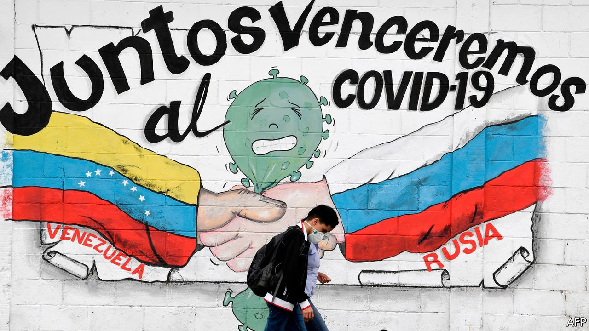

###### Thyme, the great healer

# Venezuela’s despot touts a herbal quack cure for covid-19 

##### Meanwhile, hospitals lack water and vaccines are scarce 

 

> Apr 29th 2021 

THE BLACK market in Venezuela has taken a dark turn in recent weeks. In online chat groups, where weary Caracas residents trade everything from detergent to US dollars, covid-19 is the dominant theme. Emotional pleas for medicine are commonplace. The price of oxygen tanks and masks is soaring. So too is rental space for the large refrigerators needed to preserve bodies in the tropical heat, as waiting lists for burials and cremations grow.

Switch on state television and it is another world. Every Sunday Nicolás Maduro, the dictator, addresses the nation. Wards of pristine unused hospital beds are displayed. Venezuela’s relatively low official death count is contrasted with carnage elsewhere. Mr Maduro labels  the “Bolsonaro mutation”, blaming an uptick in cases on Brazil’s populist president.


Mr Maduro’s hubris is misplaced. For the first year of covid-19 Venezuela was largely spared. But this was mostly luck. With the economy tanking and sanctions from the United States biting, the number of foreign visitors had already started tumbling. Before the pandemic, at least a dozen big airlines stopped flying there. But since March cases have been rising. Even by the government’s improbably low figures, there were around 1,000 new infections nearly every day in April, a record.

The country is ill-prepared. In 2019 fully 70% of public hospitals did not have reliable running water, according to Doctors for Health, a nationwide medical network. Morgues are now full, says Douglas Leon Natera, president of the Venezuelan Medical Federation.Health workers who give out detailed statistics which contradict the government’s claims risk imprisonment, he warns.

Instead of introducing clear lockdowns, Mr Maduro has imposed a bizarre one-week-on, one-week-off procedure, whereby non-essential shops are closed for a week and then allowed to reopen. “He seems to think the virus disappears every other week,” quips one sardonic carequeño. Mr Maduro has also touted a “miracle” cure for covid-19, which he claims was developed by Venezuelan scientists. The quack concoction appears to be made from an extract of thyme. His claims prompted Facebook to freeze his page for a month.

Vaccines are a long way off. Mr Maduro received his first jab on March 6th. But almost everyone else could be waiting months. Less than 2% of the country’s 18m adults have had their first dose, by far the worst roll-out in South America. The vaccines that are available (around 880,000 from Russia and China) are politicised. They have been restricted to those with a state loyalty card known as the carnet de la patria, which is mostly held by people who get state aid and so back the government.

In January up to 2.4m AstraZeneca jabs were reserved for Venezuela as part of the . The catch is paying for them. Venezuela is poor enough to qualify for free shots, but absurdly it still ranks as a “wealthier nation”, because Mr Maduro’s government has refused, since 2014, to provide accurate economic data to the World Bank.

In March Juan Guaidó, the leader of the opposition and recognised by many democratic governments as the legitimate president, was working on a deal whereby $30m of Venezuelan government funds frozen in the United States would be released to pay for them. Mr Maduro appears to have scuppered the arrangement, claiming that local “technical reports” found that the AstraZeneca jab had undesirable side-effects.

Weeks later, however, the government joined COVAX on more expensive terms. In April it said it had made two down-payments for 11m vaccines, understood to total around $120m. It is refusing to specify the origin of the funds. But assuming the government continues to refuse AstraZeneca’s jab, the vaccines may not arrive in the country until July.“You get the sense that there’s no rush,” says Miguel Pizarro, a politician representing Mr Guaidó at the UN. “Everyone is scared, and that is what a dictatorship wants.”■

A version of this article was published online on April 28th, 2021

Dig deeper

All our stories relating to the pandemic and the vaccines can be found on our . You can also listen to , our new podcast on the race between injections and infections, and find trackers showing ,  and the virus’s spread across  and .

