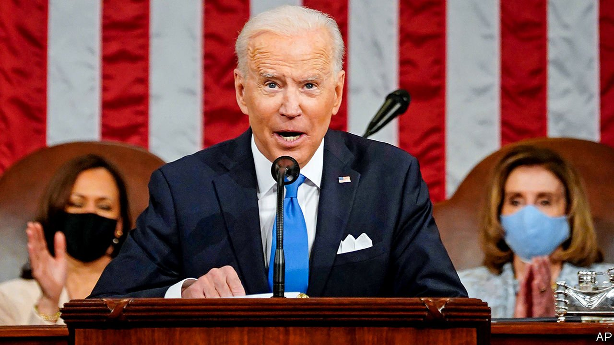

###### 

# Business this week 

#####  

 

> May 1st 2021 

In a speech to a joint session of Congress, , the most ambitious attempt to expand social programmes since the 1960s. The plan includes universal child care for three- and four-year-olds, a family-leave initiative and tuition-free community college. The $1.8trn price tag will be paid in part by increasing the top rate of income tax to 39.6%. And for those earning over $1m, taxes on capital gains and dividends will soar.

Fortune tallying


The family ofLee Kun-hee, Samsung’s late chairman, are to pay almost $11bn in taxes on his estate, one of the world’s biggest-ever inheritance-tax bills. His art collection, which includes works by Salvador Dalí, Claude Monet and Pablo Picasso, will be donated to the National Museum of Koreaand other institutions.

The Ethiopian government’s auction of two licences to operate telecoms was deemed a failure, when only two bidders submitted offers. The sale of the licences was supposed to be the jewel in the privatisation drive under Abiy Ahmed, the reform-minded prime minister. Potential buyers were put off by some of the restrictions, such as excluding foreign telecoms from providing mobile-money services.

Total, a French oil and gas company, suspended work indefinitely on a $20bn liquefied natural gas project in Mozambique, Africa’s largest energy investment, because of attacks by jihadists. Total evacuated its staff from the town of Palma in March.

Apple had a bumper first quarter. Revenues soared to $89.6bn, as did net profit, to $23.6bn. That is more than Amazon’s profit for all of last year. The tech company recorded big increases in sales of iPhones, iPads and other devices, confounding the market narrative that it is increasingly reliant on services (apps, TV and the like) for growth.

Huawei’s revenues fell by 16.5% in the first quarter, year on year, the second consecutive quarter in which it has registered a hefty drop. The Chinese maker of telecoms equipment was banned from having access to some American technology under the Trump administration, which is putting its business under immense pressure.

China’s competition regulator launched an investigation into Meituan, a shopping platform for food, entertainment and other lifestyle services. It is the latest antitrust action taken against a tech giant in China, coming soon after Alibaba was fined $2.8bn for abusing its market power.

Lyft has followed Uber in giving up the development of autonomous vehicles. The ride-hailing company sold its self-driving-cars unit to Toyota. It will be integrated into the Japanese carmaker’s Woven Planet division, which is “on a mission of mobility to love”.

 revved up in the first three months of 2021, increasing by 74% over the same quarter last year, despite problems in obtaining semiconductors for its electric cars. The company reported net income of $438m, its best quarterly profit to date.

Panasonic made its biggest-ever foreign acquisition when it agreed to buy the 80% of Blue Yonder it doesn’t already own in a deal valued at $7.1bn. Blue Yonder specialises in software for supply-chain management.

More banks disclosed losses from their exposure to the collapse of Archegos, an investment fund. Nomura took a hit of over $2.9bn, more than it had estimated previously, dragging the Japanese bank to its worst quarterly performance since 2008. UBS recorded a $774m loss in operating income related to Archegos, overshadowing the Swiss bank’s solid quarterly profit.

By contrast, Deutsche Bank said it had managed to sell its assets in Archegos before it imploded, avoiding any associated damage to its balance-sheet. The German bank made a net profit of €908m ($1.1bn) in the first quarter, its best since the start of 2014.

In one of the firmest commitments to getting workers back into the office, JPMorgan Chase told staff that it wants them to return to their place of employment by early July, albeit on a rotational basis to comply with a 50% cap on office occupancy. The bank recognised that for some people, returning to the office “is a change you’ll need to manage”. It also encouraged staff to get vaccinated, but said this would not be a requirement for entering the office.

Snappy fashion

Loved and loathed in equal measure, sales of Crocs footwear have rebounded, growing by 64% in the first quarter year on year and producing a comfortable profit for the company. The shoes, a cross between a foam clog and a hospital sandal, have benefited from the trend towards cosywear during the pandemic. Affirming that it’s OK to go out in your slippers, they were also seen on the Oscars red carpet.

