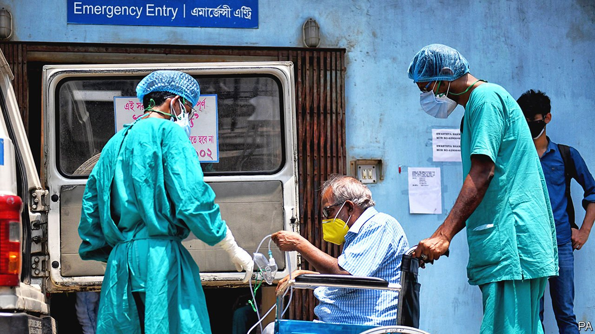

###### 

# Politics this week 

#####  

 

> May 1st 2021 

India’s second wave of covid-19 gained strength. The number of infections detected hit new records, with some 380,000 on April 28th alone. The official death toll surpassed 200,000, though evidence grew that many more fatalities are going unrecorded. Shortages of beds and oxygen afflicted many hospitals. The government ordered Twitter to remove posts critical of its handling of the epidemic, sparking widespread outrage. India now accounts for around 40% of the world’s new recorded infections.

An Indonesian general died in a shoot-out with separatists in Papua province, in Indonesia's half of the island of New Guinea. Gusti Putu Danny Karya Nugraha was the first Indonesian general ever to be killed in action.


Fighters from the Karen National Liberation Army, an insurgent group, captured an outpost on the Thai border from the Burmese army. Several rebel groups have taken advantage of the chaos in Myanmar to seize territory.

China began construction of an orbiting space station with the launch of Tianhe (“harmony of the heavens”), the first of three planned modules. When finished in 2022, the station will be a fifth the size of the existing International Space Station.

Leaks from last year’s census suggested that China’s population has started to shrink, earlier than the Communist Party had hoped or expected. Official media denied the leaks, but added details that appeared to support them.

The Census Bureau reported that America’s population stood at 331.4m on April 1st 2020. That was an increase of 7.4% since 2010, the slowest rate of decennial growth since the Depression. Texas gained 4m people, the most of any state; Utah’s population grew the most in percentage terms: 18%. California remains the most populous state, but it will lose a congressional seat for the first time ever.

California’s governor, Gavin Newsom, will probably face an election to recall him from office later this year, after a conservative-driven petition to remove him gathered enough signatures to qualify for the ballot.

Joe Biden used the 106th anniversary of atrocities committed by Turkey against Armenians during the first world war to define them as genocide, the first time an American president has formally done so. More than 1m Armenians were deported or died at the hands of the Ottomans. Turkey protested, but its reaction was less intense than some had feared.

Mario Draghi, the prime minister of Italy, laid out his government’s plans for rebuilding the economy after covid in the form of a €248bn ($300bn) spending package. Almost all the money will come from the EU, which has imposed some tough reform conditions. Fulfilling them will be tricky.

Hungary passed a law to hand control of state universities to foundations. These are likely to be run by ruling-party supporters, who can appoint their successors. This arrangement cannot be changed without a two-thirds majority in parliament. Critics griped that the ruling party had in effect given itself permanent control of higher education.

Arlene Foster said she would step down as Northern Ireland’s first minister (or premier) in June following a revolt against her leadership in her Democratic Unionist Party. Its members have become increasingly agitated by the post-Brexit deal for Northern Ireland, which in effect creates a border for goods crossing from mainland Britain.

Somalia’s president promised to reverse legislation that would extend his term in office by two years, after fighting broke out in the capital, Mogadishu. Mohamed Abdullahi Mohamed was supposed to have stepped down in February.

More than 80 people were killed when a fire, caused by an oxygen cylinder, erupted at a hospital treating covid-19 patients in Baghdad.

In a leaked audio tape Muhammad Javad Zarif, Iran’s foreign minister, said that the Revolutionary Guard dictates foreign policy and took Iran into Syria’s civil war at the urging of Russia. He also said that Russia tried to stop Iran from agreeing to a nuclear deal in 2015. Talks to revive the deal, which America ditched in 2018, resumed in Vienna.

In Israel Benny Gantz, the leader of the Blue and White party, was appointed justice minister after Binyamin Netanyahu, the prime minister, tried to slide a member of his own party, Likud, into the position. Mr Netanyahu’s move was deemed illegal by the attorney-general, as it violated the coalition agreement with Mr Gantz. The appointment is a sensitive issue: Mr Netanyahu is on trial for corruption.

Israel recorded no new daily  covid-19 deaths for the first time in ten months.

Thousands of people took to the streets in Colombia, to protest against a controversial tax reform. In the city of Cali a 1pm curfew was put in place after several buses were burned. Trade union leaders, who have been organising the protests, called for another gathering in May.

Coronavirus briefs


Japan declared a state of emergency in Tokyo and three other prefectures. Unlike previous restrictions, bars selling alcohol and shopping malls were told to close.

Chile will keep its borders closed for another month, even though the number of new covid-19 cases is easing.

America’s Centres for Disease Control revised its advice on wearing masks. Fully vaccinated people do not need to wear one outside, it said, except in crowded venues, like sports stadiums.

Americans were allowed to receive the one-shot Johnson &amp; Johnson jab again after regulators ended their suspension of the vaccine. They had been investigating claims that it caused blood clots.

America said it would donate up to 60m doses of the AstraZeneca jab to other countries. The vaccine has not been approved for use in the US.

