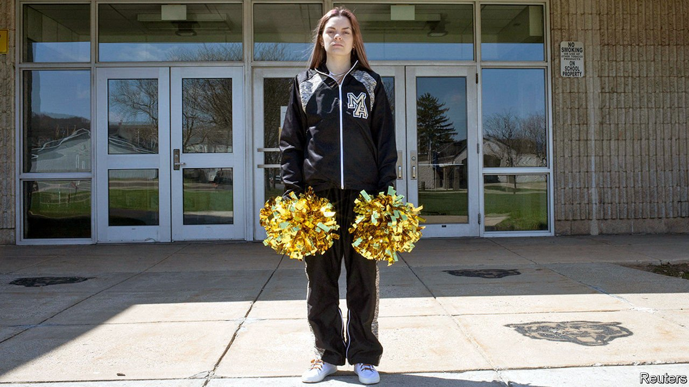

###### Sidelined

# A cheerleader’s cursing may reshape American free-speech laws 

##### The Supreme Court asks whether schools can punish students for what they say on social media 

 

> Apr 28th 2021 

IT HAS BEEN a half-century since the Supreme Court came to the defence of Mary Beth Tinker, a 13-year-old student who had been suspended for wearing a black armband to school as a protest against America’s role in the Vietnam war. Neither teachers nor students “shed their constitutional rights...at the schoolhouse gate”, the justices ruled then, but speech that could cause a “material and substantial” disruption falls outside the umbrella. The question in Mahanoy Area School District v. B.L., which the justices struggled with for nearly two hours on April 28th, is whether schools can punish uncouth expression made on the other side of the school gates, too.

Many of America’s wrangles over what can be said involve students asking administrators to curtail speech. Mahanoy is the other way around. In 2017 Brandi Levy sought solace in Snapchat when she learned she hadn’t made the top cheerleading team. Over the weekend, she posted an image of her upturned middle finger captioned with the message “fuck school fuck softball fuck cheer fuck everything”. This did not amuse the coaches: they booted her from the squad for a year. The jilted teen sued and two courts ruled that the punishment violated her freedom of speech. Schools may discipline students for disruptive or vulgar speech during class, in the hallway or on school trips, the Third Circuit Court of Appeals held. But they cannot discipline students for intemperate expression outside the schoolhouse gate.


The oral argument was a clash of two highly skilled lawyers. David Cole, national legal director of the American Civil Liberties Union, spoke up for Ms Levy’s right to vent on Snapchat without having to answer to school administrators. If purportedly disruptive off-campus speech could get students in trouble, kids “would be carrying the schoolhouse with them wherever they go”, he told the justices. That would leave no “breathing space” for students to exchange ideas and hamper discussions of matters related to their schools. Chief Justice John Roberts seemed to share this worry, wondering whether off-campus criticism of teachers or school policy should be subject to regulation.

Justice Brett Kavanaugh showed empathy with Ms Levy, noting that even Michael Jordan was sore about being cut from his varsity basketball team as a high-school sophomore. But he echoed Justice Stephen Breyer’s sentiment that the court was ill-equipped to “write a treatise on the First Amendment” concerning the boundaries of student speech in the internet age. Perhaps the best the justices can do, he suggested, is to erase the bright line between on-campus and off-campus speech and send the matter back to the lower court to ask whether Ms Levy’s rant amounted to a substantial disruption worthy of punishment. Justice Breyer said that he was “frightened to death of writing a standard”, but noted that if off-campus swearing counts as a material disruption, “every school in the country would be doing nothing but punishing.”

That hesitancy may favour the school’s position, argued by Lisa Blatt, owner of a fearsome 37-3 record in her Supreme Court appearances. There is no “talismanic significance to students’ location” when schools confront disruptive student speech, she wrote in a filing. And Ms Blatt countered Mr Cole’s cautions with warnings of her own. If schools cannot address student speech uttered just across the street, or posted on social media, they will be unable to fulfil their role of in loco parentis guardians of students’ well-being.

Mr Cole countered that schools are free to address threats, harassment, bullying and cheating when they happen off campus. But he said it would be a “dangerous proposition” if schools could punish anything posted over the weekend that they deem disruptive. Ms Blatt says worries about such “schoolhouse tyranny” are a red herring: principals cannot punish students just because they are offended by what they have to say.

The Supreme Court’s ruling, expected in June, could affect not only public schools and their 50m students but the contours of free speech at public universities. An amicus brief siding with the cheerleader from the Foundation for Individual Rights in Education cites the “pervasive form of administrative scrutiny” governing college students’ everyday online speech. Satirical Instagram posts and Facebook criticism of administrators have landed university students in hot water. That may change if the Supreme Court gives three cheers to freer expression for student speech online. But given the reticence emanating from the bench, such an expansion of youngsters’ free speech seems unlikely. Ms Blatt’s closing warning may stay with the justices: circumscribing school authority over student expression, she said, would bring “madness, confusion and chaos”.■

A version of this article was published online on April 28th, 2021

