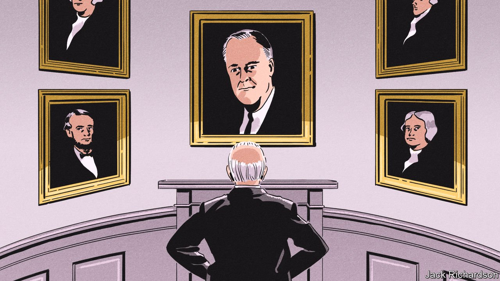
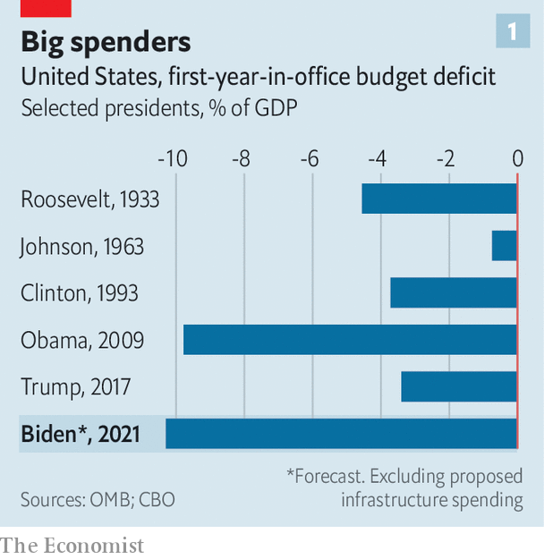
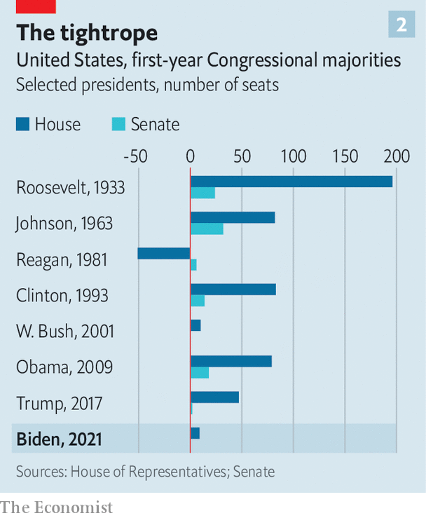
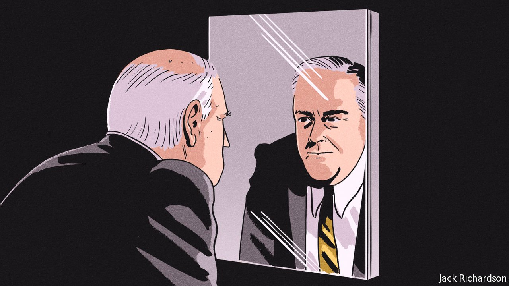

###### 100 days of aptitude

# Joe Biden was a boring candidate. He now draws comparisons to FDR 

##### Are they justified? 

 

> May 1st 2021 

“I’M SICK AND tired of reading how we’re planning another ‘hundred days’ of miracles,” griped John F. Kennedy before assuming the presidency. The sentiment made its way into his inaugural address, albeit in a more stirring manner: “All this will not be finished in the first 100 days. Nor will it be finished in the first 1,000 days, nor in the life of this administration.”

A recurrent trope of American politics is to scour the actions of the first 100 days of a new president’s administration and compare it, usually unfavourably, with the productivity of the first 100 days of Franklin Roosevelt’s presidency (in which he managed to pass 76 pieces of legislation, 15 of them country-changing). The exercise is both arbitrary and imperfect: presidents with early legislative successes tend to have more later on in their term, but it is hardly a guarantee. Nonetheless, it is still a test that White Houses past and present torture themselves over. Lyndon Johnson ordered his congressional liaison to “jerk out every damn little bill you can and get them down here by the 12th”. “On the 12th you’ll have the best 100 days,” Johnson boasted. “Better than [FDR] did!” Joe Biden’s administration is no different.


One year ago, when enthusiasm was difficult to detect from even his keenest supporters, the comparisons with Roosevelt would have seemed absurd. And yet here they are. “Biden is off to an excellent start—arguably, one of the best since Roosevelt,” writes David Gergen, a former adviser to four presidents of both parties.

 


Mr Biden assumed power at an awful time, with crises in democracy, public health and racial grievance to address. Yet crises can be auspicious. More than 230m Americans have been partially vaccinated—more than the 100m he set out at the start of his term. The post-covid-19 economy is forecast to grow by 6.5% in 2021. Both of these would probably have occurred no matter who won the election in 2020. But the confluence of crises at his inauguration, plus a competent cabinet cribbed from the Obama years, has carried along ambitious plans. Mr Biden has already signed a $1.9trn covid-19 rescue package into law, spending that dwarfs even Roosevelt’s initial outpouring of cash (see chart 1). Unlike past crisis presidents, Mr Biden does not start with vast majorities in Congress; a lukewarm mandate gave Democrats only the barest majorities. Yet he has wielded the tools at his disposal—a budget measure known as reconciliation to surmount the threat of a filibuster—to pass laws all the same.

Transformational presidents often arrive as curious avatars. Johnson, who ascended to the presidency by the historical accident of Kennedy’s assassination, was a creature of the Texas political machine. Walter Lippmann, a renowned American commentator, wrote dismissively of FDR during his first presidential campaign: “He is no tribune of the people. He is no enemy of entrenched privilege. He is a pleasant man who, without any important qualifications for the office, would very much like to be president.” Many Democrats would have cribbed those words a year ago to describe their party’s nominee. Yet apathy now seems an asset. Mr Biden does not stir the same ire that Mr Obama did within the conservative media, which sometimes seems to dwell more on his supposed aphasia and diminished mental faculties than his objectionable policies. “Boring but radical,” is how Senator Ted Cruz tried to put it. All the same, Mr Biden is pursuing a muscular policy of state intervention in the economy and race relations that should delight progressives. He is far to the left of Mr Obama on both counts.

This method comes with risks. In the absence of a reliable negotiating partner, with the Republican Party still unable to exorcise itself of Trumpism and its anti-democratic fantasies, Mr Biden has no responsible opposition to save his administration from bad ideas and excess. Securing bipartisan legislation with the filibuster in place requires ten Republican Senate votes—which look so far out of reach that the White House barely goes through the motions of trying to attract them. The bad Democratic habit of throwing mountains of money at malfunctioning sectors of the economy and hoping for the best—like a largely unexplained proposal for $400bn of elder-care spending, or the $225bn to be spent on subsidising child-care centres and their poorly paid workers—thus goes unchecked.

The theory of the Biden presidency thus far is that extraordinary levels of spending, only partially matched by raising taxes on corporations and the rich, can enrich America indefinitely without triggering inflation. And that direct government intervention, not creative destruction, is a powerful force to spur innovation. This is a remarkable gamble.

Try something

What spurs most of the Roosevelt comparisons is the American Rescue Plan, the $1.9trn behemoth of legislation that Democrats managed to pass in Congress without Republican votes and with few edits. It spends a huge amount of money rather diffusely: cheques for $1,400 distributed to most Americans (at a cost of $400bn), and $350bn in aid for states and communities whose budgets did not appear to be in dire need of it. Though double the size of the stimulus measure that Mr Obama was able to pass in the aftermath of the financial crisis, it does not signify a permanent transformation of the welfare state just yet. Even child tax allowances, the most significant measure, which are expected to halve child poverty, are only temporary.

 


That means that although Mr Biden has outdone his hero (FDR’s portrait now hangs over the fireplace in the Oval Office) in size, he has not yet done so in scope. Roosevelt managed to stabilise the careening banking sector, pass the Glass-Steagall Act, establish a federal system of deposit insurance, take the dollar off the gold standard, create the Civilian Conservation Corps and the Tennessee Valley Authority, besides passing other public-works and relief legislation. Mr Biden would clearly like to effect a transformation on the Rooseveltian or Johnsonian scale. But that cannot simply be bought.

Instead, the great transformation, should it ever arrive, will come in the next 100 days. Throughout his presidential campaign, Mr Biden promised that after immediate relief, which he has provided perhaps over-generously, he would “build back better”. That promise will arrive only with Democratic unanimity in Congress—which will be even harder to achieve than for the American Rescue Plan. The next plan aims to spend more than $4trn on mobilising all of government to fund infrastructure of various kinds and arrest the progress of climate change.

Presidents, at least Democratic ones, measure their success by the number of landmark acts and enduring governmental programmes left behind. Social Security, food stamps and modern unemployment insurance are among Roosevelt’s innumerable contributions. Beyond sweeping health-care and poverty-reduction programmes, Johnson’s include major civil-rights legislation on anti-discrimination, voting rights and fair housing. Mr Obama left his health-care plan. Mr Biden’s best chance of entering this pantheon would be to start the decarbonisation of America.

Before he assumed office, Mr Biden pledged that America would decarbonise its economy (meaning no net carbon emissions) by 2050. To get there, he aims to make power generation entirely carbon-free by 2035. He aims too to reclaim the mantle of global climate leadership tossed away by Mr Trump and his administration’s know-nothingism. At a summit of world leaders held (virtually) in late April, Mr Biden announced that America would aim to reduce its emissions by about 50% from 2005 levels by 2030. If the country realises these ambitious targets sometime after Mr Biden has left office, he could lay claim to the title of most consequential president of the century—remarkable given his slim margin of victory, lacklustre oratory, and the tepid enthusiasm he inspires even in his own party.

Were he to get his way, hundreds of billions of dollars would be spent putting Americans to work (preferably within unions): not just in green jobs, but in building roads and bridges, repairing sewers and power lines, and laying down broadband fibre cables. There is even a Civilian Climate Corps—deliberately recalling Roosevelt’s Civilian Conservation Corps, which employed 3m men who, among other things, planted 3bn trees. Other expansions to the welfare state, like permanent child allowances, paid family leave, extra subsidies for child-care centres and expanded health-insurance programmes, were revealed on April 28th at an estimated cost of $1.8trn. Mr Biden aims to raise these immense sums from much higher taxes on corporations and the wealthy, who did well under Mr Trump’s tax reform.

These plans have been sketched by the White House. Making them happen would require all Mr Biden’s skill at arm-twisting and back-slapping in the Senate, given that Democrats hold the chamber by the thinnest margin possible. So far, he has proposed starting a clean-energy revolution by spending close to $1trn over the next decade on basic research, subsidies for renewable energy and a jobs programme for “millions” put to work building new infrastructure, such as 500,000 electric-vehicle charging stations (there are only 115,000 petrol stations in the whole country) and retrofitting and weatherising existing infrastructure.

But enacting change so quickly cannot be accomplished through subsidies and direct employment. Mr Biden would need to rapidly shake up a cocktail of regulations that would force such a transition. More executive orders are among the ingredients, but legislation would be required, too. The trade-off between good policy and winning elections is clear here. A clean-electricity standard is politically palatable, but limited compared with the scale of the problem. The bolder, more effective option of a carbon tax is going nowhere.

Senate rules mean that the budgetary portions of the Biden agenda—like expanded social safety-net spending—stand a good chance of passage because they can avoid the risk of a filibuster, a minoritarian stalling tactic that holds up legislation unless 60 senators agree to move forward. Many of Mr Biden’s plans, like green spending, the trillions in safety-net expansion and the raising of taxes on businesses and rich Americans, are engineered to get around this threat through reconciliation, which only requires a simple majority.

 


Other sweeping reforms contemplated by the administration, which principally change regulation rather than government spending, will be casualties of the filibuster for as long as Democrats keep it. This applies to immigration reform, a boosted federal minimum wage, or greater voting-rights and civil-rights protections. Even if the filibuster were to be ditched, which seems unlikely now, the time limit on such reforms is also shorter than a four-year term would suggest. Even small losses during the mid-term elections in 2022, which first-term presidents often suffer, would flip Democratic control of one chamber of Congress and therefore probably doom future legislation (as Mr Biden will remember from his vice-presidential days). Perhaps that is why the focus has been squarely on economic policy.

Politics is not the only constraint on Mr Biden. The White House seems to relish eye-popping spending proposals. That is a departure from the Clinton-era Democrats, who cared about fiscal rectitude. Even Roosevelt began his presidency with the intention of balancing the budget, and only later turned Keynesian. The Congressional Budget Office estimates that the budget deficit of 2021 will be 10.3%, after a covid-induced shortfall of 14.9% in the previous year. The national debt is on track to be 102% of GDP by 2021 and 202% of it in 30 years’ time. Yet Mr Biden is blasé about the problem and keen to spend trillions more, which may only partly be covered by rising taxes. While interest rates are low, the spending may be sustained. But they will not stay low indefinitely. Already, inflation expectations have risen; if they do so quickly and unexpectedly, and Mr Biden’s economic experiment comes undone, it would badly damage the Democratic Party at a time when the other lot are unfit to govern.

If dealing with Congress and the bond market may be a headache, Mr Biden can at least issue directives. He has already taken some 60 important executive actions—more than any president since Roosevelt. Many of these revoke the actions of Mr Trump on immigration, like building a wall on the Mexican border, or climate change, by re-entering the Paris accord to reduce emissions. Because Mr Trump was singularly unsuccessful at passing major legislation (his only one, a tax cut in 2017, also stands a good chance of rollback), these revocations signal the end of a permanent Trump policy agenda in Washington. Others sketch the beginnings of causes Mr Biden aims to pursue through legislation: defining racial equity, relaxing immigration enforcement, mandating “buy American” rules, even forming a commission to study possible expansion of the Supreme Court. This all implies a muscular executive branch that will unilaterally seek to rewrite environmental, immigration and civil-rights rules to the maximum permitted by the courts.

 


Mr Biden may have plainly modelled himself on Roosevelt at the start of his presidency, but on race he aims to differ from the New Deal. Local administrators of Roosevelt’s innovations explicitly excluded African-Americans. Mr Biden’s plans, by contrast, are avowedly anti-racist. So far the racial-equity agenda of the first “woke” administration has been pursued in ways that look a bit like reparations. The covid-19 relief bill included a $5bn relief fund for minority farmers alone. The infrastructure package maintains that, somehow, 40% of the benefits of clean-energy investments will go to previously disadvantaged communities.

This too may perhaps be a quirk of the reconciliation procedure used to circumvent the filibuster. Spending targeted towards minorities alone can pass through the Senate more easily than consequential legislation that would reform policing, prisons, immigration and voting rights. Formal reparations (an issue which Mr Biden supports the study of by another commission) are deeply unpopular; policymaking that resembles reparations may not be much more warmly received. The politics of this racial-equity agenda is worse for the White House than the politics of big spending, which is broadly popular. Should progressives grow discontented with the signalling on racial equity, and instead demand that Mr Biden pushes harder, his party’s showing in the 2022 elections could suffer.

Government is ourselves

The Trump administration suffered from a severe form of attention-deficit disorder. Under Mr Biden, Washington has mercifully receded from global headlines. “Boring but radical” gets fewer clicks than “fascinating but incompetent”. This has led many to underestimate the scale of change currently under way in the relationship between the people and their government.

Mr Biden is a Rooseveltian revanchist, who seeks to reclaim the trust Americans once placed in government. His proposals for muscular industrial policy, autarkic supply chains and massive publicly-funded employment will be inefficient. But economic rationality is not their point. They are the results of a complicated balancing act between idealist left-liberal policy, centrist caution and what Congress can pass through reconciliation. The first 100 days of the Biden presidency have shown that he will pursue that philosophy in surprisingly maximalist fashion for a supposed moderate, even with such slim margins of Democratic control in Congress. The daunting tasks he has laid out for himself—averting climate change and rectifying racial injustice—will, in Kennedy’s words, not be finished in the first 1,000 days or even in Mr Biden’s lifetime. But he has already done more than seemed possible when he was sworn in.■

For more coverage of Joe Biden’s presidency, visit our dedicated 

