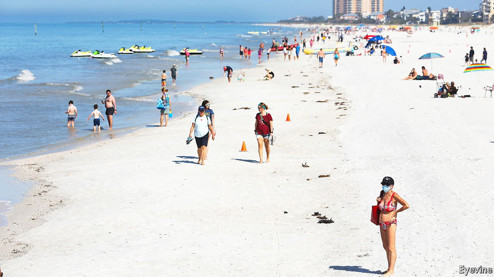

###### Overproof

# Republicans want to ban businesses from requiring proof of vaccination 

##### Governors are making an illiberal argument in the name of freedom 

 

> May 1st 2021 

AS CASES OF covid-19 in America are falling and the fourth wave subsides, states are again wondering how and when to loosen the remaining rules on travel between them. Six states, all led by Republican governors, have banned covid-19 vaccine passports. Three (Florida, Texas, and Montana) even prevent private businesses from requiring proof of vaccination. These bans may be politically advantageous for Republicans catering to a base angered by mask mandates (which changed this week after new guidance from the Centres for Disease Control and Prevention). Only one state, Democratic-led Hawaii, is publicly planning to use vaccination credentials for in-bound travel.

Vaccine passports come in three colours. The first and least controversial form is a vaccine passport for international travel, similar to the Yellow Card implemented by the World Health Organisation to prove inoculation for diseases like yellow fever and childhood illnesses like rubella. The second form is a one-time proof, such as those currently required by some schools for childhood vaccinations. The third is a transactional pass required for entrance into establishments. Denmark, Estonia and Israel have launched passports that grant vaccinated individuals access to restaurants, salons, large events, and more. The European Union plans to roll out a vaccine passport in June. The Republican state bans address the last two types of passes.


Utah, Arizona, Idaho, Montana, Texas, and Florida all currently ban vaccine passports. Hawaii is the only state that has publicly announced a covid-19 vaccination requirement for travel, between islands. Governor David Ige, a Democrat, announced on Twitter that, from May 11th, fully vaccinated people will be able to bypass current state requirements to provide proof of a negative covid-19 test or quarantine for 10 days. While other states have been lax with covid entry requirements, Hawaii has rigorously enforced its policies, even arresting people who break quarantine rules.

Its new rule is probably legal. States cannot prohibit citizens from travelling between them. But Hawaii’s policy allows for reasonable alternatives for those without vaccination proof, so it is probably appropriate, says Lawrence Gostin of Georgetown University. Albert Fox Cahn, head of the Surveillance Technology Oversight Project, a New York group that campaigns to regulate surveillance technology, likens the policy to receiving TSA PreCheck, a credential provided by the Customs and Border Protection agency that allows people who have voluntarily provided information to keep their shoes on and bypass other annoying procedures while going through security at some airports.

State bans that affect private businesses could face legal challenges, however. One state, New York, has implemented a voluntary passport system for entrance into venues. Called Excelsior Pass, this provides proof of vaccination or a negative covid-19 test for entry to basketball games and other large gatherings. But Montana, Texas and Florida have tried to prevent private businesses from requiring vaccine passports, via executive orders from the governor. This goes too far, says Mr Gostin. “It’s unlawful for a governor of a state to ban vaccine passports,” he says, speaking specifically about the orders by Texas and Florida for private businesses.

Florida’s policy seems particularly shaky. As written, the order aims to prevent private businesses from requiring proof of vaccination, but it does not explain which laws give Florida’s governor this authority. “If he had good authority, why didn't he put it in [the executive order]?” asks Walter Olson, a legal scholar at the Cato Institute, a libertarian think-tank. Mr Olson says that Florida’s executive order is written like a statement intended to be read by the public, not a legal document meant to be defended before a judge. According to Mr Cahn, Texas’s order is similarly vague.

Other states have enacted more successful bans. Utah’s legislation, which prevents only the state government and its public universities from requiring a vaccination passport, is probably legal, says Mr Gostin. “[The law is] basically telling the governor that the governor is not permitted to launch a governmental vaccine passport system. That’s not the same as saying that no business can do it.” Arizona’s and Idaho’s executive orders prevent state and local governments from requiring vaccine passports, so they also seem legally sound.

Florida, Texas, Montana and several other states have bills banning vaccine passports currently moving within their legislatures. Several states are just weeks away from legally forbidding vaccine passports. Jeffrey Singer, a doctor and a fellow at the Cato Institute, thinks these legislative bans should exempt private businesses. “Private entities have a right…to request proof of vaccination,” Dr Singer explains. “They have a right to be concerned about their safety and the safety of their employees and customers.”■

