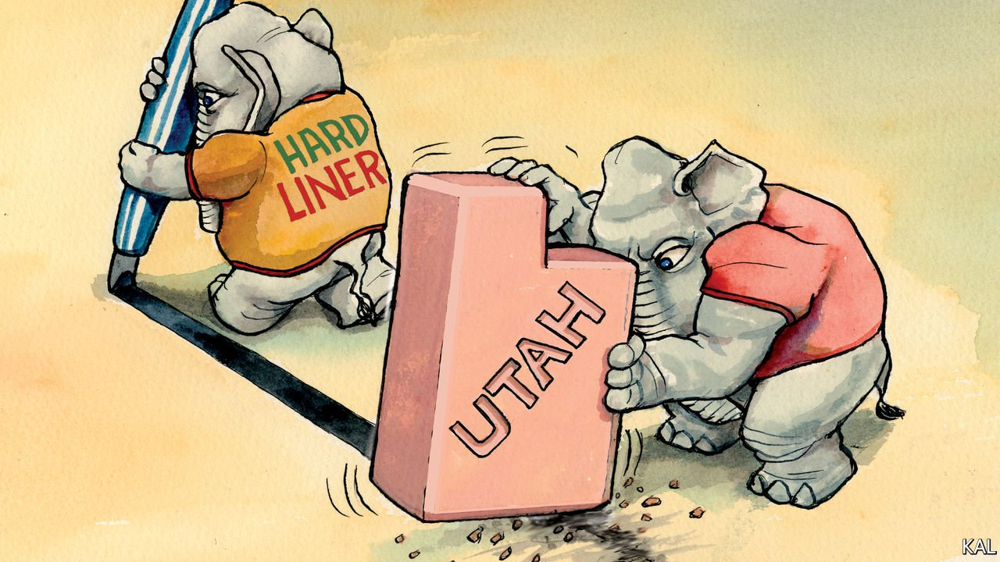

###### Lexington

# Why Utah’s conservatism is better 

##### The Mormon right has not followed white evangelicals’ descent into grievance politics 

 

> Apr 29th 2021 

ONE OF THE few uplifting notes of last year’s election season was struck by the candidates for Utah’s governorship. “Win or lose, in Utah, we work together,” said Christopher Peterson, the Democrat, in a humorous ad featuring him and his Republican opponent. “So let’s show the country that there’s a better way,” said that rival, Spencer Cox.

Now Utah’s governor, Mr Cox seems to be keeping his pledge. The upbeat 45-year-old is winning plaudits for his pragmatism and evenhandedness. After Utah’s Republican legislature demanded an early end to its mask mandate, he negotiated a month-long extension, with exceptions for schools and businesses. He issued his first veto of a bill sponsored by his brother-in-law (it was an attack on social-media firms and probably unconstitutional).


He is popular with Democrats as well as Republicans—as Utah’s governors tend to be. Gary Herbert and Jon Huntsman had similar records. Though Utah is one of the most conservative states, the relative moderation of its Republican leaders has helped make it one of the less polarised. “We have a history here of wanting to bring the other side to the table,” says Mr Cox.

An illustration of that was a deal between gay-rights and religious-liberties activists known as the Utah compromise. A textbook legislative trade-off, which recognised the rights of gays in employment and housing while permitting churches not to marry them, it has been cited approvingly by both sides in a budding row over Joe Biden’s support for new LGBT protections.

Another sign that Utah conservatives are different is their aversion to Donald Trump. The former president did better in the state last year than he did in 2016; but worse than any other Republican candidate in a two-horse race since Barry Goldwater in 1964.Though some leading Utah conservatives have warmed to him—including Senator Mike Lee—Mr Cox is among the many who remain opposed to Mr Trump and his grievance politics. “We’ve created something that we used to criticise, the victim culture that now exists on the right,” said the governor, more in sadness than anger.

The results of Utah’s functional conservatism are impressive. The state is as welcoming to immigrants as it is to investors—and one of the fastest-growing in both population and output. The main explanation for it is signified by the needle-like spires that pierce the Salt Lake City skyline. Over 60% of Utahns, and a bigger majority of Utah Republicans, are Mormons. This makes them members of a church imbued with little of the pessimism evident elsewhere on the religious right. To the contrary, where white evangelicals—the Republicans’ biggest constituency—harbour the wounded sense of entitlement of a group hurtling from cultural primacy to the margins, Mormons exude the confidence of a once reviled but now thriving minority. Founded in upstate New York in 1830, by a 24-year-old visionary called Joseph Smith, their religion is one of the world’s richest and fastest-growing. It claims to have almost 17m members in 160 countries.

The church, to which most Utah Republicans belong, is deeply conservative yet sometimes adaptable. It was behind the Utah compromise, a concession that ended up reaffirming some of its architects’ Mormon faith. “If you’re a true Christian, you want to love your neighbour.” concluded the leader of Utah’s Senate, Stuart Adams, who had previously opposed gay rights.

Sadly, a comparison between the Mormon and evangelical churches also suggests how hard it will be for evangelicals to follow the Latter-day Saints’ lead. The big difference between the two is psychological and rooted in their divergent histories. “My great-great-great-grandparents’ home was burned to the ground by a mob in Illinois,” said Mr Cox. “You don’t forget stuff like that.” That past not only explains Utah’s openness to immigration. It represents for Mormons a parable of existence as a sacred struggle, demanding humility and accommodation with a hostile world. Unlike aggrieved evangelicals, says Richard Mouw, a leading evangelical theologian, “Mormons are not angry, they don’t want to win, they just want a place at the American table.”

Mormons’ and evangelicals’ distinct perspectives are also a product of their churches’ organisation. The decentralised nature of evangelical America has allowed worshippers to sort themselves into racially and otherwise homogeneous congregations. This has in turn led them to elevate cultural over spiritual concerns. By contrast, Mormons’ centralised institutions underpin their greater pragmatism and openness to diversity.

They must worship at their local church and are urged to provide alms and other support to poorer neighbours. This helps explain why Utah has the lowest wealth inequality of any state. It also promotes empathy over righteousness; the church’s missionary tradition does the same. To that end, Mr Cox did a stint in Mexico; Mitt Romney in France. And this structure is overseen by one of America’s tightest, and more enlightened, church hierarchies.

Senior Mormons are considered to be “prophets, seers and revelators”. The current ruling trio were formerly a pioneering surgeon, a justice of Utah’s Supreme Court and a Stanford business professor. Their example in getting promptly inoculated against covid-19 helps explain why Mormons, who tend to be more observant than white evangelicals, are also likelier to get vaccinated.

Saints alive

For the literary critic Harold Bloom, a fan of Mormonism, it was the “authentic version of the American religion … [which] yet may prove decisive for the nation”. Something similar could be said for the pragmatic politics the church endorses.

Utah conservatism is a reminder to the American right of its more expansive, optimistic past. It also offers a warning of where Republicans’ current pessimistic course may lead. Almost half of Mormons under the age of 40 voted for Joe Biden. ■

A version of this article was published online on April 27th, 2021

