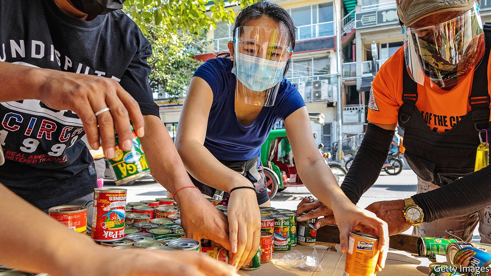

###### Pantry poopers

# Filipino food banks are accused of communist sympathies 

##### A paranoid general sees reds under the veg 

 

> May 6th 2021 

PRECAUTIONS AGAINST covid-19 have constricted the livelihoods of millions of Filipinos. So a recent sprouting of hundreds of local food banks meant to keep their hunger at bay should, on the face of it, be widely welcome. Instead, it has stirred up a storm of political controversy. Lieutenant-General Antonio Parlade, a leading defender of the Philippine state against communist rebels, denounced the food banks, called community pantries, as the work of the devil. The general’s suspicion that communist plotters are behind the food banks may seem far-fetched. But the pantries are nonetheless a threat to elected politicians, who would prefer to preserve a monopoly on handing out goodies to voters near election time.

The pioneer of community pantries is Ana Patricia Non (pictured), who set up a tiny stall in the Quezon City area of metropolitan Manila in mid-April, and invited anybody in need to take the food arrayed on it, which was supplied by donors. She was responding to the government’s tight lockdown of Manila and nearby provinces during a second wave of covid-19 that swelled in March, which had choked off economic activity and slashed incomes. Within days, similar stalls were springing up all over the country, stocked with donated provisions and attracting long queues. Admittedly Ms Non did post a variation on a Marxist maxim on her stall, asking people to take according to their need and give according to their ability.


The phrase caught the eye of Lieutenant-General Parlade, the spokesman for the National Task Force to End Local Communist Armed Conflict, who inferred that the community pantry movement was a communist conspiracy. “It’s all over the country, with a similar theme. It looks like it was packaged with the same strategy,” he said. He compared those supplying Ms Non with food to Satan tempting a gullible Eve with forbidden fruit in the Garden of Eden, to bring about humanity’s downfall.

The general speaks for the body that President Rodrigo Duterte hopes will end a half-century-old communist rebellion in the Philippines. This insurgency is moribund. Its leaders are nearing the end of their natural lives and its dwindling rank and file survive by extorting money from businesses at gunpoint. While attempting to overthrow the state by force of arms is against the law, simply being a communist is perfectly legal. But being labelled as a possible communist or communist sympathiser—called red-tagging—can put the suspect at risk of becoming a casualty of the now mostly clandestine conflict.

The uproar caused by Lieutenant-General Parlade’s remarks means that Ms Non, her community pantry and their imitators are now so firmly fixed in the public eye that they should all be safe to carry on feeding the needy unmolested. Mr Duterte ignored the general. Harry Roque, the president’s spokesman, lauded the community pantry movement as an admirable manifestation of Filipino neighbourliness, while rejecting the idea that it revealed the inadequacy of the government’s lockdown-relief scheme. That effort makes a single payment of 1,000 pesos (around $21) to each of 23m people in Manila and nearby provinces. “The position of the president is clear,” Mr Roque said. “Let a thousand community pantries bloom.” Whether any irony was intended by paraphrasing a Maoist slogan is unclear.

Still, the food banks put local politicians in a fix. Local governments have the task of distributing official relief, affording politicians planning to run for re-election next year a chance to curry favour with voters. To prevent community pantries from putting the official relief in the shade, local politicians could try to stamp them out by regulating or red-tagging them. Or they could simply jump on the bandwagon as food donors, hoping that the recipients will remember their charity, come election time. The stance of Mr Duterte, ever the populist even though the law forbids him from running for a second term, forces local governments to accept that the needy must receive both the official relief and charitable aid. Who will succour the politicians hungry for the people’s gratitude? ■

