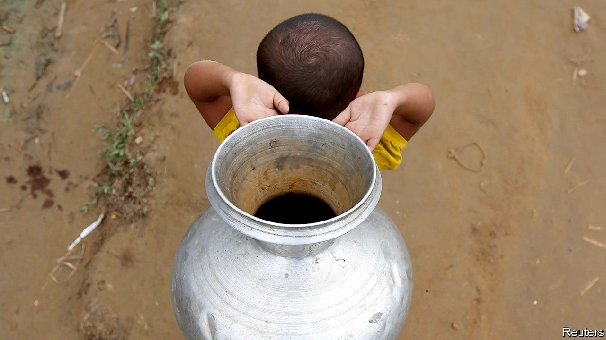

###### Thirst trap

# Water in Bangladesh is either unhealthy or pricey 

##### But there is a new set of ideas to fix an old problem 

 

> May 8th 2021 

BANGLADESH, WHICH sits within the world’s largest river delta, has no shortage of water. Alas, barely any of it is drinkable.Much of the country’s surface water contains high levels of poisonous arsenic, owing to both man-made and natural causes. The effects of climate change increasingly sully the rest with salt, even in wells dug deep. As cyclones and tidal surges from the Bay of Bengal intensify, sea water fills the delta.Salt-ridden soil makes growing rice impossible, forcing Bangladeshis to abandon low-lying regions—home to a quarter of the country’s 170m people—in favour of more fertile areas or cities.

Too much salt is as bad for humans as it is for crops. It causes hypertension, raising the risk of strokes, heart attacks and miscarriages. Those who remain on the coast collect rainwater to drink and cook with. This is hard in the dry season, says Shikha Rani Mala, who lives in Morrelganj, in the coastal district of Bagerhat. A nearby pond offers a substitute for rain, she says, but quickly becomes stagnant. This is when Ms Mala turns to one of the many vendors who travel around peddling pricey bottled water from cycle rickshaws.


Various groups are trying to fix this state of affairs. The Department of Public Health Engineering (DPHE), a government agency responsible for managing water infrastructure outside big cities, has bought expensive new nanofiltration machines, which use a membrane to remove most organic matter, bacteria, viruses and salts. It is trying them out in three districts, including Bagerhat, and providing the water, for now, without charge. Brac, Bangladesh’s biggest NGO, has teamed up with a Welsh business, Hydro, to install equipment that purifies water using a process called electrocoagulation. The machines cost about the same as those used by DPHE, but treat water twice as fast. This allows Brac to sell the water at the relatively affordable rate of ten taka ($0.12) for 20 litres. Yet even where water can be cleaned cheaply, middlemen like Ms Mala’s rickshaw vendor end up as distributors, pushing up prices by as much as 250%.

Nor is access to clean water guaranteed for the 300,000 to 400,000 migrants who move to Dhaka, the capital, each year. Some 4m of the city’s 18m residents, mostly in the slum districts, do not have piped connections to their homes. Most still pay a premium to the city’s water mafia for illegally tapped water, which is often contaminated in the process.

Minhaj Chowdhury, a Bangladeshi-American entrepreneur, thinks he has found a way to cut out unscrupulous middlemen. His company, Drinkwell, works with state water utilities in Dhaka and Chattogram (formerly Chittagong) but sells directly to consumers using vending machines and a pay-as-you-go card system for between $0.09 and $0.14 a litre. The utilities provide the untreated water, the land and the electricity, but “we do everything else,” says Mr Chowdhury, including purifying the water. A bigger prize than keeping costs low, however, is ensuring the long-term sustainability of the system. Many worthy attempts to provide cheap, clean water eventually run out of funding. Drinkwell’s profit-based model and tie-ups with utilities should help make its operation pay for itself.

It will be a while before Drinkwell’s success in the cities can be applied to places like Morrelganj. Half of all water-treatment projects fail because, whether set up by the government or an NGO, “the running and maintenance are then left to fall on the community”, says Saifur Rahman of DPHE. The costs are usually too high. Local governments are supposed to provide water to rural areas. Often they do not.Mr Rahman and his colleagues are in the process of reminding elected officials—most of whom live in Dhaka and rarely visit their rural constituencies—that this is their job.■

